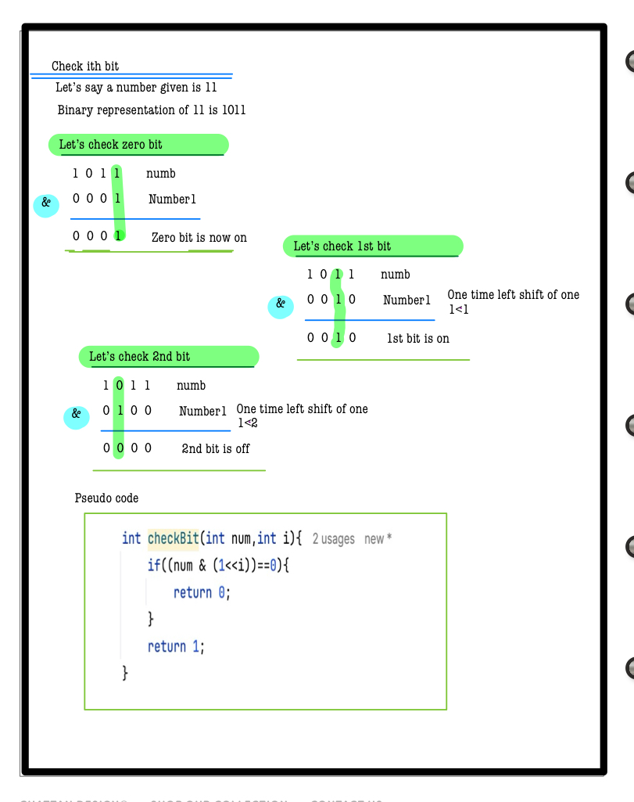

# Q5. Check bit

---

## 🚀 Introduction
Given two integers **A** and **B**, determine if the B-th bit of **A** is set (1) or unset (0).  
You need to return 1 if it is set, and 0 if it is unset.

Bit manipulation is essential for fast computations in low-level programming.

_Use hints to guide your solution. Complete solutions are penalty-free!_

---

## 📝 Problem Description
You are given two integers **A** and **B**.

- Return `1` if the B-th bit in **A** is set (1).
- Return `0` if the B-th bit in **A** is unset (0).

**Note:**  
The B-th bit is 0-indexed, with 0 being the least significant bit.

---

## ⚙️ Problem Constraints
- `1 <= A <= 10^9`
- `0 <= B <= 30`

---

## 📝 Input Format
- First argument: an integer **A**.
- Second argument: an integer **B**.

---

## 📤 Output Format
Return an integer:
- `1` if the B-th bit in **A** is set
- `0` if the B-th bit in **A** is unset

---

## 📚 Example

### Input 1:
```plaintext
A = 4, B = 1
```
### Output 1:
```plaintext
0
```
### Explaination 1:
```plaintext
Given N = 4 which is 100 in binary. The 1-st bit is unset
so we return 0
```
### Input 2:
```plaintext
A = 5, B = 2
```
### Output 2:
```plaintext
1
```
### Explaination 2:
```plaintext
Given N = 5 which is 101 in binary. The 2-nd bit is set
so we return 1
```
# 📝 Problem Solutions
---
### Approach1 :
#### Source code : [checkBit.java](../../src/bitManipulationOne/checkBit/checkBit.java)
#### Time Complexity : o(1)
#### Space Complexity : o(1)
  