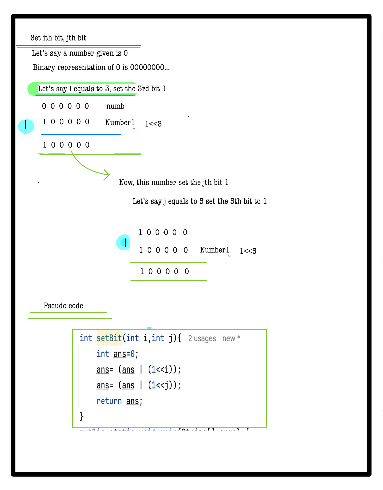

# Q6. Set Bit

---

## 🚀 Introduction
Given two integers **A** and **B**, set the A-th and B-th bits in a binary number starting from 0 (least significant bit).  
Return the resulting number in decimal form.

Bit manipulation plays a crucial role in low-level programming, allowing efficient control over bits.

_Use hints to guide your solution. Complete solutions are penalty-free!_

---

## 📝 Problem Description
You are given two integers **A** and **B**.

- Set the A-th bit and B-th bit in a binary number initially 0.
- Return the decimal representation of this binary number.

**Note:**  
The bit positions are 0-indexed, with 0 being the least significant bit (LSB).

---

## ⚙️ Problem Constraints
- `0 <= A <= 30`
- `0 <= B <= 30`

---

## 📝 Input Format
- First argument: integer **A**
- Second argument: integer **B**

---

## 📤 Output Format
Return an integer which is the decimal equivalent of the binary number with the specified bits set.

---

## 📚 Example

### Input 1:
```plaintext
A = 3, B = 5
```
### Output 1:
```plaintext
40
```
### Explaination 1:
```plaintext
The binary expression is 101000 which is 40 in decimal.
```
### Input 2:
```plaintext
A = 4, B = 4
```
### Output 2:
```plaintext
16
```
### Explaination 2:
```plaintext
The binary expression is 101000 which is 40 in decimal.
```

# 📝 Problem Solutions
---
### Approach1 :
#### Source code : [checkBit.java](../../src/bitManipulationOne/setBit/setBit.java)
#### Time Complexity : o(1)
#### Space Complexity : o(1)
  