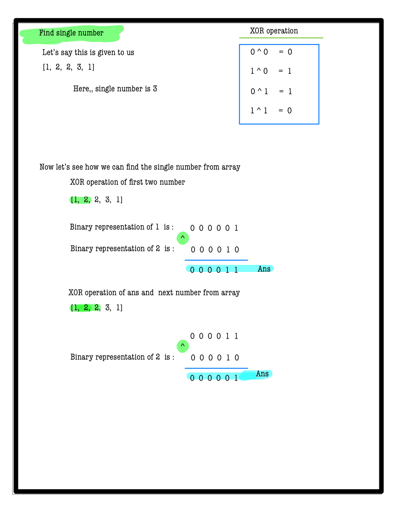
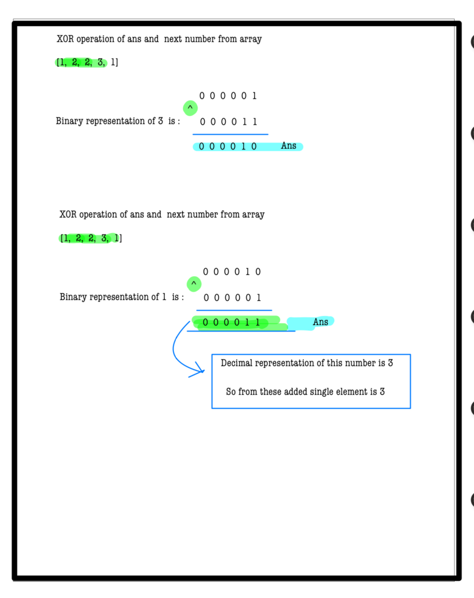
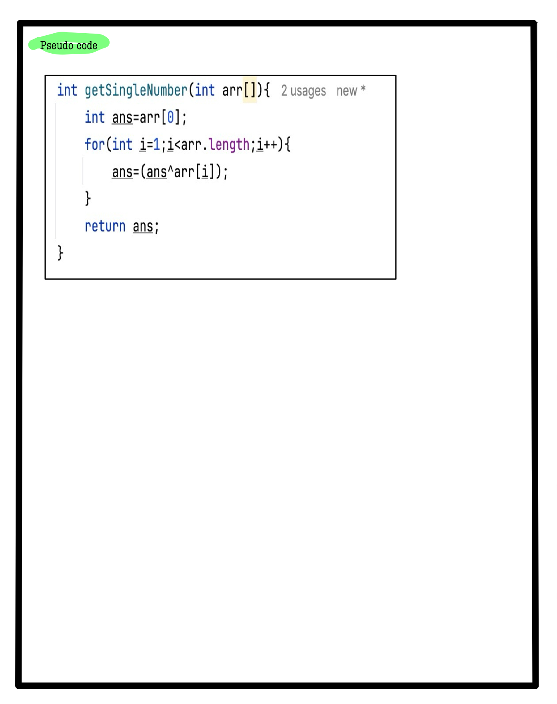

# Q2. Single Number
---
## 🚀 Introduction
Given an array where every element appears twice except for one, find the element that appears only once. This problem highlights efficient approaches to identify unique elements with minimal time and space complexity.

_Use hints to develop your solution. Complete solution approaches are penalty-free!_
---
## 📝 Problem Description
Given an array **A** of integers, where all elements occur twice except for one element, find that single unique element.

**Note:** Your solution should:
- Have linear runtime complexity (`O(N)`).
- Not use extra memory (`O(1)` space complexity).

---

## ⚙️ Problem Constraints
- `1 <= |A| <= 2,000,000`
- `0 <= A[i] <= INTMAX`

---

## 📝 Input Format
- The input contains a single array **A**.

---

## 📤 Output Format
- Return the integer that occurs once in the array.

---

## 📚 Example
### Input 1:
```plaintext
 A = [1, 2, 2, 3, 1]
```
### output 1:
```plaintext
3
```
### Explaination 1:
```plaintext
3 occurs once.
```
### Input 2:
```plaintext
 A = [1, 2, 2]
```
### output 2:
```plaintext
1
```
### Explaination 2:
```plaintext
1 occurs once.
```
# 📝 Problem Solutions
---
### Approach1 :
#### Source code : [singleNumber.java](../../src/bitManipulationOne/numberOf1Bits/numberOf1Bits.java)
#### Time Complexity : o(1)
#### Space Complexity : o(1)

 
 
 
