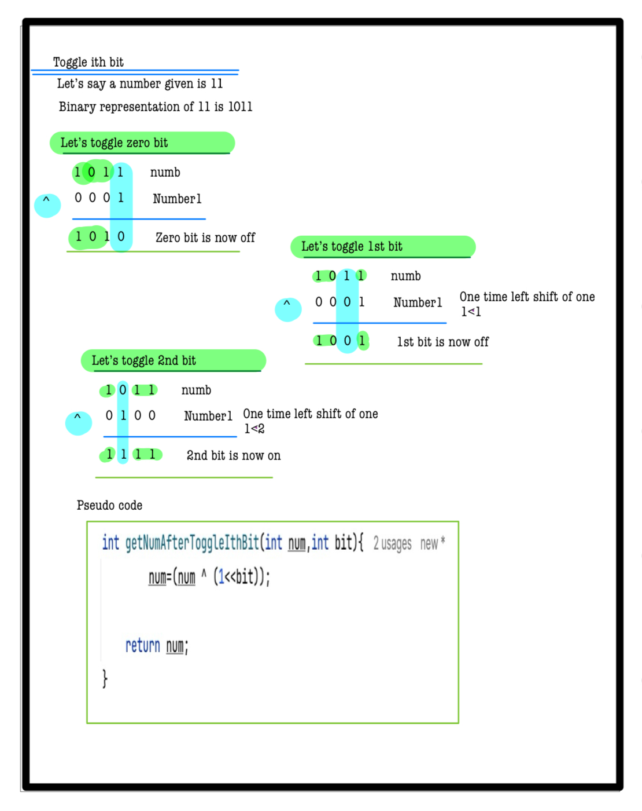

# Q4. Toggle i-th bit

---

## 🚀 Introduction
Given two integers **A** and **B**, toggle the B-th bit of **A**.
- If the B-th bit is currently set (1), unset it (make it 0).
- If the B-th bit is currently unset (0), set it (make it 1).

Bit manipulation is a core concept in optimizing low-level operations and algorithms.

_Use hints to develop your solution. Complete solutions are penalty-free!_

---

## 📝 Problem Description
You are given two integers **A** and **B**.

- If the B-th bit in **A** is set, change it to unset.
- If the B-th bit in **A** is unset, change it to set.

Return the updated value of **A**.

**Note:**  
The B-th bit is 0-indexed, with 0 being the least significant bit.

---

## ⚙️ Problem Constraints
- `1 <= A <= 10^9`
- `0 <= B <= 30`

---

## 📝 Input Format
- First argument: an integer **A**.
- Second argument: an integer **B**.

---

## 📤 Output Format
Return an integer representing the value of **A** after toggling the B-th bit.

---

## 📚 Example

### Input 1:
```plaintext
A = 4, B = 1
```
### Output 1:
```plaintext
6
```
### Explaination 1:
```plaintext
Given N = 4 which is 100 in binary. The 1-st bit is unset
so we make it set
```
### Input 2:
```plaintext
A = 5, B = 2
```
### Output 2:
```plaintext
1
```
### Explaination 2:
```plaintext
Given N = 5 which is 101 in binary. The 2-nd bit is set
so we make it unset
```
# 📝 Problem Solutions
---
### Approach1 :
#### Source code : [toggleIthBit.java](../../src/bitManipulationOne/toggleIthBit/toggleIthBit.java)
#### Time Complexity : o(1)
#### Space Complexity : o(1)
  
