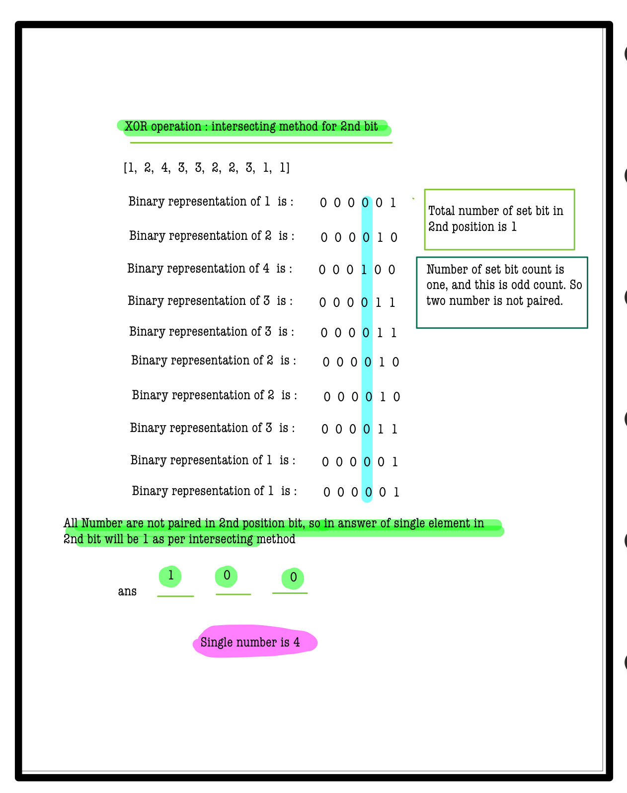

# Q1. Single Number II

---

## 🚀 Introduction
Given an array of integers where every element appears **thrice** except for one element that appears **once**, find that unique element.

Your solution should have linear runtime complexity and ideally use constant extra space.

_Use hints to assist your development. Complete solutions are penalty-free!_

---

## 📝 Problem Description
You are given an array of integers **A**.

- Every element appears **exactly three times** except for one element which appears **once**.
- Find and return the element that appears only once.

**Note:**  
Your algorithm should run in **O(n)** time and use **O(1)** extra space.

---

## ⚙️ Problem Constraints
- `2 <= |A| <= 5*10^6`
- `0 <= A[i] <= INTMAX`

---

## 📝 Input Format
A single array of integers **A**.

---

## 📤 Output Format
Return the integer that appears only once.

---

## 📚 Example

### Input 1:
```plaintext
A = [1, 2, 4, 3, 3, 2, 2, 3, 1, 1]
```
### output 1:
```plaintext
4
```
### Explaination 1:
```plaintext
 4 occurs exactly once in Input 1.
```
### Input 2:
```plaintext
 A = [0, 0, 0, 1]
```
### output 2:
```plaintext
1
```
### Explaination 2:
```plaintext
 1 occurs exactly once in Input 2.
```
# 📝 Problem Solutions
---
### Approach1 :
#### Source code : [singleNumber2.java](../../src/bitManipulationTwo/singleNumber2/singleNumber2.java)
#### Time Complexity : o(n)
#### Space Complexity : o(1)

 
 
 
 
