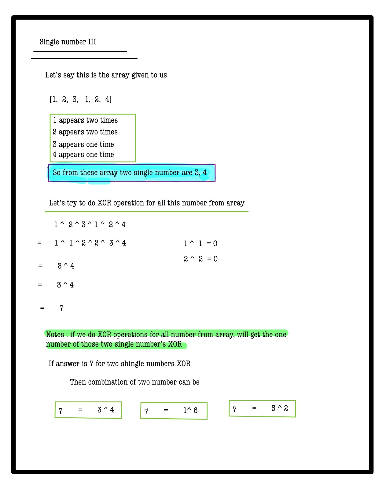
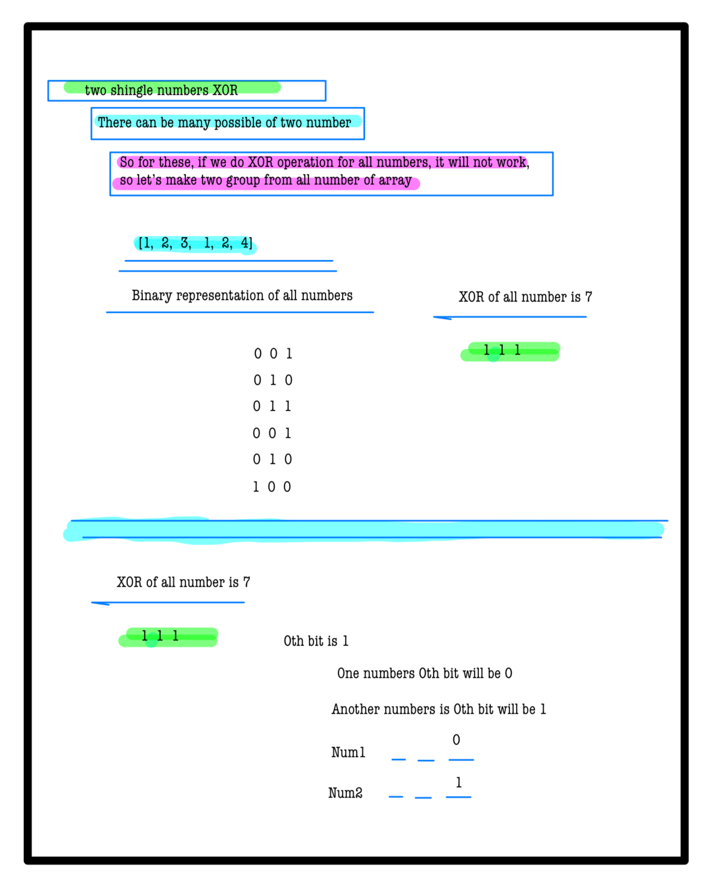
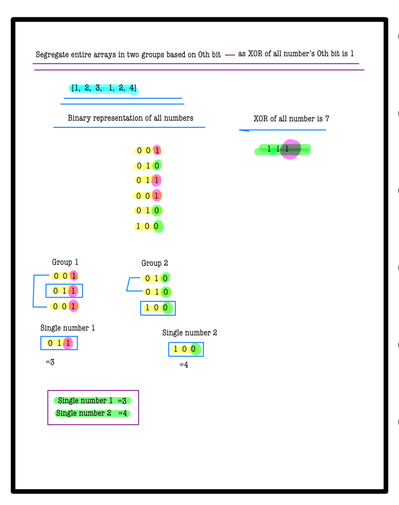
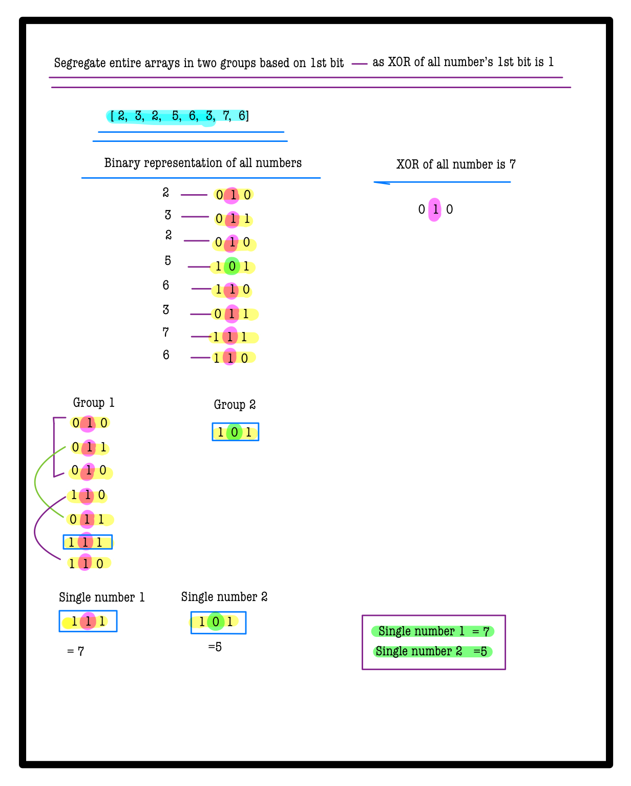
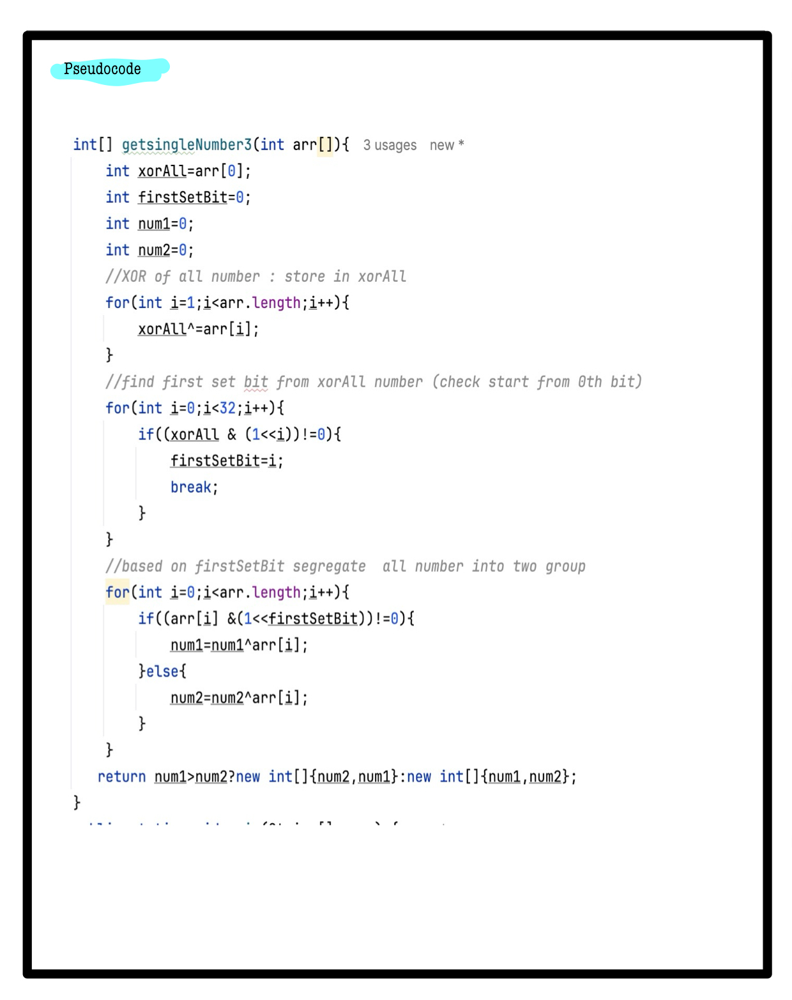

# Q2. Single Number III

---

## 🚀 Introduction
Given an array of positive integers **A**, where exactly **two numbers** appear **only once**, and all other numbers appear **twice**, find these two unique numbers.  
Return the two numbers in **ascending order**.

This problem is a classic application of bit manipulation techniques for handling XOR operations efficiently.

_Use hints to guide your solution. Complete solutions are penalty-free!_

---

## 📝 Problem Description
You are given an array of integers **A**.

- Exactly two elements appear **once**.
- All other elements appear **twice**.
- Find these two unique elements and return them in ascending order.

---

## ⚙️ Problem Constraints
- `2 <= |A| <= 100,000`
- `1 <= A[i] <= 10^9`

---

## 📝 Input Format
A single array of integers **A**.

---

## 📤 Output Format
Return an array of **two integers** that appear only once, sorted in ascending order.

---

## 📚 Example

### Input 1:
```plaintext
A = [1, 2, 3, 1, 2, 4]
```
### output 1:
```plaintext
[3, 4]
```
### Explaination 1:
```plaintext
3 and 4 appear only once.
```
### Input 2:
```plaintext
A = [1, 2]
```
### output 2:
```plaintext
[1, 2]
```
### Explaination 2:
```plaintext
1 and 2 appear only once.
```
# 📝 Problem Solutions
---
### Approach1 :
#### Source code : [singleNumber3.java](../../src/bitManipulationTwo/singleNumber3/singleNumber3.java)
#### Time Complexity : o(n)
#### Space Complexity : o(1)

 
 
 
 
 