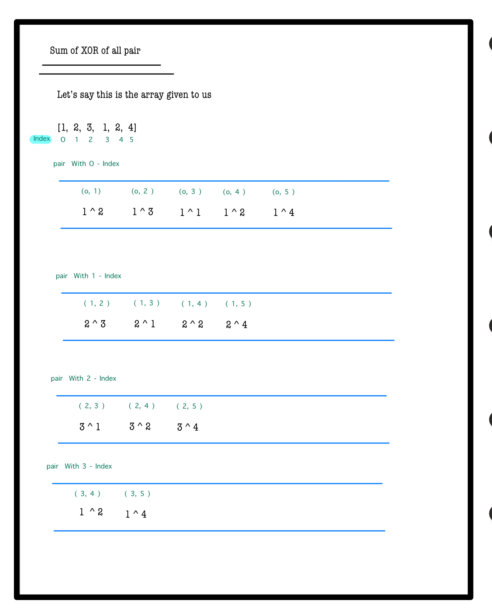
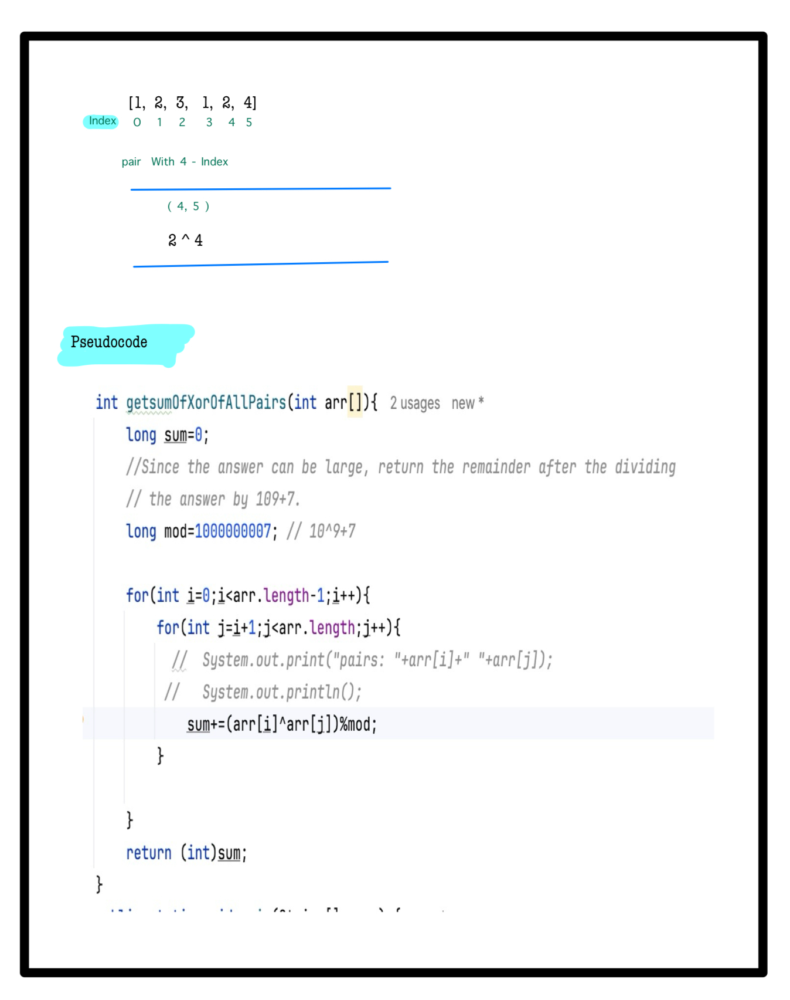
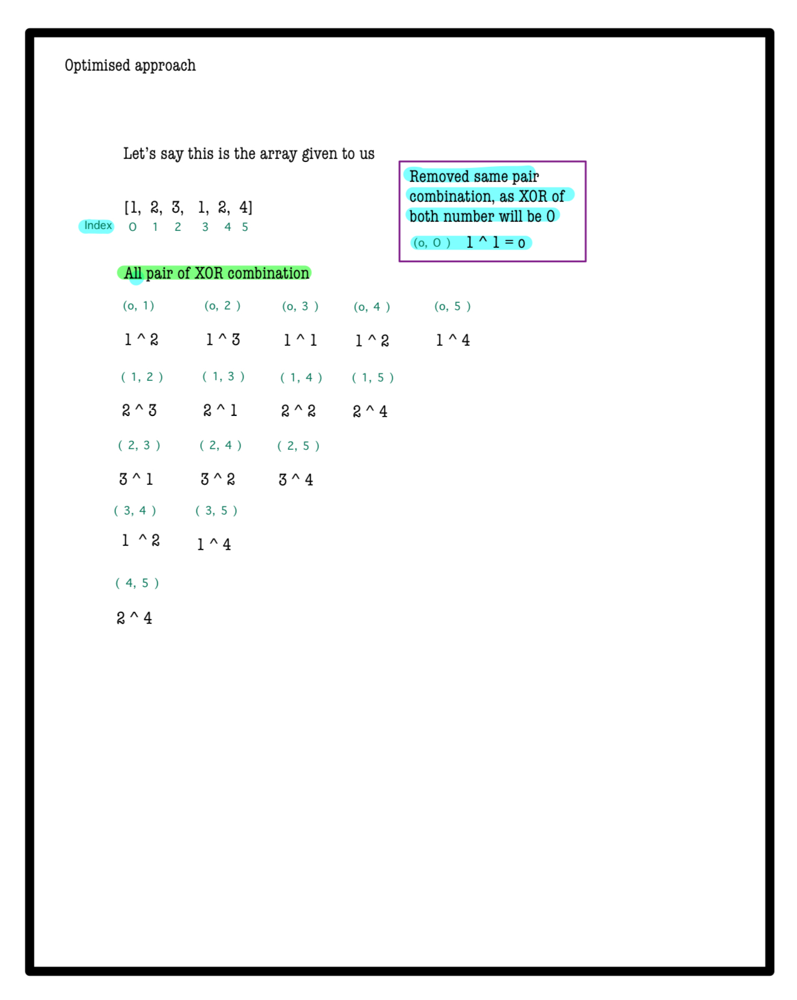
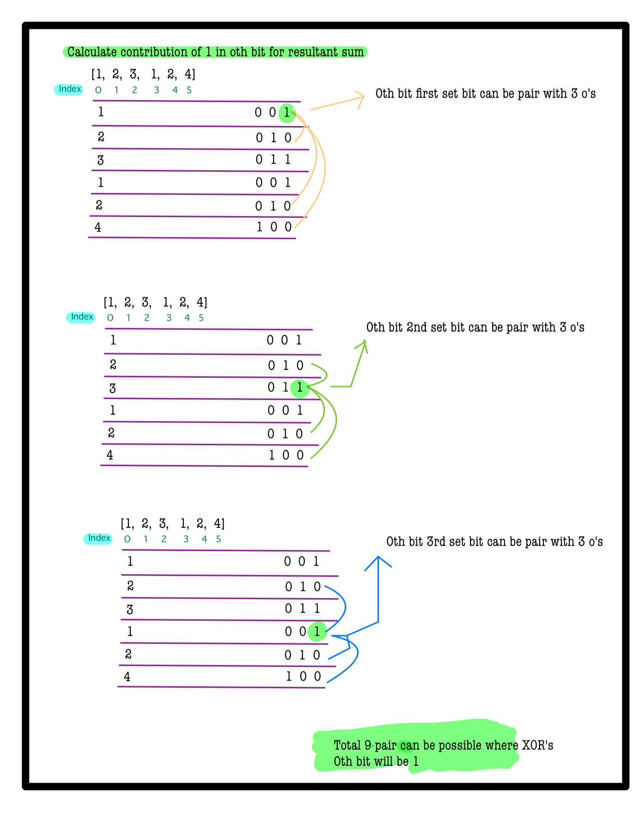
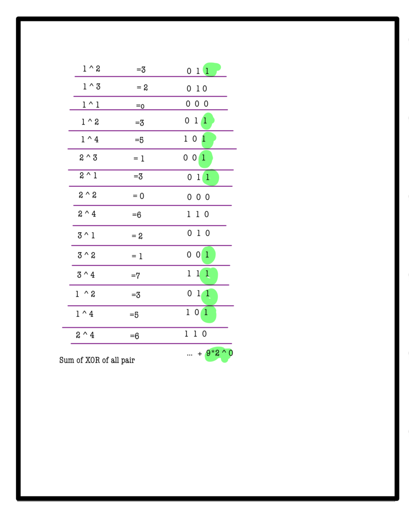
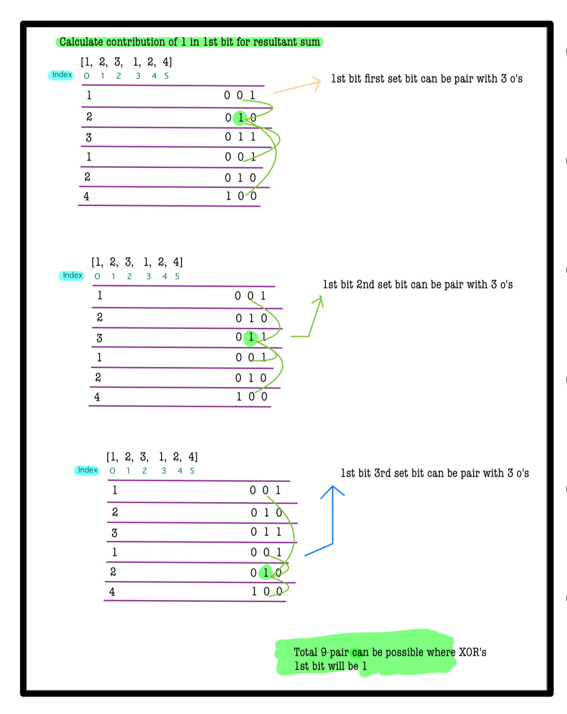
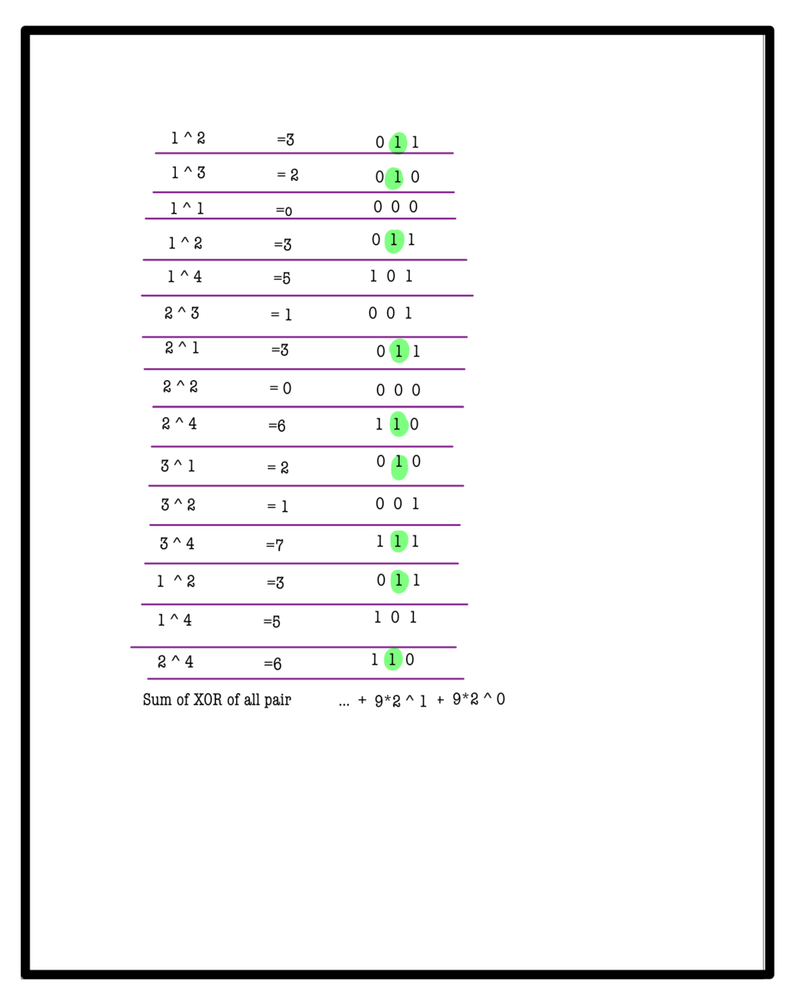
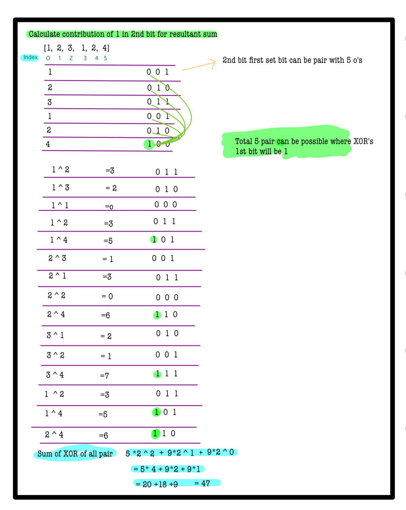
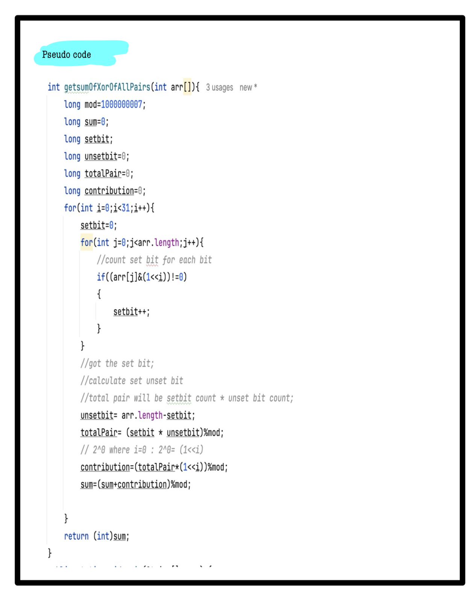

# Q3. Sum of Xor of all Pairs

**Using hints except Complete Solution is Penalty free now**  
**Use Hint**

---

## 🚀 Problem Description
Given an array **A** of **N** integers, find the sum of the bitwise XOR of all pairs of numbers in the array.  
Since the answer can be large, return the result modulo **10^9 + 7**.

---

## ⚙️ Problem Constraints
- `1 <= N <= 10^5`
- `1 <= A[i] < 10^9`

---

## 📝 Input Format
An array of integers **A**.

---

## 📤 Output Format
An integer representing the sum of XORs of all pairs in the array, modulo `10^9 + 7`.

---

## 📚 Example

### Input 1:
```plaintext
A = [1, 2, 3]
```
### output 1:
```plaintext
6
```
### Explaination 1:
```plaintext
Pair    Xor
{1, 2}  3
{1, 3}  2
{2, 3}  1
Sum of xor of all pairs = 3 + 2 + 1 = 6.
```
### Input 2:
```plaintext
A = [3, 4, 2]
```
### output 2:
```plaintext
14
```
### Explaination 2:
```plaintext
Pair    Xor
{3, 4}  7
{3, 2}  1
{4, 2}  6
Sum of xor of all pairs = 7 + 1 + 6 = 14.
```
# 📝 Problem Solutions
---
### Approach1 :
#### Source code : [sumOfXorOfAllPairs.java](../../src/bitManipulationTwo/sumOfXorOfAllPairs/approach_one/sumOfXorOfAllPairs.java)
#### Time Complexity : o(n^2)
#### Space Complexity : o(1)

 
 

---
### Approach2 :
#### Source code : [sumOfXorOfAllPairs.java](../../src/bitManipulationTwo/sumOfXorOfAllPairs/approach_two/sumOfXorOfAllPairs.java)
#### Time Complexity : o(1)
#### Space Complexity : o(1)

 
 
 
 
 
 
 
