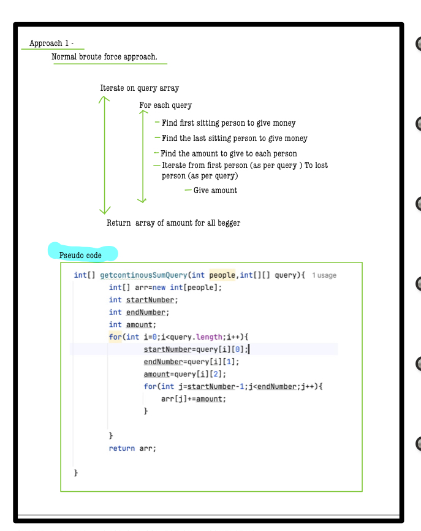

# Q2. Continuous Sum Query
---
## 🚀 Introduction
This problem involves efficiently updating ranges in an array based on multiple donations, and then calculating the final total for each beggar. It demonstrates the use of the **difference array** technique for range updates.
_Use hints to develop your solution. Complete solution approaches are penalty-free!_
---
## 📝 Problem Description
There are **A** beggars sitting in a row outside a temple. Each beggar initially has an empty pot. When devotees come to the temple, they donate some amount of coins to these beggars. Each devotee gives a fixed amount of coin (based on their faith and ability) to some **K** beggars sitting next to each other.

Given the amount **P** donated by each devotee to the beggars ranging from **L** to **R** index, where **1** <= **L** <= **R** <= **A**, find out the final amount of money in each beggar's pot at the end of the day, assuming they don't fill their pots by any other means.

For ith devotee, `B[i][0] = L`, `B[i][1] = R`, `B[i][2] = P`, given by the 2D array **B**.

---
## ⚙️ Problem Constraints
- **A:** `1 <= A <= 2 * 10^5`
- **L, R:** `1 <= L <= R <= A`
- **P:** `1 <= P <= 10^3`
- **len(B):** `0 <= len(B) <= 10^5`

---
## 📝 Input Format
- The first argument is a single integer `A`.
- The second argument is a 2D integer array `B`.

---
## 📤 Output Format
- Return an array (0-based indexing) that stores the total number of coins in each beggar's pot.

---
## 📚 Example
### Input:
```plaintext
A = 5
B = [[1, 2, 10], [2, 3, 20], [2, 5, 25]]
```
# 📝 Problem Solutions
---
### Approach1 : 
#### Source code : [continousSumQuery.java](../src/continousSumQuery/approach_one/continousSumQuery.java)
#### Time Complexity : o(qn)
#### Space Complexity : o(1)

  
  
  

 

---
### Approach2
#### Source code : [continousSumQuery.java](../src/continousSumQuery/approach_two/continousSumQuery.java)
#### Time Complexity : o(n+q)
#### Space Complexity : o(n)
  
  
  
