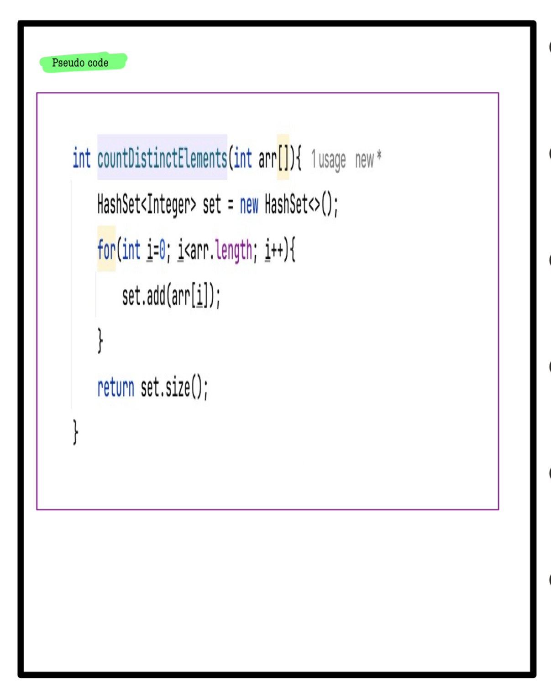

# Q2. Count distinct elements

**Problem Description**  
Given an array **A** of **N** integers, return the number of **unique** elements in the array.

---

**Problem Constraints**
- `1 <= N <= 10^5`
- `1 <= A[i] <= 10^9`

---

**Input Format**
- First argument **A** is an array of integers.

---

**Output Format**
- Return an integer representing the count of distinct elements in the array.

---

## 📚 Example

### Input 1:
```plaintext
A = [3, 4, 3, 6, 6]
```
### output 1:
```plaintext
3
```
### Explaination 1:
```plaintext
The distinct elements of the array are 3, 4 and 6.
```
### Input 2:
```plaintext
A = [3, 3, 3, 9, 0, 1, 0]
```
### output 2:
```plaintext
4
```
### Explaination 2:
```plaintext
The distinct elements of the array are 3, 9, 0 and 1.
```
# 📝 Problem Solutions
---
### Approach1 :
#### Source code : [countDistinctElements.java](../../src/hashingOne/countDistinctElements/approachOne/countDistinctElements.java)
#### Time Complexity : o(n^2)
#### Space Complexity : o(1)

 
 
 

### Approach2 :
#### Source code : [countDistinctElements.java](../../src/hashingOne/countDistinctElements/approachTwo/countDistinctElements.java)
#### Time Complexity : o(n)
#### Space Complexity : o(n)

 
 