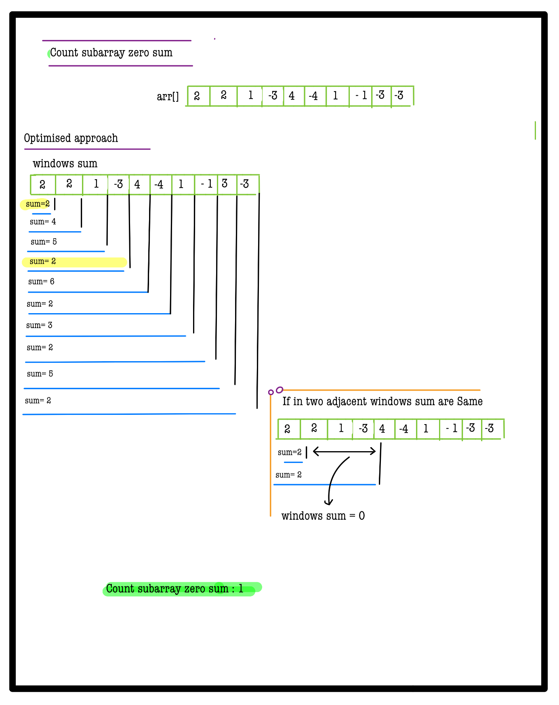
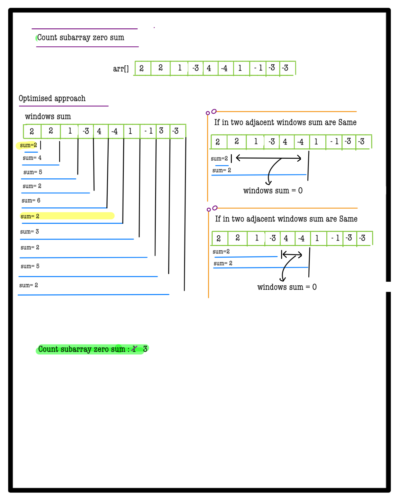
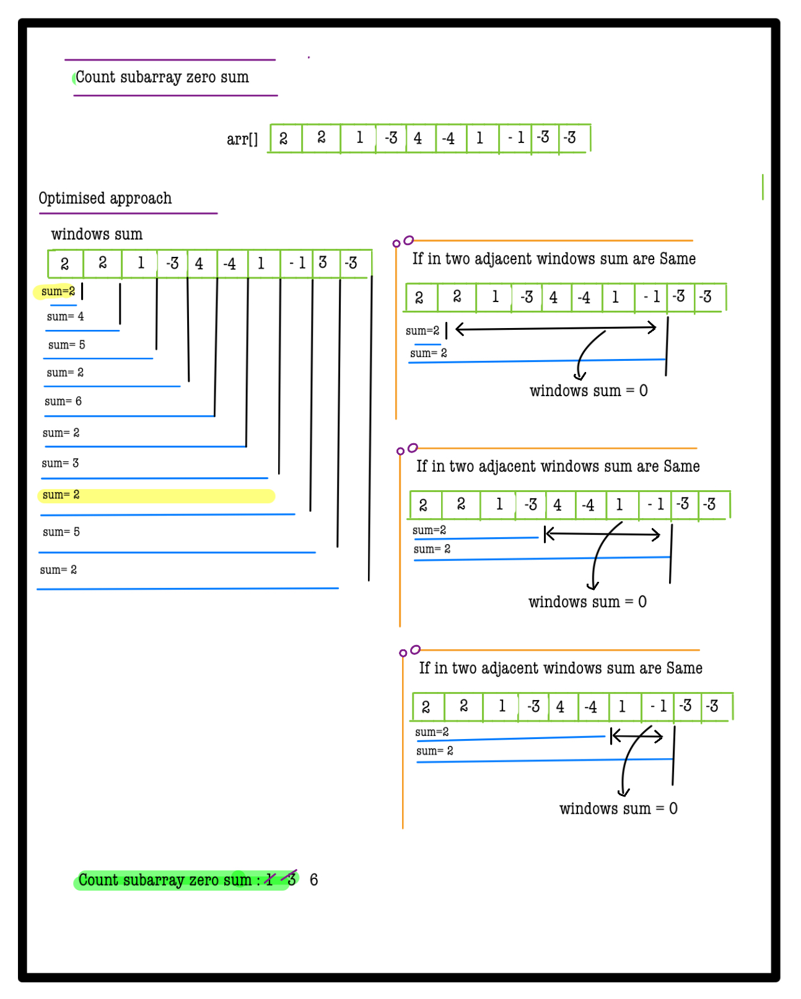
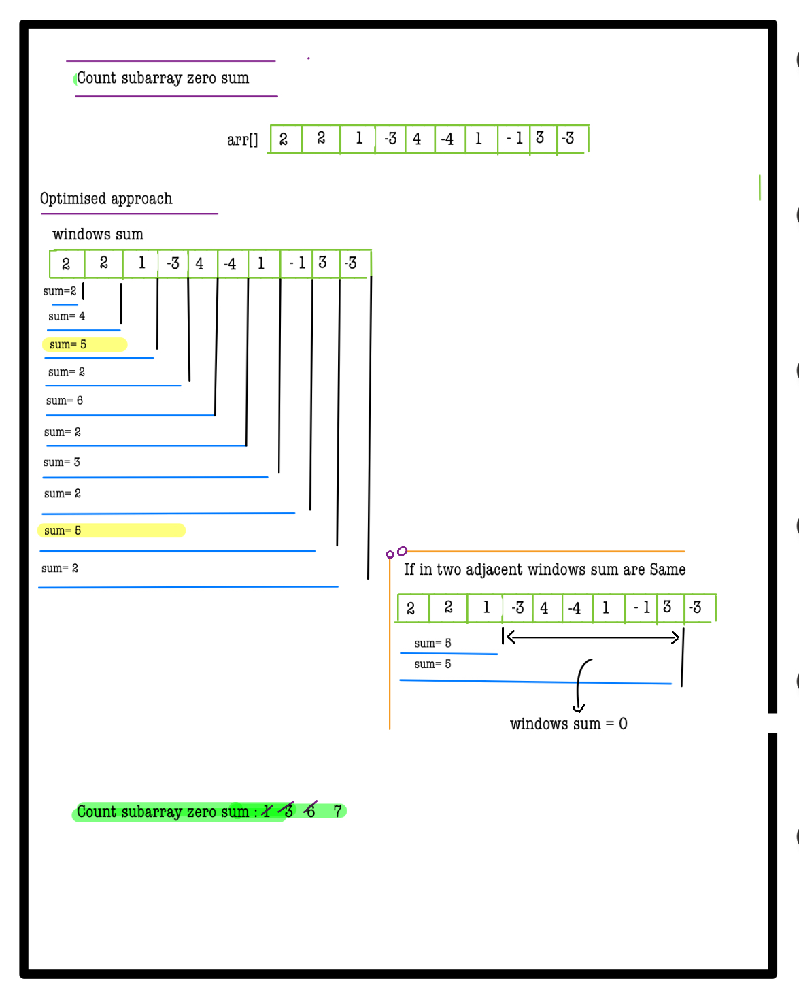
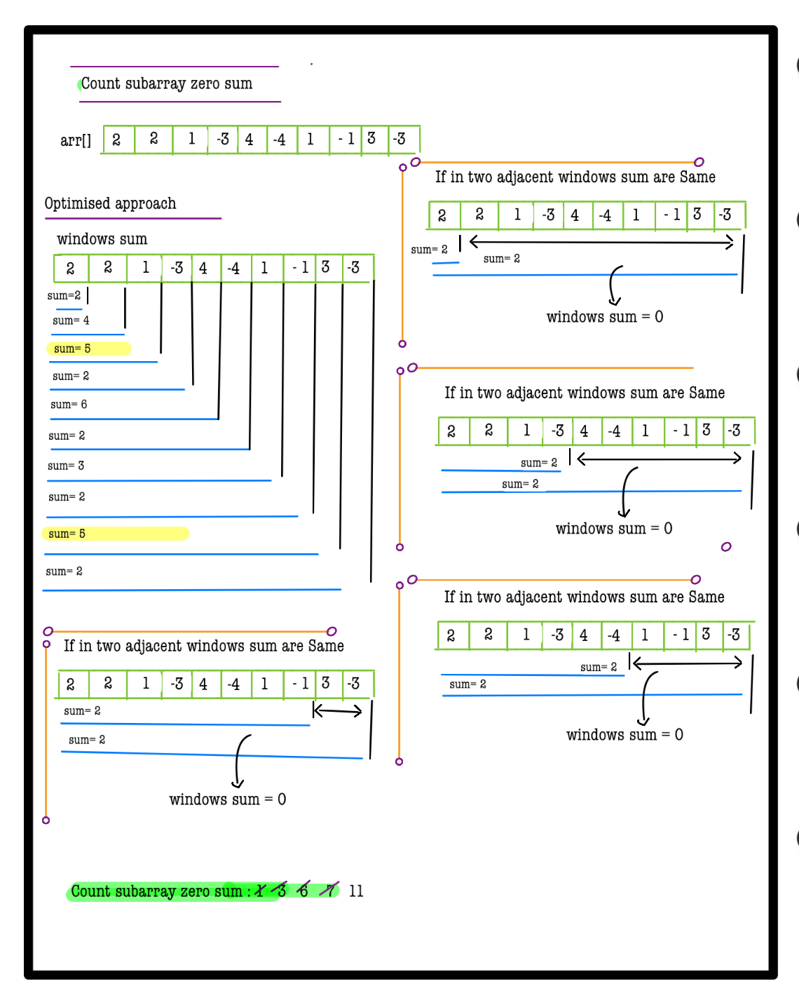
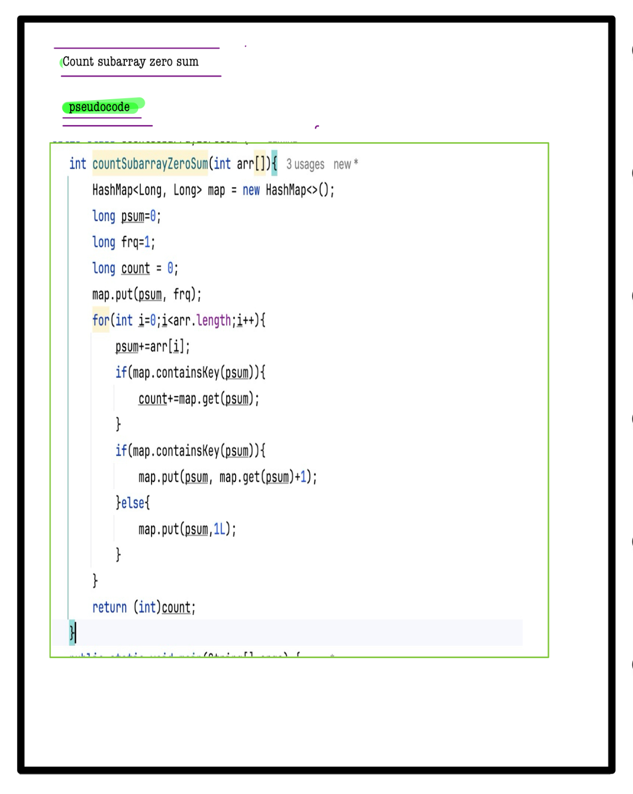

# Q2. Count Subarray Zero Sum

**Problem Description**  
Given an array **A** of **N** integers, find the count of subarrays in the array which sum to zero. Since the answer can be very large, return the remainder when dividing the result by \(10^9 + 7\).

---

**Problem Constraints**
- `1 <= N <= 10^5`
- `-10^9 <= A[i] <= 10^9`

---

**Input Format**
- A single argument which is an integer array **A**.

---

**Output Format**
- Return an integer denoting the count of subarrays with sum zero modulo \(10^9 + 7\).

---

## 📚 Example

### Input 1:
```plaintext
 A = [1, -1, -2, 2]
```
### output 1:
```plaintext
3
```
### Explaination 1:
```plaintext
 The subarrays with zero sum are [1, -1], [-2, 2] and [1, -1, -2, 2].
```
### Input 2:
```plaintext
 A = [-1, 2, -1]
```
### output 2:
```plaintext
1
```
### Explaination 2:
```plaintext
 The subarray with zero sum is [-1, 2, -1].
```

# 📝 Problem Solutions
---
### Approach1 :
#### Source code : [countSubarrayZeroSum.java](../../src/hashingOne/countSubarrayZeroSum/approachOne/countSubarrayZeroSum.java)
#### Time Complexity : o(n^2)
#### Space Complexity : o(1)

 
 
 
 
 
 
