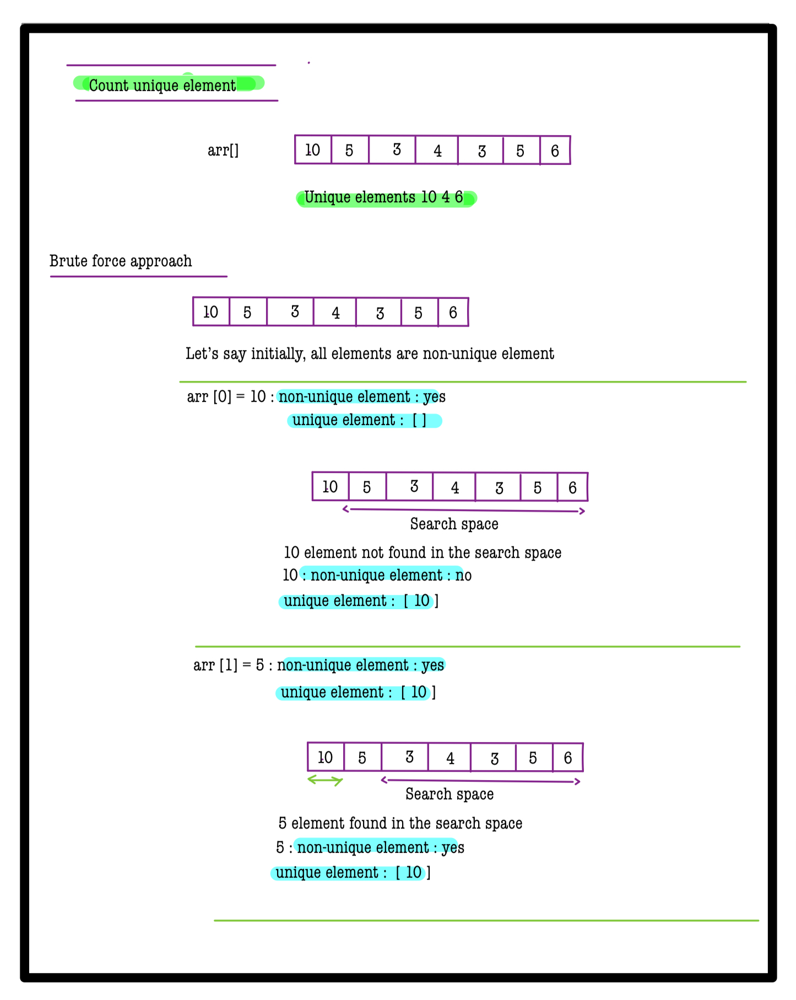
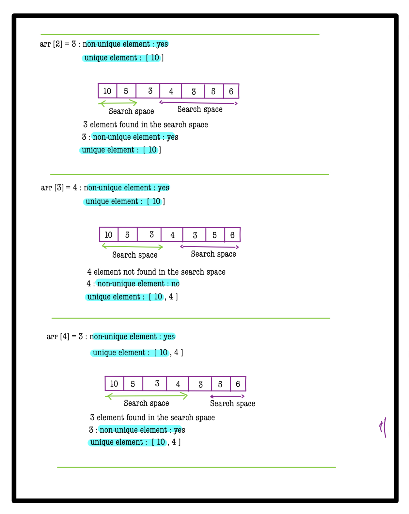
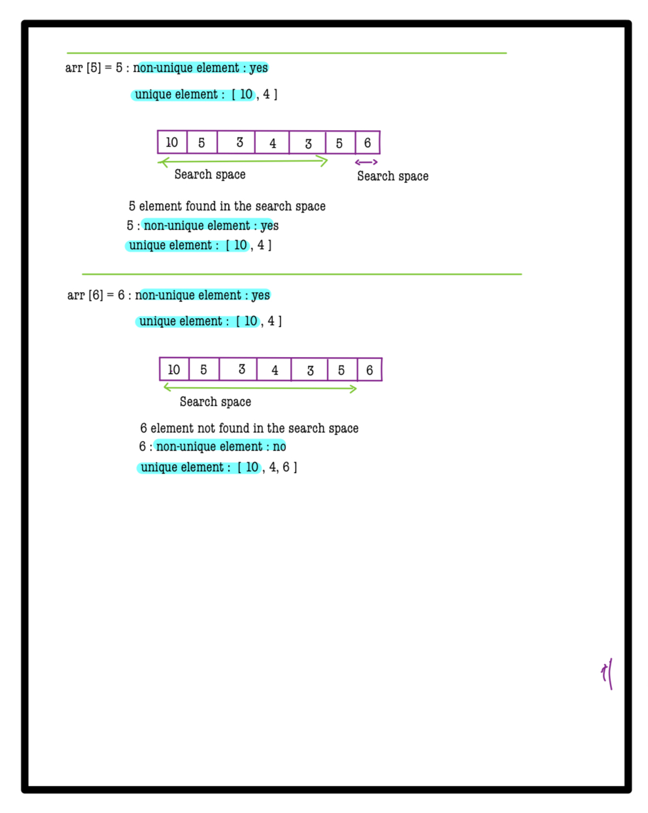
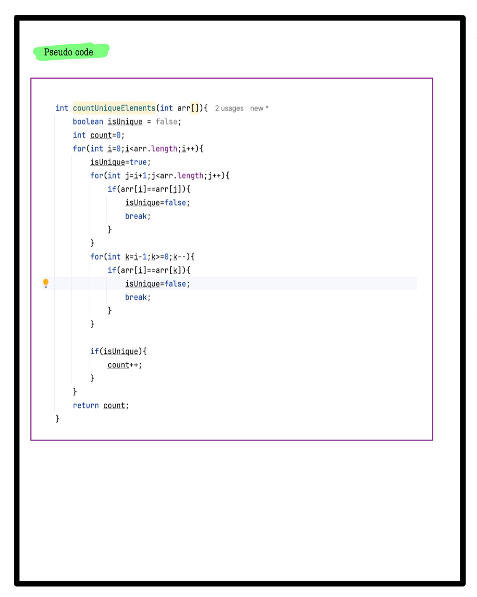
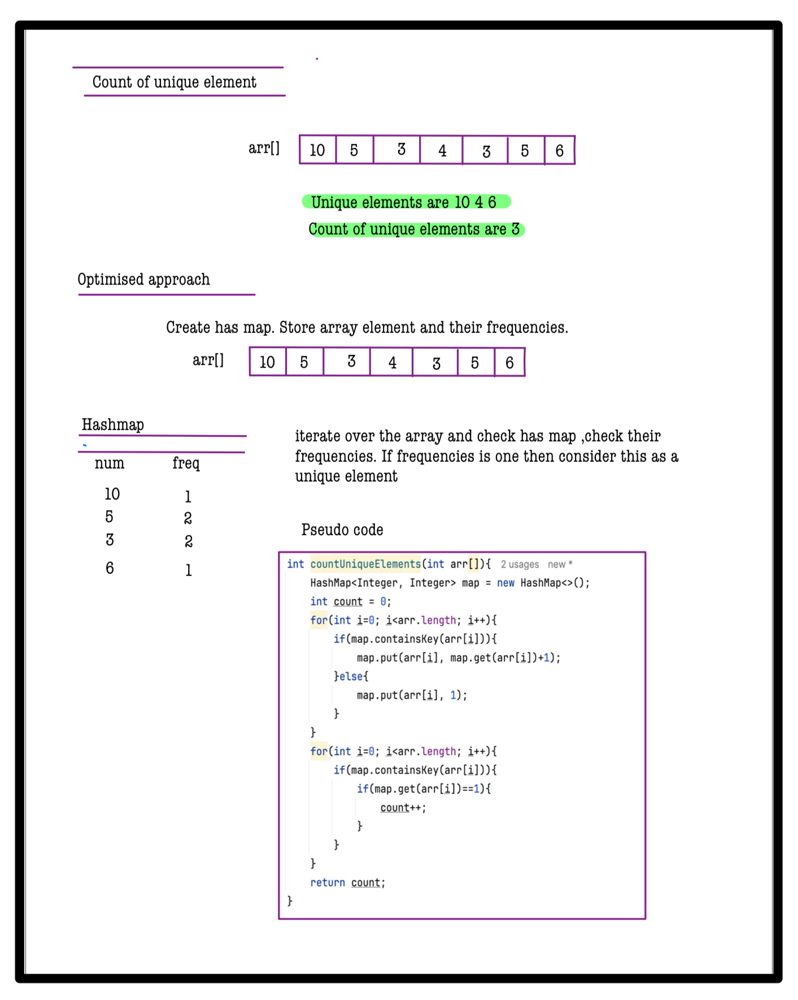

# Q1. Count unique elements

**Problem Description**  
You are given an array **A** of **N** integers. Return the count of elements that have a frequency of **1** in the given array.

---

**Problem Constraints**
- `1 <= N <= 10^5`
- `1 <= A[i] <= 10^9`

---

**Input Format**
- The first argument **A** is an array of integers.

---

**Output Format**
- Return an integer representing the count of elements with frequency 1.

---
## 📚 Example

### Input 1:
```plaintext
A = [3, 4, 3, 6, 6]
```
### output 1:
```plaintext
1
```
### Explaination 1:
```plaintext
Only the element 4 has a frequency 1.
```
### Input 2:
```plaintext
A = [3, 3, 3, 9, 0, 1, 0]
```
### output 2:
```plaintext
2
```
### Explaination 2:
```plaintext
The elements 9 and 1 has a frequncy 1.
```

# 📝 Problem Solutions
---
### Approach1 :
#### Source code : [countUniqueElements.java](../../src/hashingOne/countUniqueElements/approachOne/countUniqueElements.java)
#### Time Complexity : o(n^2)
#### Space Complexity : o(1)

 
 
 
 

### Approach2 :
#### Source code : [countUniqueElements.java](../../src/hashingOne/countUniqueElements/approachOne/countUniqueElements.java)
#### Time Complexity : o(n)
#### Space Complexity : o(n)

 
