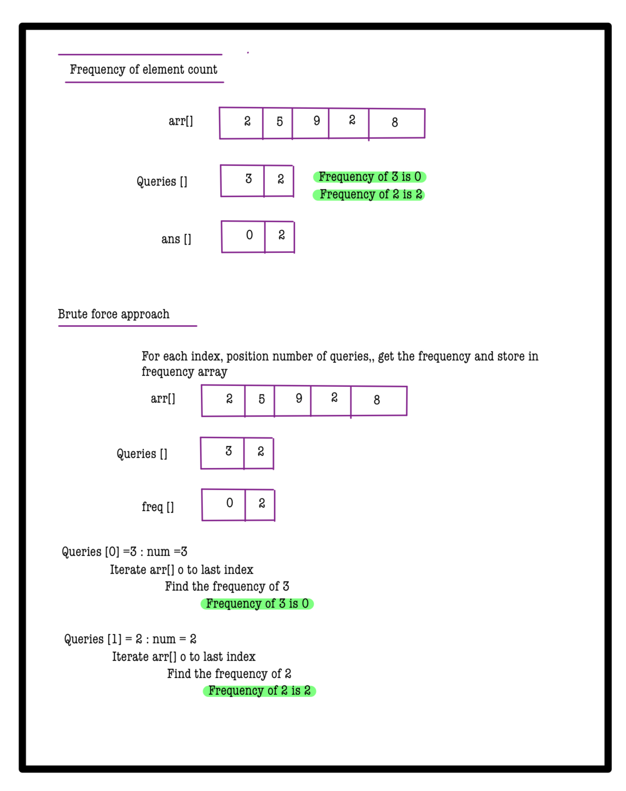
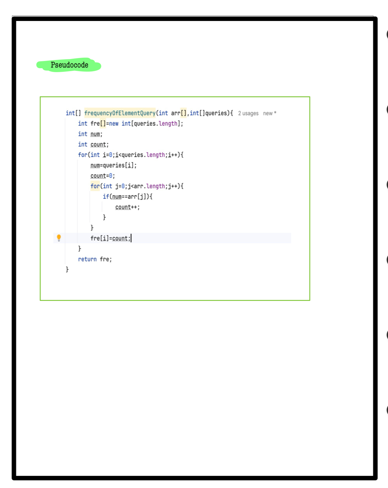

# Q1. Frequency of element query

**Problem Description**  
SCALER organizes a series of contests aimed at helping learners enhance their coding skills. Each learner can participate in multiple contests, and their participation is represented by integers in an array. The goal is to identify how frequently each learner has participated in these contests. This information will help SCALER determine which learners are participating the least, allowing them to provide targeted support and encouragement.

Given an array **A** that represents the participants of various contests, where each integer corresponds to a specific learner, and an array **B** containing the learners for whom you want to check participation frequency, your task is to find the frequency of each learner from array B in array A and return a list containing all these frequencies.

---

**Problem Constraints**
- `1 <= |A| <= 10^5`
- `1 <= |B| <= 10^5`
- `1 <= A[i] <= 10^5`
- `1 <= B[i] <= 10^5`

---

**Input Format**
- First argument, **A**, is an array of integers.
- Second argument, **B**, is an array of integers denoting the queries.

---

**Output Format**
- Return an array of integers containing the frequency of each learner in **B** as found in array **A**.

---

## 📚 Example

### Input 1:
```plaintext
A = [1, 2, 1, 1]
B = [1, 2]
```
### output 1:
```plaintext
[3, 1]
```
### Explaination 1:
```plaintext
The frequency of learner 1 in the array A is 3 (they participated in three contests).
The frequency of learner 2 in the array A is 1 (they participated in one contest).
```
### Input 2:
```plaintext
A = [2, 5, 9, 2, 8]
B = [3, 2]
```
### output 2:
```plaintext
[0, 2]
```
### Explaination 2:
```plaintext
The frequency of learner 3 in the array A is 0 (they did not participate in any contest).
The frequency of learner 2 in the array A is 2 (they participated in two contests).
```
# 📝 Problem Solutions
---
### Approach1 :
#### Source code : [frequencyOfElementQuery.java](../../src/hashingOne/frequencyOfElementQuery/approachOne/frequencyOfElementQuery.java)
#### Time Complexity : o(q*n)
#### Space Complexity : o(q)

 
 
