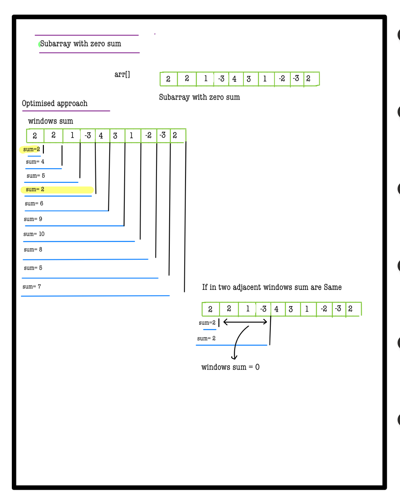
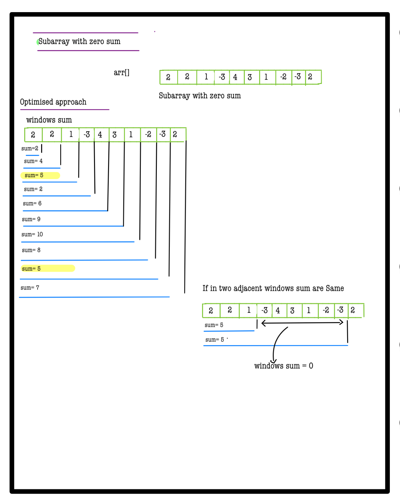
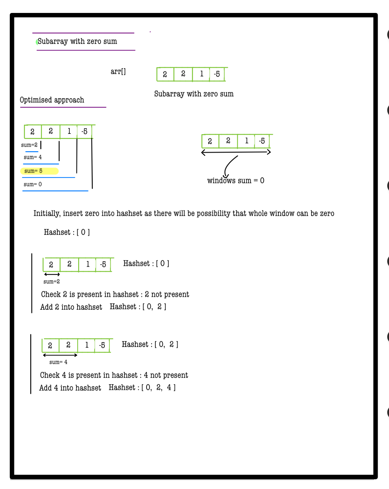
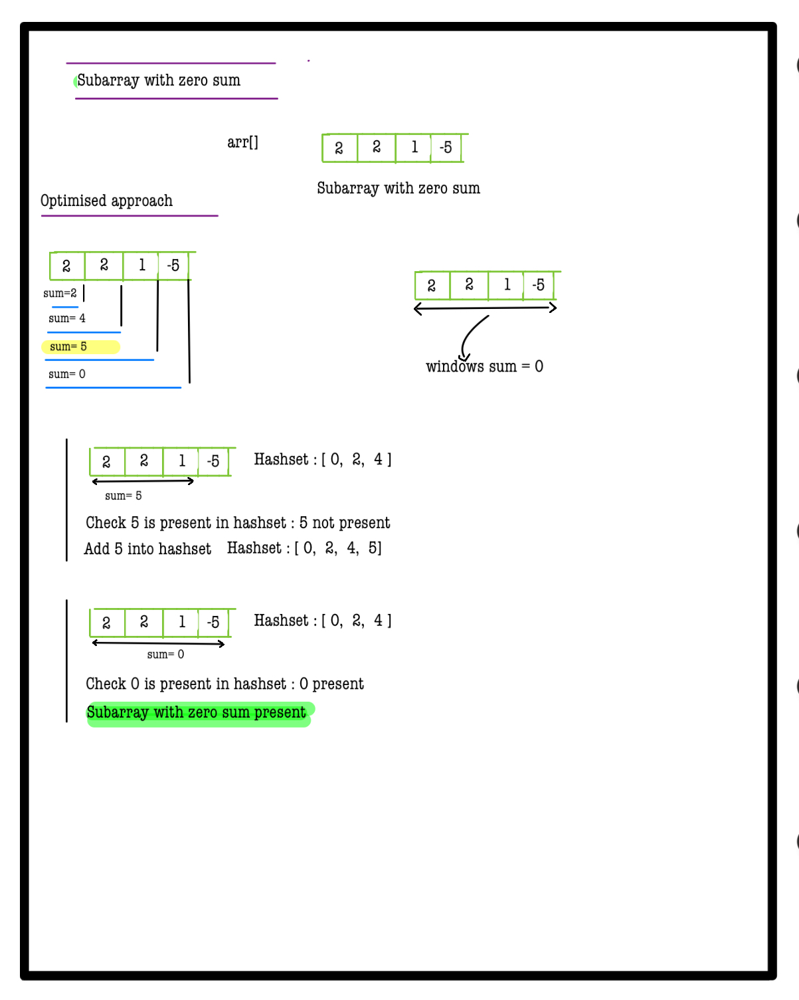
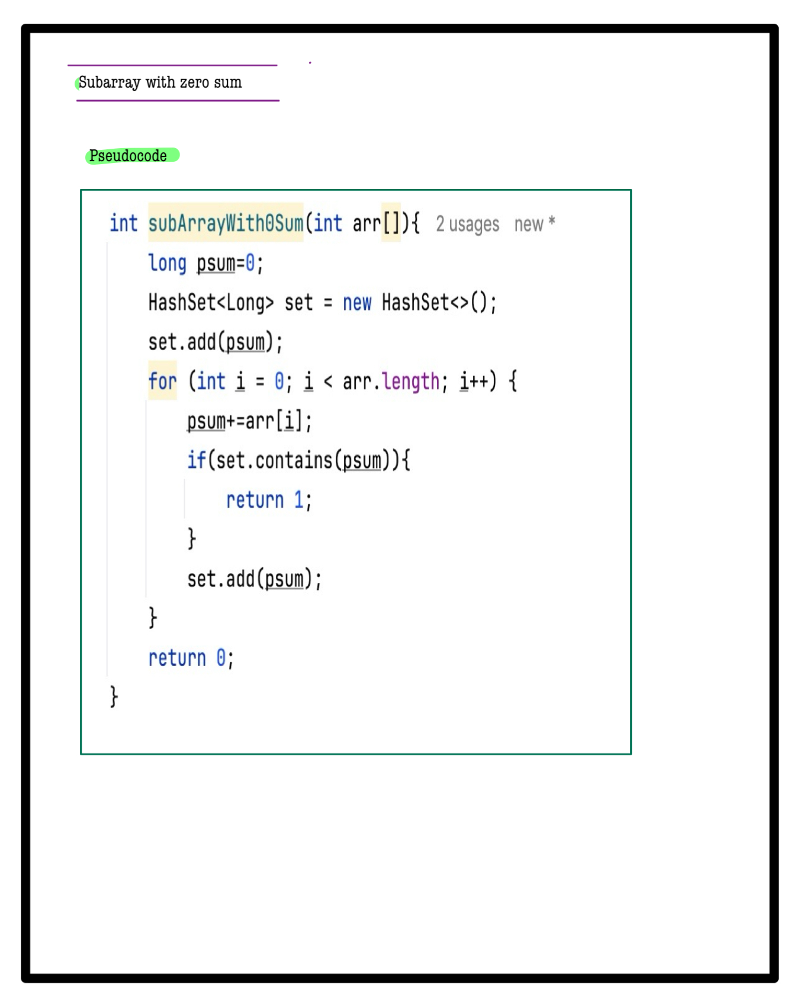

# Q4. Sub-array with 0 sum

**Problem Description**  
Given an array of integers **A**, find and return whether the given array contains a **non-empty** subarray with a sum equal to 0.  
If the given array contains such a sub-array, return 1; otherwise, return 0.

---

**Problem Constraints**
- `1 <= |A| <= 100000`
- `-10^9 <= A[i] <= 10^9`

---

**Input Format**
- The only argument given is the integer array **A**.

---

**Output Format**
- Return 1 if there exists a subarray with sum 0, else return 0.

---

## 📚 Example

### Input 1:
```plaintext
 A = [1, 2, 3, 4, 5]
```
### output 1:
```plaintext
0
```
### Explaination 1:
```plaintext
 No subarray has sum 0.
```
### Input 2:
```plaintext
 A = [4, -1, 1]
```
### output 2:
```plaintext
1
```
### Explaination 2:
```plaintext
 The subarray [-1, 1] has sum 0.
```
# 📝 Problem Solutions
---
### Approach1 :
#### Source code : [subArrayWith0Sum.java](../../src/hashingOne/subArrayWith0Sum/approachOne/subArrayWith0Sum.java)
#### Time Complexity : o(n)
#### Space Complexity : o(n)

 
 
 
 
 
