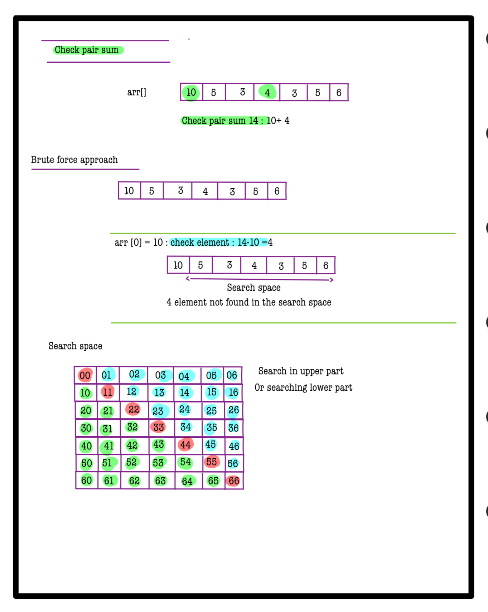
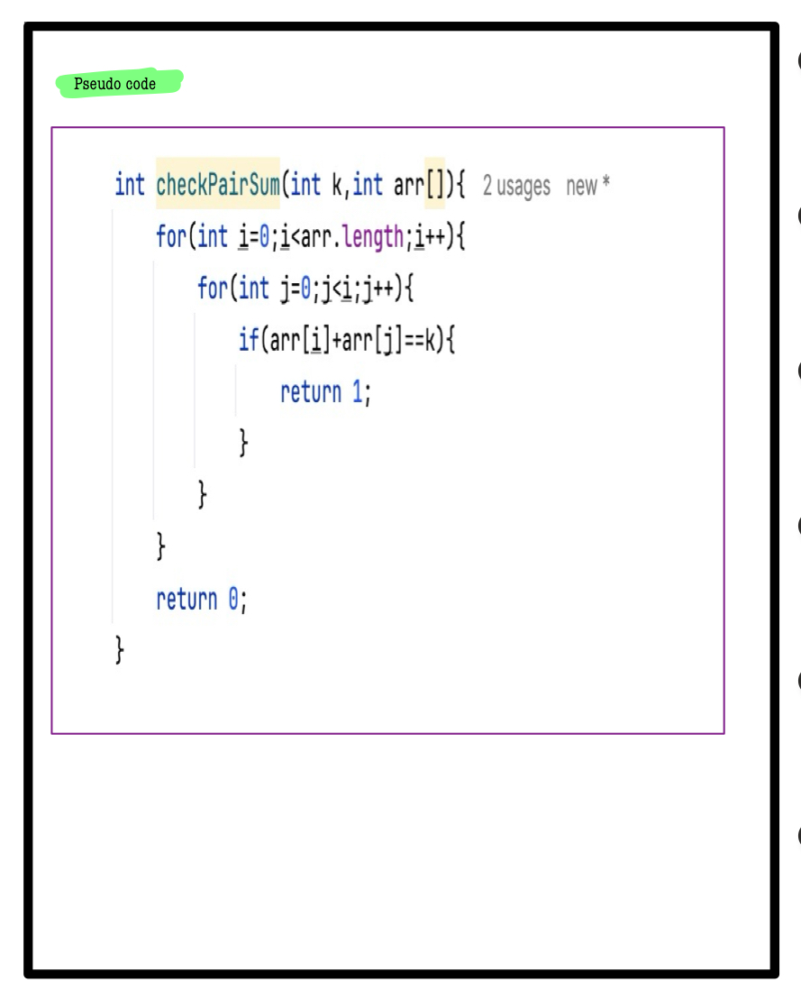
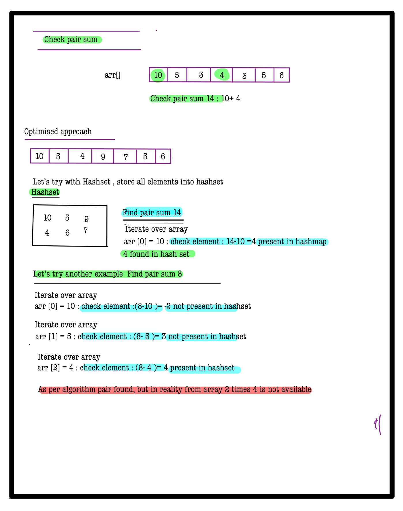
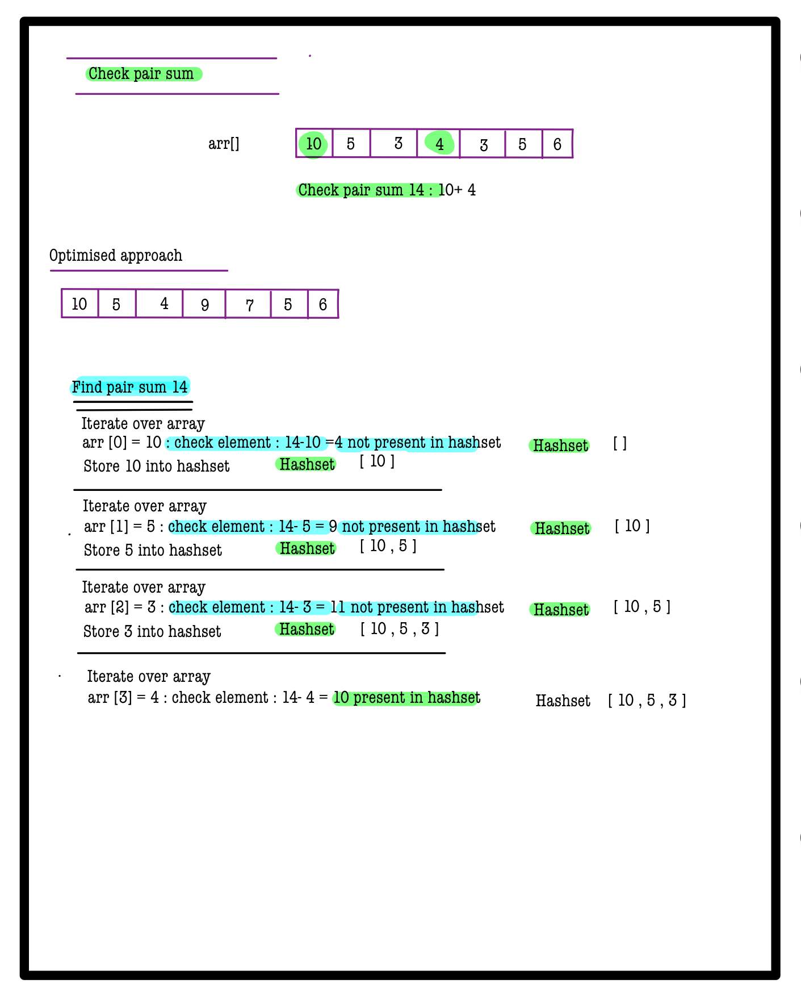
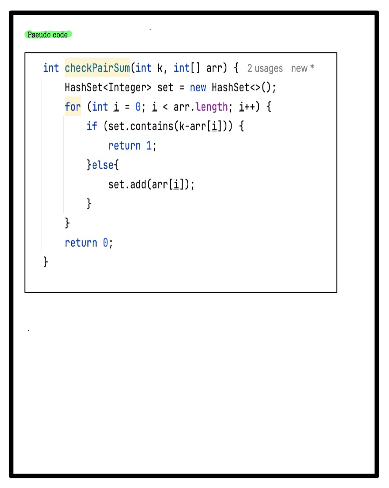

# Q1. Check Pair Sum

**Problem Description**  
Given an array of integers **B**, and a target sum **A**, check if there exists a pair `(i, j)` such that `B[i] + B[j] = A` and `i != j`.

---

**Problem Constraints**
- `1 <= length of array B <= 10^5`
- `0 <= B[i] <= 10^9`
- `0 <= A <= 10^9`

---

**Input Format**
- First argument **A** is the target sum.
- Second argument is the array **B**.

---

**Output Format**
- Return an integer value **1** if such a pair exists, else return **0**.

---


## 📚 Example

### Input 1:
```plaintext
A = 8   
B = [3, 5, 1, 2, 1, 2]
```
### output 1:
```plaintext
1
```
### Explaination 1:
```plaintext
It is possible to obtain sum 8 using 3 and 5.
```
### Input 2:
```plaintext
A = 21   
B = [9, 10, 7, 10, 9, 1, 5, 1, 5]
```
### output 2:
```plaintext
0
```
### Explaination 2:
```plaintext
There is no such pair exists.
```

# 📝 Problem Solutions
---
### Approach1 :
#### Source code : [checkPairSum.java](../../src/hashingTwo/checkPairSum/approachOne/checkPairSum.java)
#### Time Complexity : o(n^2)
#### Space Complexity : o(1)

 
 


### Approach2 :
#### Source code : [checkPairSum.java](../../src/hashingTwo/checkPairSum/approachTwo/checkPairSum.java)
#### Time Complexity : o(n)
#### Space Complexity : o(n)

 
 
 