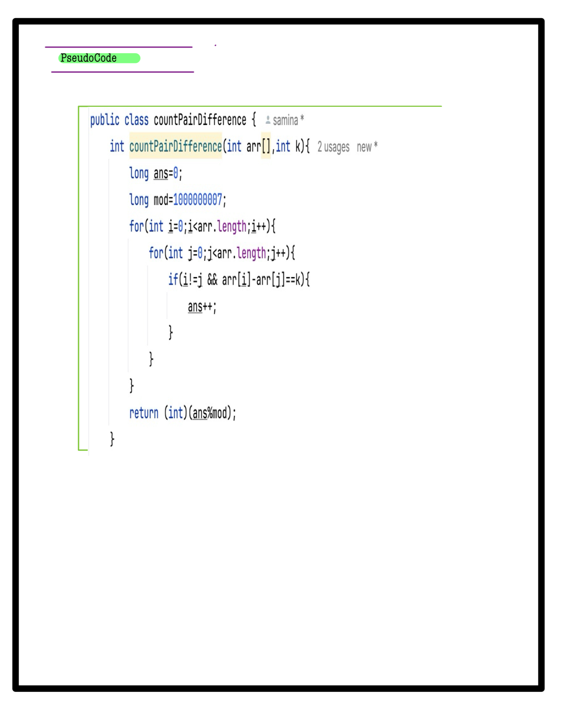
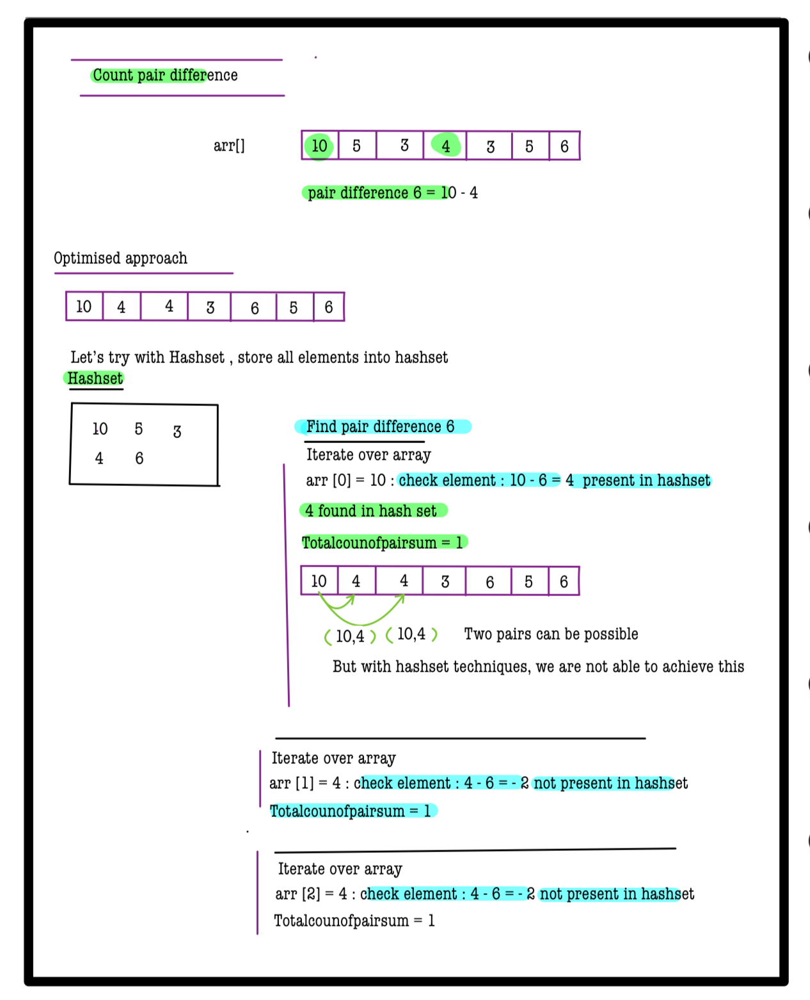
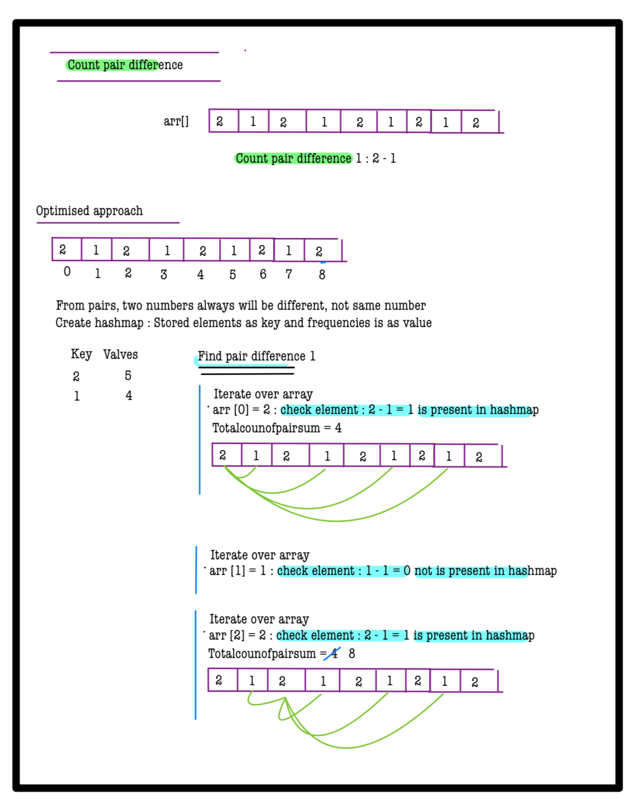
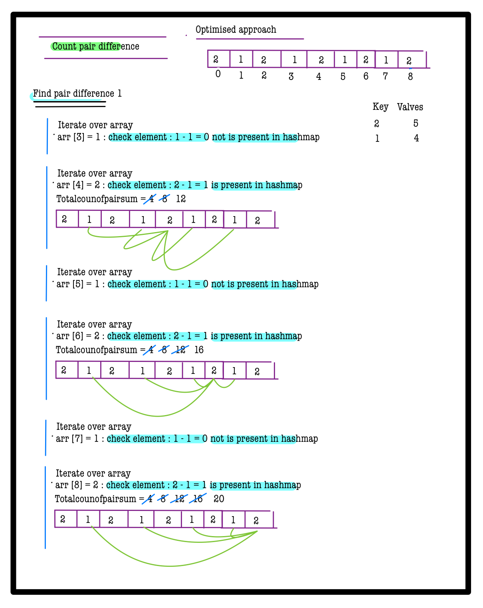
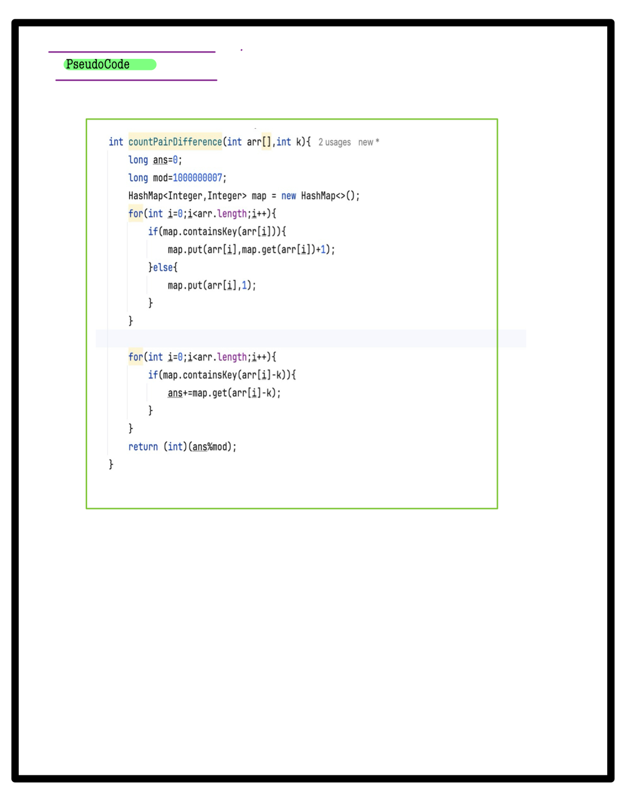

# Q2. Count Pair Difference

**Problem Description**  
You are given an array **A** of **N** integers and an integer **B**.  
Count the number of pairs `(i, j)` such that `A[i] - A[j] = B` and `i != j`.

Since the answer can be very large, return the remainder after dividing the count with \(10^9 + 7\).

---

**Problem Constraints**
- `1 <= N <= 10^5`
- `1 <= A[i] <= 10^9`
- `1 <= B <= 10^9`

---

**Input Format**
- First argument **A** is an array of integers.
- Second argument **B** is an integer.

---

**Output Format**
- Return an integer denoting the count of pairs `(i, j)` satisfying the condition, modulo \(10^9 + 7\).

---


## 📚 Example

### Input 1:
```plaintext
A = [3, 5, 1, 2]
B = 4
```
### output 1:
```plaintext
1
```
### Explaination 1:
```plaintext
The only pair is (2, 3) which gives difference as 4
```
### Input 2:
```plaintext
A = [1, 2, 1, 2]
B = 1
```
### output 2:
```plaintext
4
```
### Explaination 2:
```plaintext
The pair which gives difference as 3 are (2, 1), (4, 1), (2, 3) and (4, 3). 
```

# 📝 Problem Solutions
---
### Approach1 :
#### Source code : [countPairDifference.java](../../src/hashingTwo/countPairDifference/approachOne/countPairDifference.java)
#### Time Complexity : o(n^2)
#### Space Complexity : o(1)

 


### Approach2 :
#### Source code : [countPairDifference.java](../../src/hashingTwo/countPairDifference/approachTwo/countPairDifference.java)
#### Time Complexity : o(n)
#### Space Complexity : o(n)

 
 
 
 