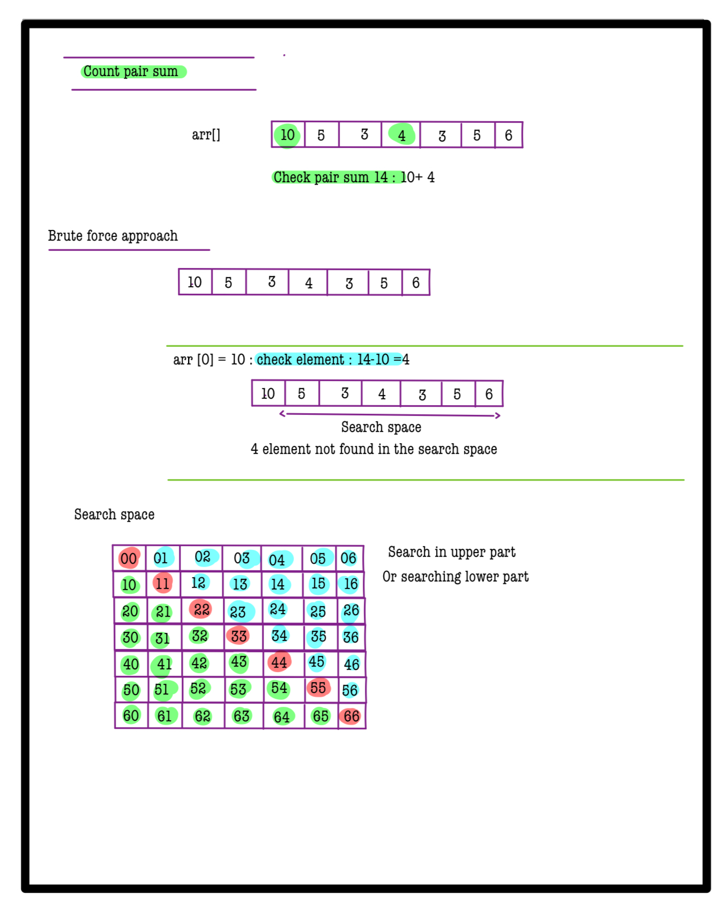
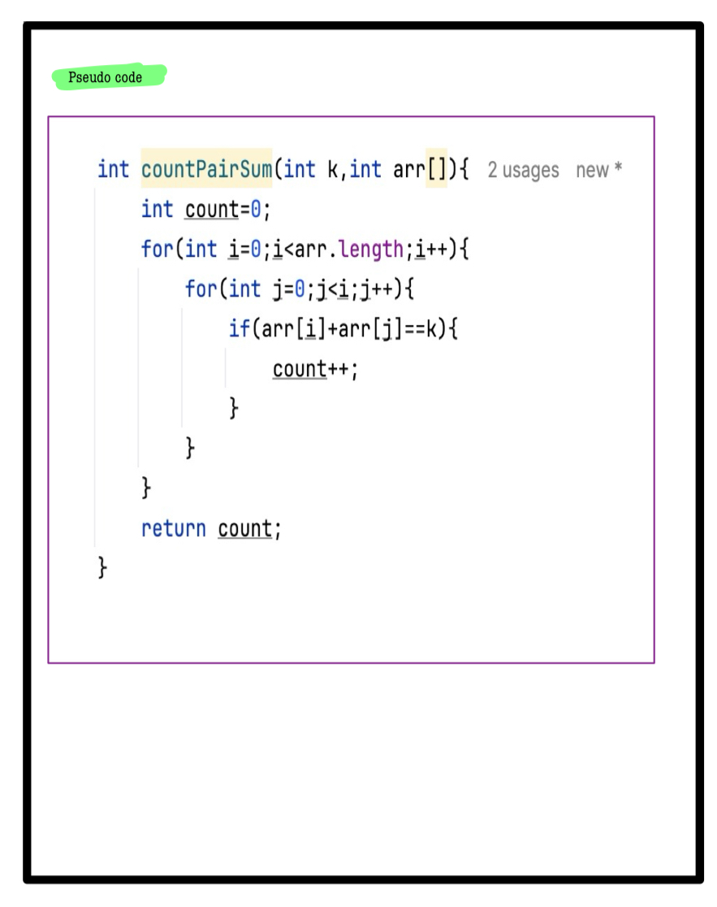
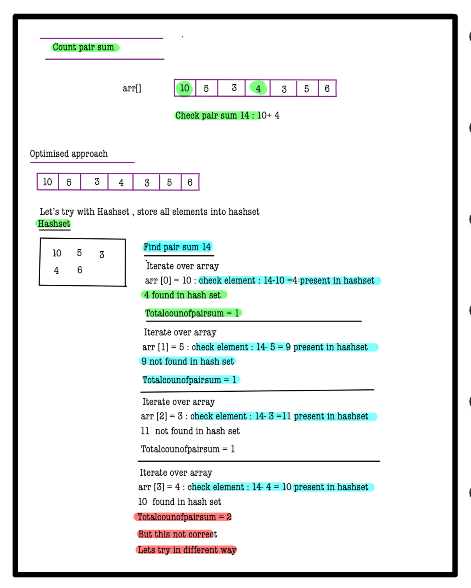
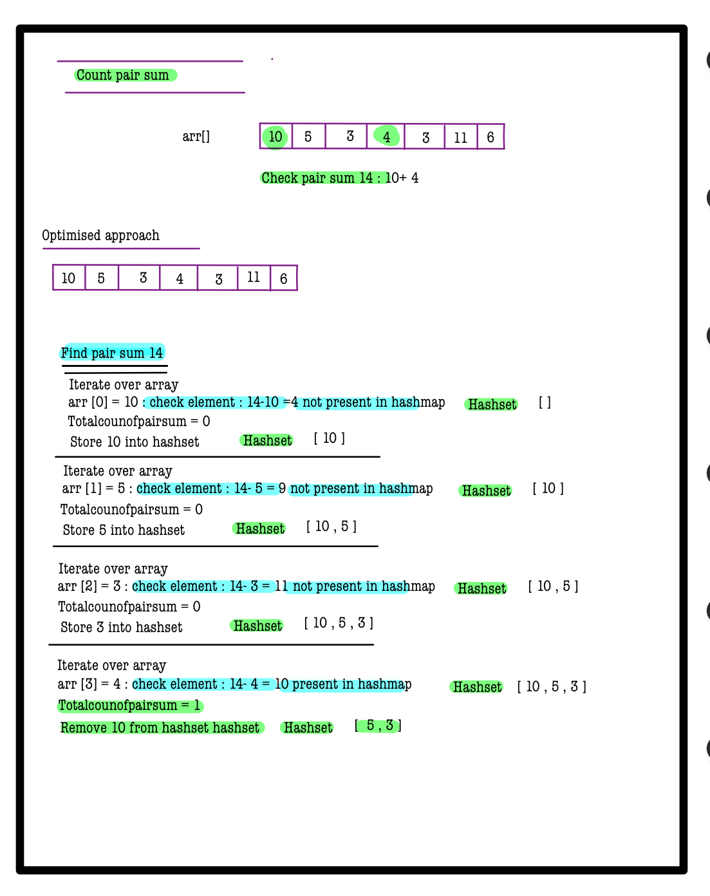
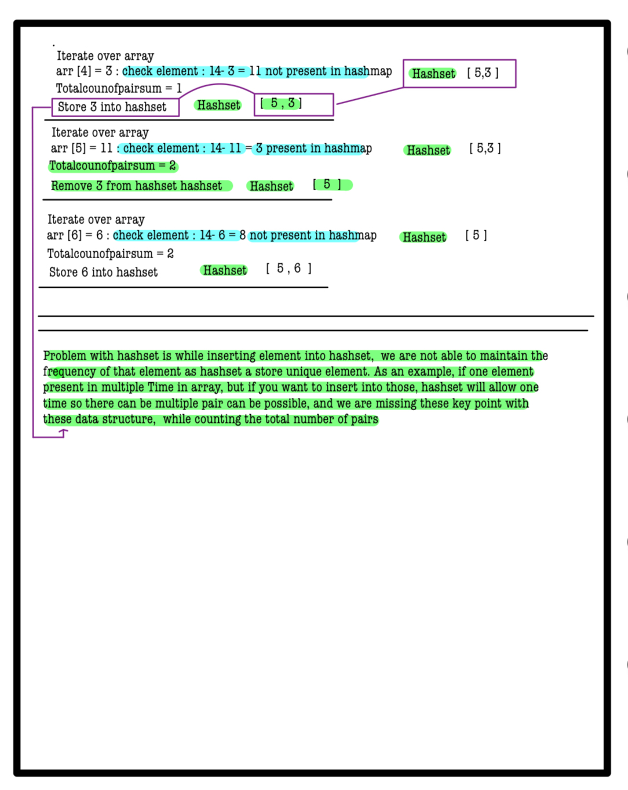
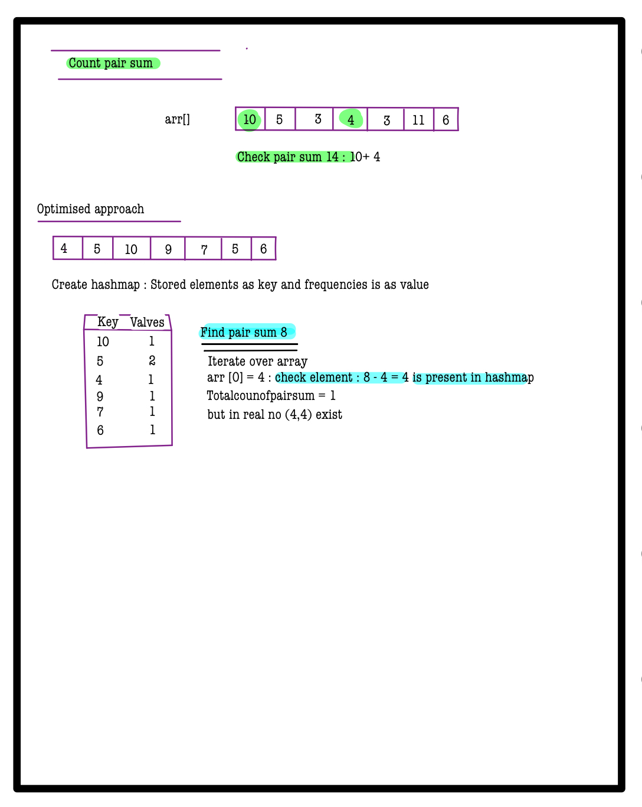
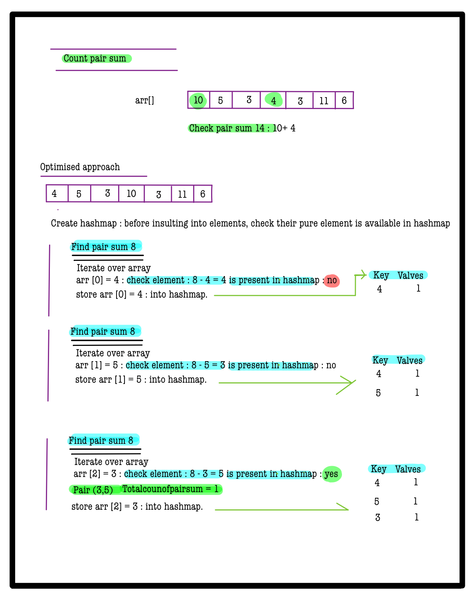
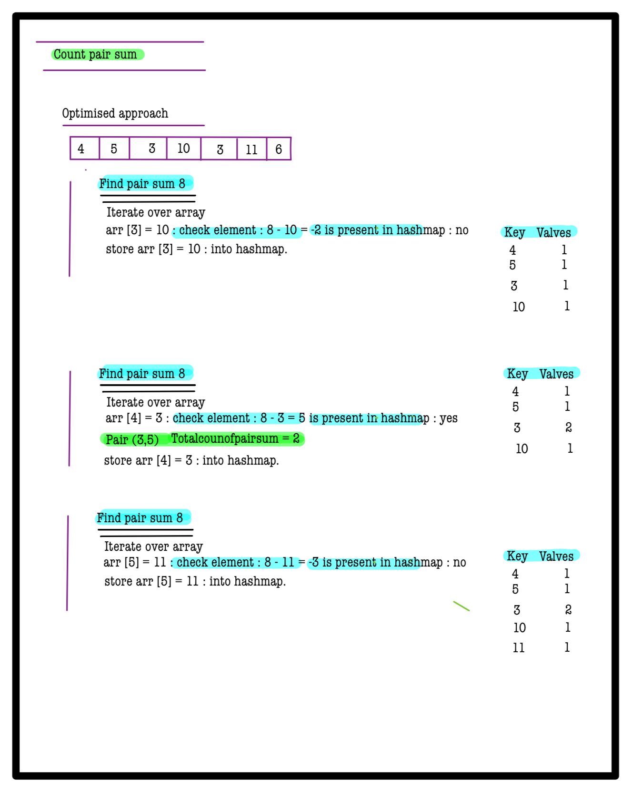
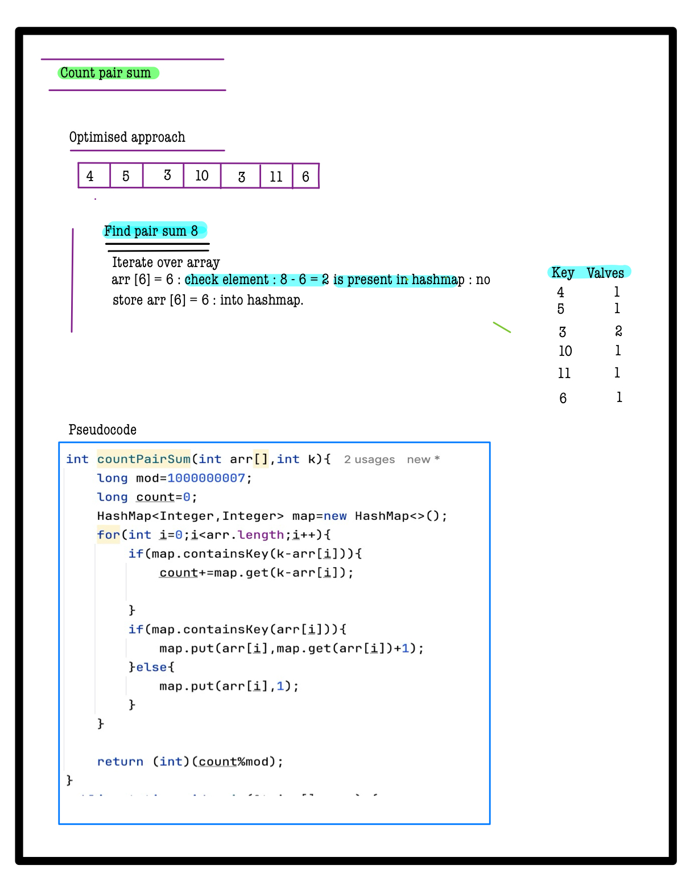

# Q1. Count Pair Sum

**Problem Description**  
You are given an array **A** of **N** integers and an integer **B**.  
Count the number of **unique pairs `(i, j)`** such that `A[i] + A[j] = B` and `i != j`.

Since the answer can be very large, return the remainder after dividing the count by \(10^9 + 7\).

**Note:** The pair `(i, j)` is considered the same as `(j, i)`; each pair should be counted only once.

---

**Problem Constraints**
- `1 <= N <= 10^5`
- `1 <= A[i] <= 10^9`
- `1 <= B <= 10^9`

---

**Input Format**
- First argument: array **A** of integers
- Second argument: integer **B**

---

**Output Format**
- Return an integer denoting the count of unique pairs satisfying the sum condition, modulo \(10^9 + 7\).

---


## 📚 Example

### Input 1:
```plaintext
A = [3, 5, 1, 2]
B = 8
```
### output 1:
```plaintext
1
```
### Explaination 1:
```plaintext
The only pair is (1, 2) which gives sum 8
```
### Input 2:
```plaintext
A = [1, 2, 1, 2]
B = 3
```
### output 2:
```plaintext
4
```
### Explaination 2:
```plaintext
The pair which gives sum as 3 are (1, 2), (1, 4), (2, 3) and (3, 4). 
```
# 📝 Problem Solutions
---
### Approach1 :
#### Source code : [countPairSum.java](../../src/hashingTwo/countPairSum/approachOne/countPairSum.java)
#### Time Complexity : o(n^2)
#### Space Complexity : o(1)

 
 


### Approach2 :
#### Source code : [countPairSum.java](../../src/hashingTwo/countPairSum/approachTwo/countPairSum.java)
#### Time Complexity : o(n)
#### Space Complexity : o(n)

 
 
 
 
 
 
 