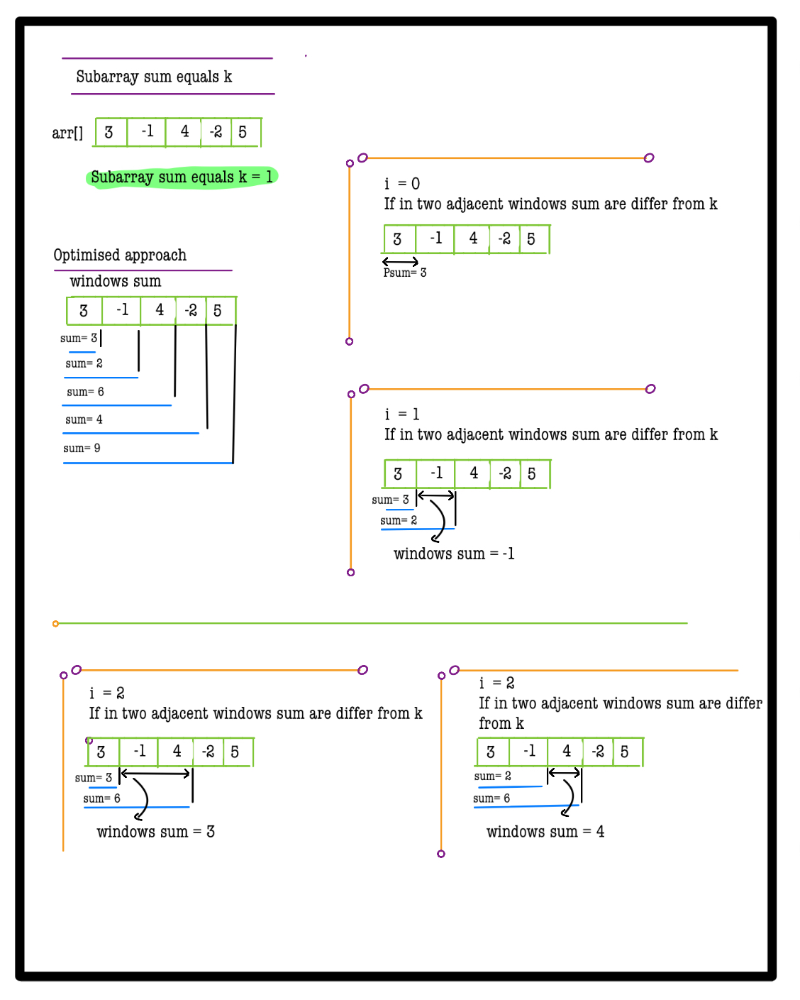
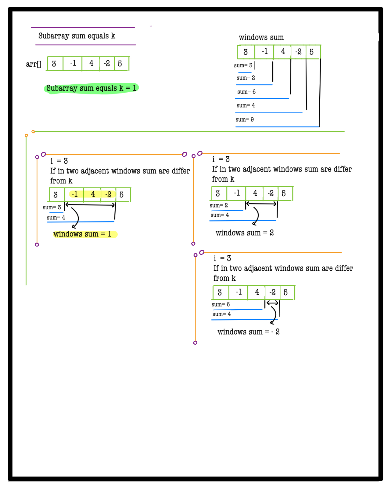
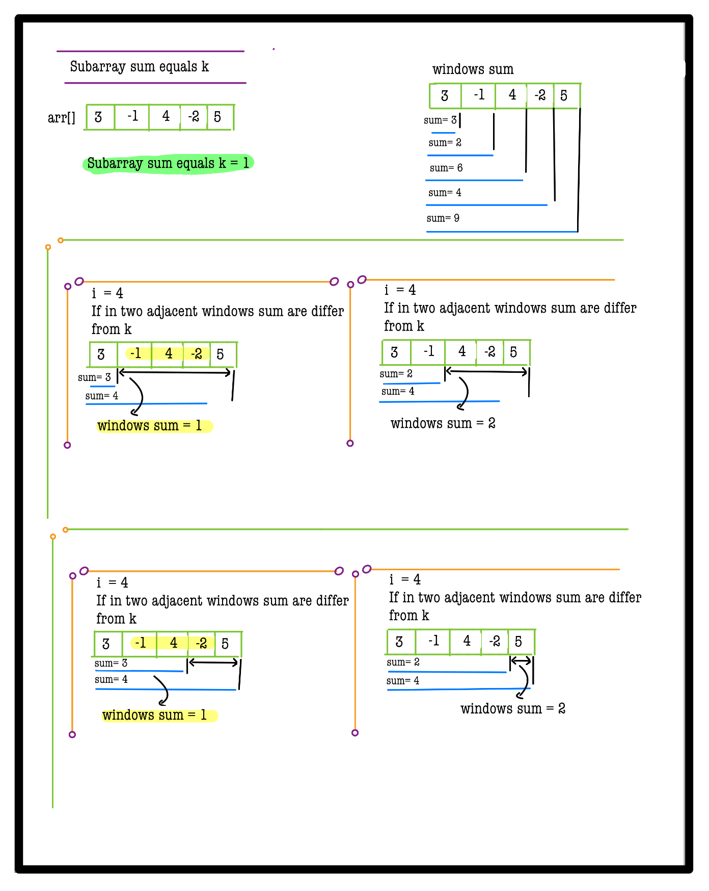
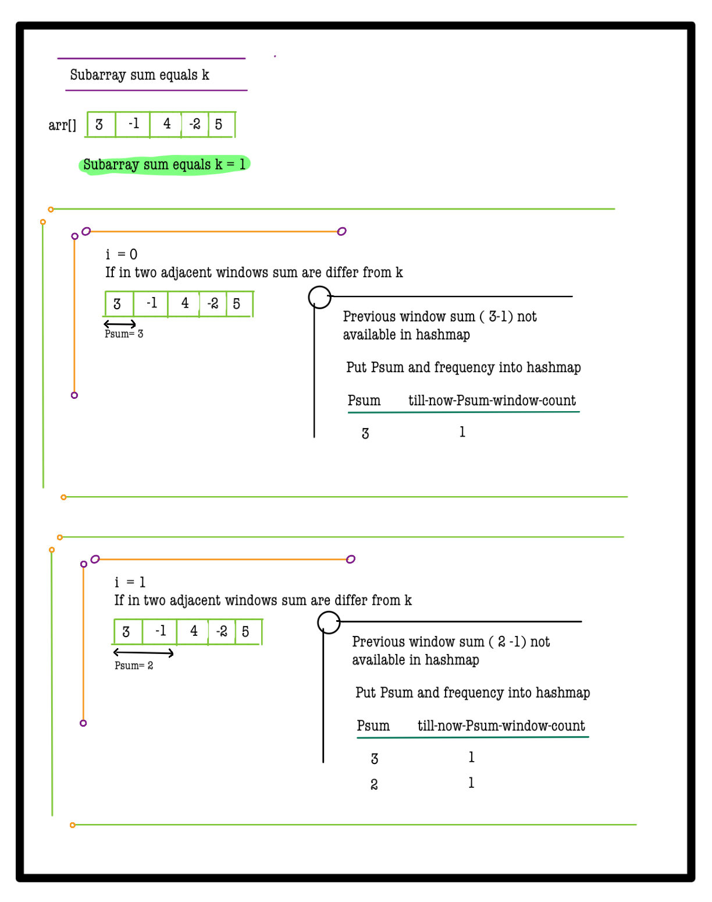
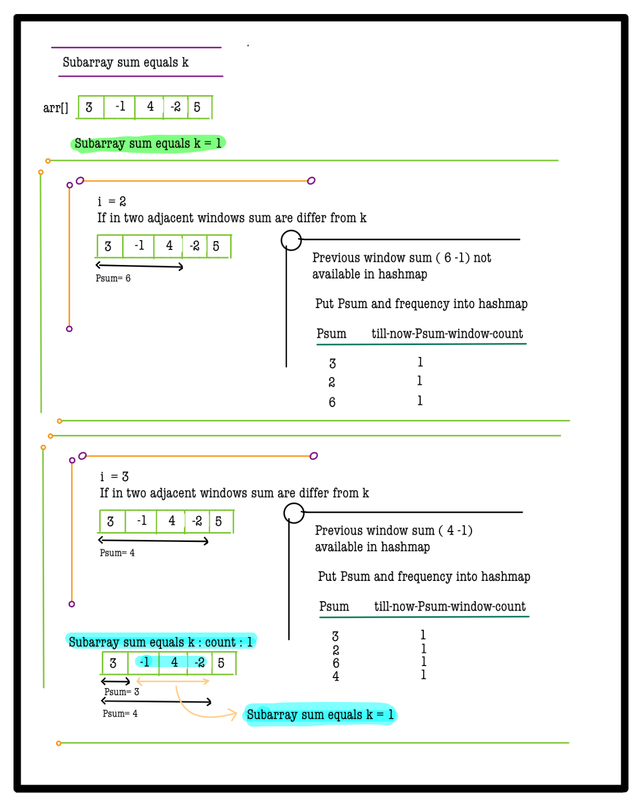
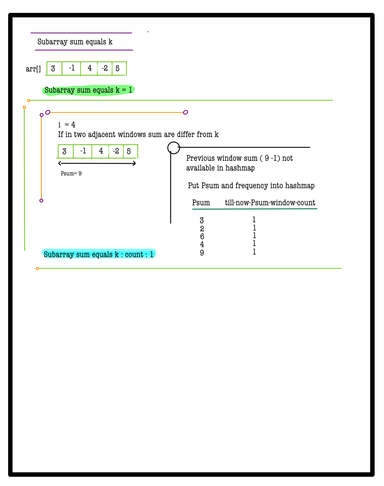
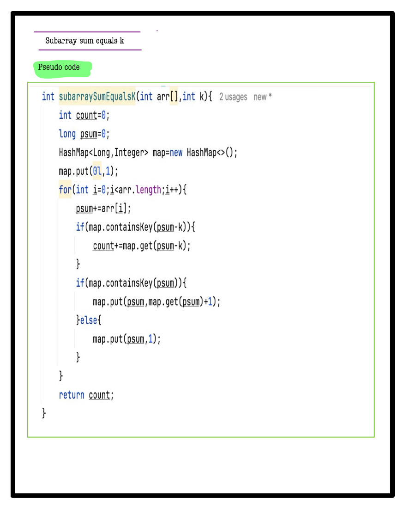

# Q3. Subarray Sum Equals K

**Problem Description**  
Given an array of integers **A** and an integer **B**, find the total number of subarrays whose sum equals **B**.

---

**Problem Constraints**
- `1 <= length of the array <= 50000`
- `-1000 <= A[i] <= 1000`

---

**Input Format**
- The first argument is the integer array **A**.
- The second argument is the integer **B**.

---

**Output Format**
- Return the total number of subarrays with sum equals to **B**.

---


## 📚 Example

### Input 1:
```plaintext
A = [1, 0, 1]
B = 1
```
### output 1:
```plaintext
4
```
### Explaination 1:
```plaintext
[1], [1, 0], [0, 1] and [1] are four subarrays having sum 1.
```
### Input 2:
```plaintext
A = [0, 0, 0]
B = 0
```
### output 2:
```plaintext
6
```
### Explaination 2:
```plaintext
All the possible subarrays having sum 0.
```

# 📝 Problem Solutions
---
### Approach1 :
#### Source code : [subarraySumEqualsK.java](../../src/hashingTwo/subarraySumEqualsK/approachOne/subarraySumEqualsK.java)
#### Time Complexity : o(n)
#### Space Complexity : o(n)

 
 
 
 
 
 
 
