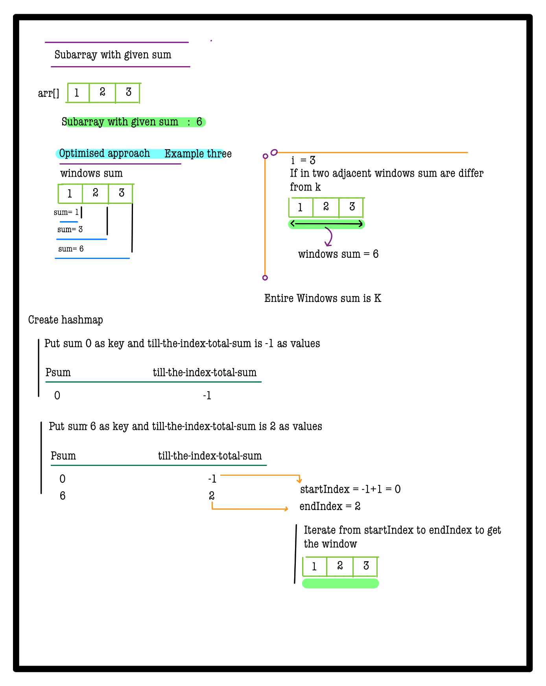

# Q2. Subarray with given sum

**Problem Description**  
Given an array of positive integers **A** and an integer **B**, find and return the **first** continuous subarray which sums to **B**.

If no such subarray exists, **return an array** with a single integer "**-1**".
- The **first** subarray means the subarray with the smallest starting index.

---

**Problem Constraints**
- `1 <= length of the array <= 100000`
- `1 <= A[i] <= 10^9`
- `1 <= B <= 10^9`

---

**Input Format**
- The first argument is the integer array **A**.
- The second argument is the integer **B**.

---

**Output Format**
- Return the **first continuous subarray** which sums to **B**.
- If no such subarray exist ,return an array with a single integer "-1".


## 📚 Example

### Input 1:
```plaintext
 A = [1, 2, 3, 4, 5]
 B = 5
```
### output 1:
```plaintext
 [2, 3]
```
### Explaination 1:
```plaintext
 [2, 3] sums up to 5.
```
### Input 2:
```plaintext
 A = [5, 10, 20, 100, 105]
 B = 110
```
### output 2:
```plaintext
 [-1]
```
### Explaination 2:
```plaintext
 No subarray sums up to required number.
```
# 📝 Problem Solutions
---
### Approach1 :
#### Source code : [subarrayWithGivenSum.java](../../src/hashingTwo/subarrayWithGivenSum/approachOne/subarrayWithGivenSum.java)
#### Time Complexity : o(n)
#### Space Complexity : o(n)

 
 
 
 
 
 
 
 

