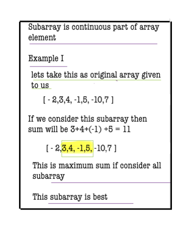
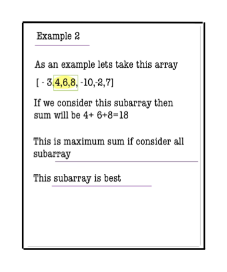
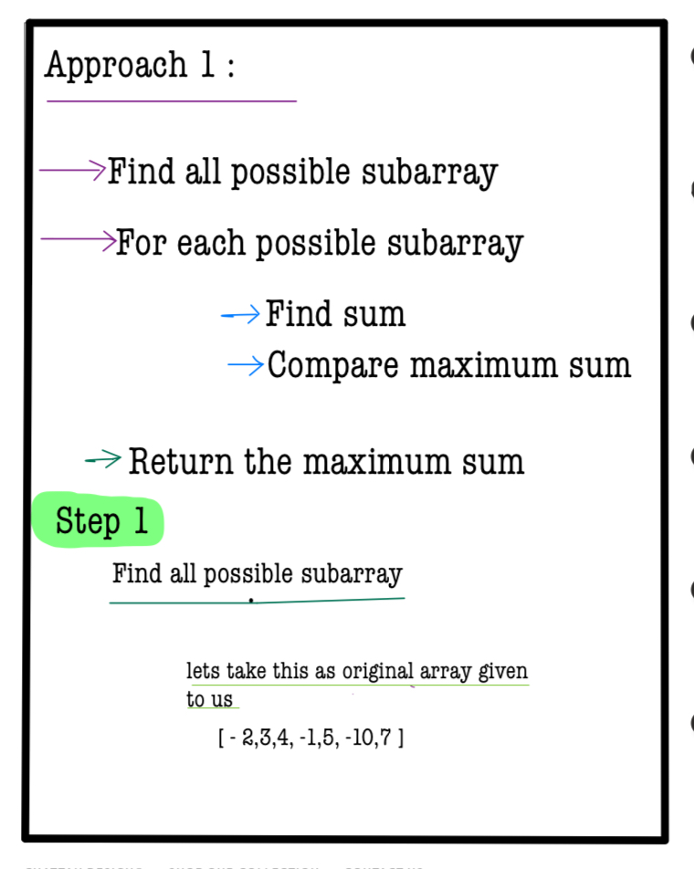
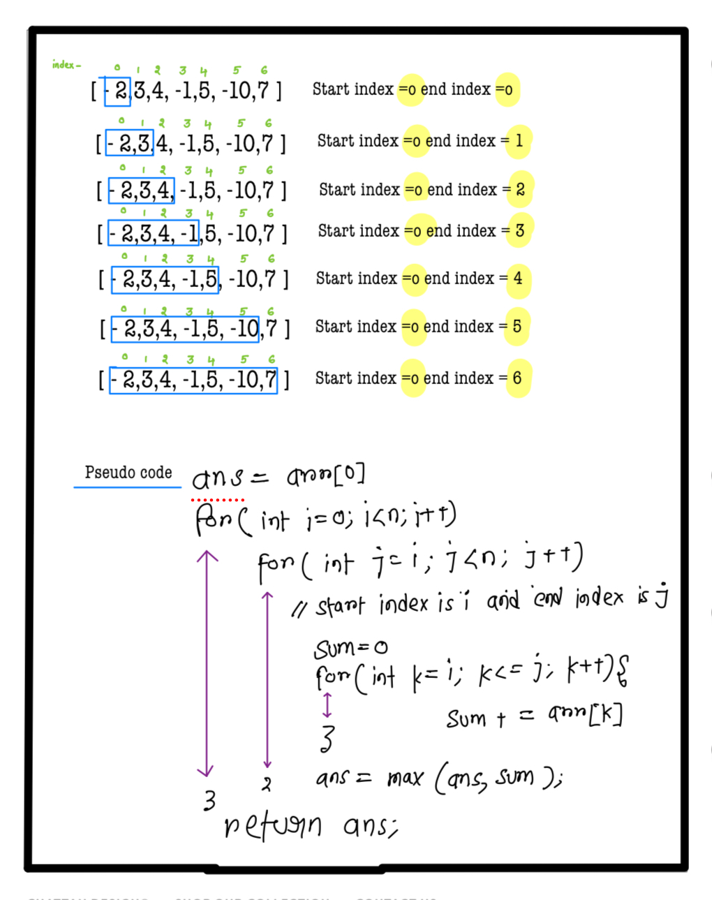

# Max Sum Contiguous Subarray

---

## 🚀 Introduction

The **Maximum Subarray Sum** problem is a classic challenge in computer science, demonstrating the power of efficient algorithms such as Kadane’s Algorithm. Your goal is to identify the subarray with the highest sum within a given array.

*Use hints to develop your solution. Complete solution approaches are penalty-free!*

---

## 📝 Problem Description

Given an array `A` of length `N`, your task is to find the **maximum possible sum** of any **non-empty contiguous subarray**.

---

## ⚙️ Problem Constraints

- **Array size:** `1 <= N <= 10^6`
- **Element range:** `-1000 <= A[i] <= 1000`

---

## 📝 Input Format

- The input consists of a single array `A`.

---

## 📤 Output Format

- Return an integer representing the maximum sum of any contiguous subarray.

---

## 📚 Examples

### Example 1
**Input:**
```plaintext
A = [1, 2, 3, 4, -10]
```
# 📝 Problem Solutions
### Approach1 : 

#### Source code : [maxSumContigiousSubarray.java](../src/maxSumContigiousSubarray/bruteforceApproach1/maxSumContigiousSubarray.java)


  
  
  
  

### Approach2

#### Source code : [maxSumContigiousSubarray.java](../src/maxSumContigiousSubarray/bruteforceApproach2/maxSumContigiousSubarray.java)


