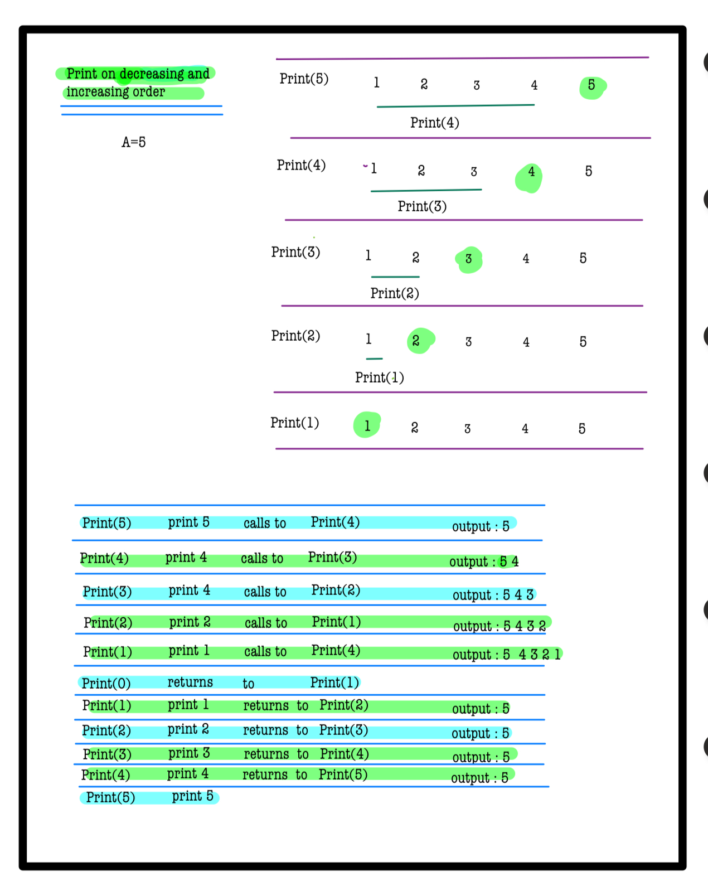
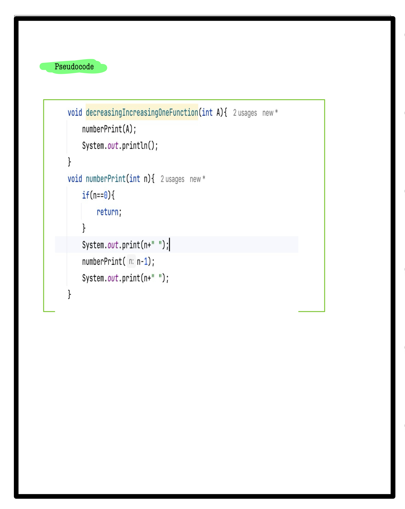

# Q3. Decreasing Increasing in one Function

**Problem Description**  
Print **N** numbers in Decreasing order and then in Increasing order.

1. You are given a positive number N.
2. You are required to print the numbers from N to 1.
3. You are required to **not use** any loops. Don't change the signature of the function **DecThenInc**.

**Note:** Please print a new line after printing the output.

---

**Problem Constraints**
- `1 <= N <= 100`

---

**Input Format**
- The first line contains a single integer N.

---

**Output Format**
- A single line having numbers printed from N to 1 and then from 1 to N, separated by spaces.

---

## 📚 Example
### Input 1:
```plaintext
 1
```
### output 1:
```plaintext
1 1
```
### Explaination 1:
```plaintext
Elements are First printer from N down to 1 and then 1 upto N.
```
### Input 2:
```plaintext
4
```
### output 2:
```plaintext
4 3 2 1 1 2 3 4
```
### Explaination 2:
```plaintext
Elements are First printer from N down to 1 and then 1 upto N.
```
# 📝 Problem Solutions
---
### Approach1 :
#### Source code : [decreasingIncreasingOneFunction.java](../../src/recursionOne/decreasingIncreasingOneFunction/decreasingIncreasingOneFunction.java)
#### Time Complexity : o(n)
#### Space Complexity : o(n)

 
 