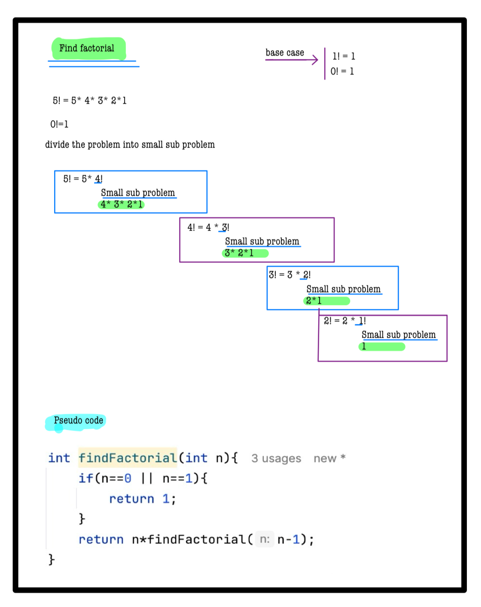

# Q2. Find Factorial!
---

**Using hints except Complete Solution is Penalty free now**  
**Use Hint**

---

## 📝 Problem Description
Write a program to find the factorial of the given number **A** using recursion.  
*Note:* The factorial of a number **N** is defined as the **product** of the numbers from 1 to N.

---

## ⚙️ Problem Constraints
- `0 <= A <= 12`

---

## 📝 Input Format
First and only argument is an integer **A**.

---

## 📤 Output Format
Return an integer denoting the factorial of the number **A**.

---
## 📚 Example
### Input 1:
```plaintext
 A = 4
```
### output 1:
```plaintext
24
```
### Explaination 1:
```plaintext
Factorial of 4 = 4 * 3 * 2 * 1 = 24
```
### Input 2:
```plaintext
 A = 1
```
### output 2:
```plaintext
1
```
### Explaination 2:
```plaintext
Factorial of 1 = 1
```
# 📝 Problem Solutions
---
### Approach1 :
#### Source code : [findFactorial.java](../../src/recursionOne/findFactorial/findFactorial.java)
#### Time Complexity : o(n)
#### Space Complexity : o(n)

 
