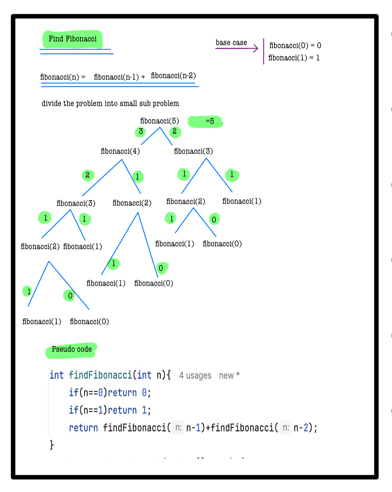
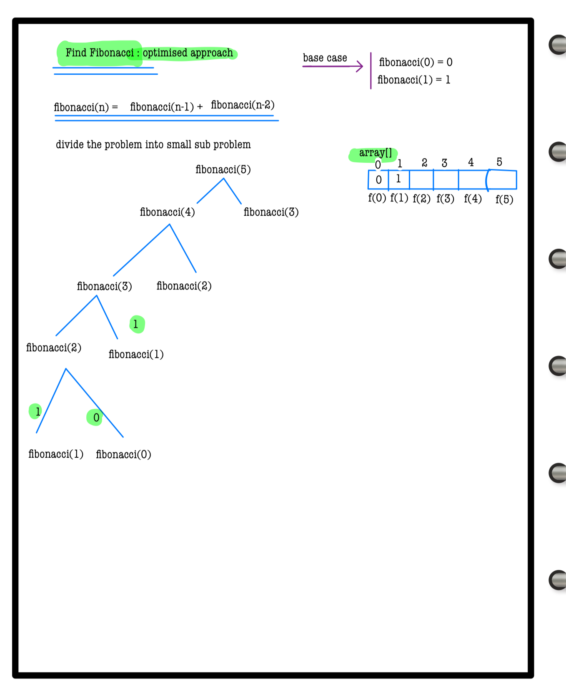
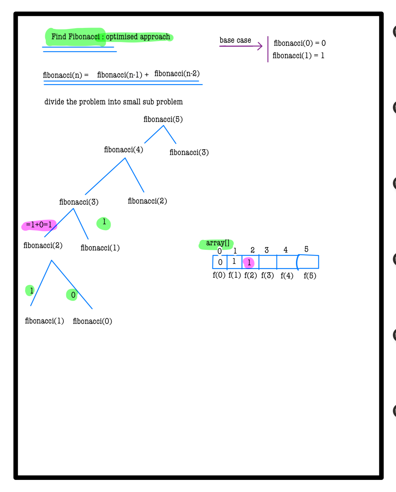
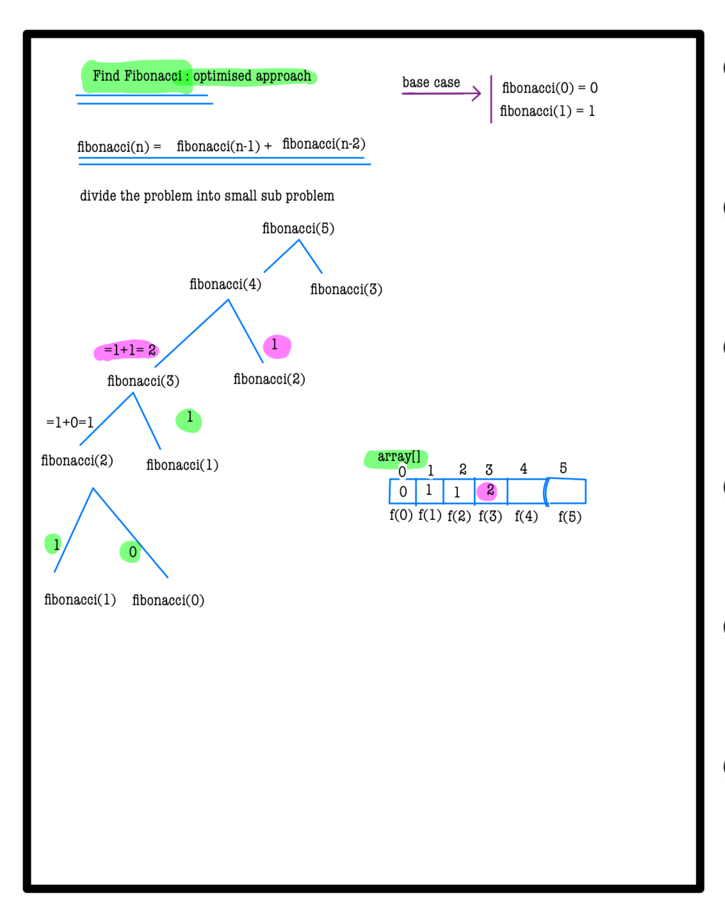
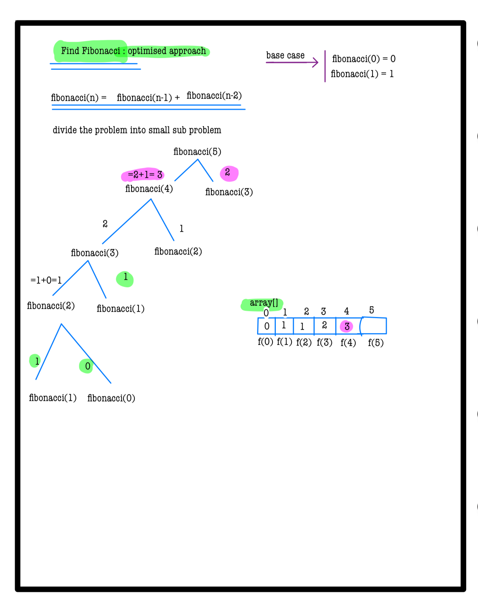
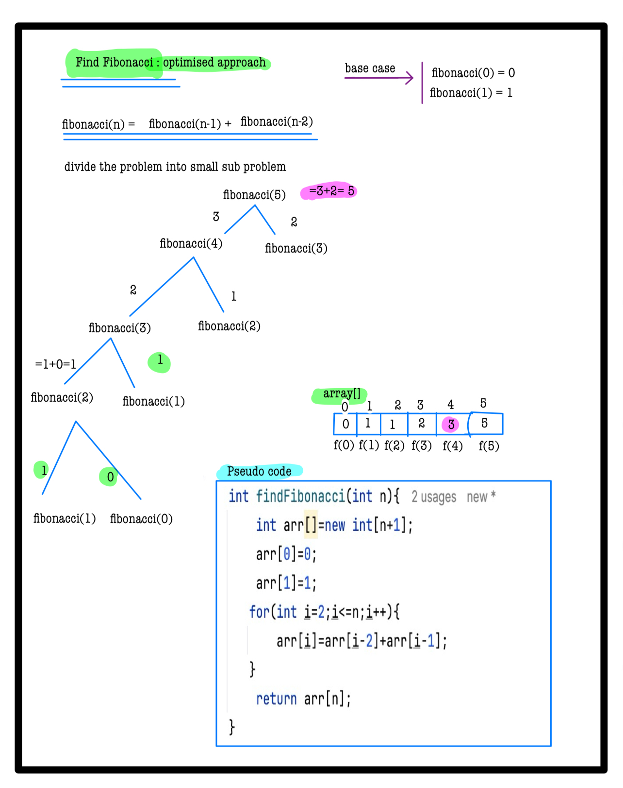
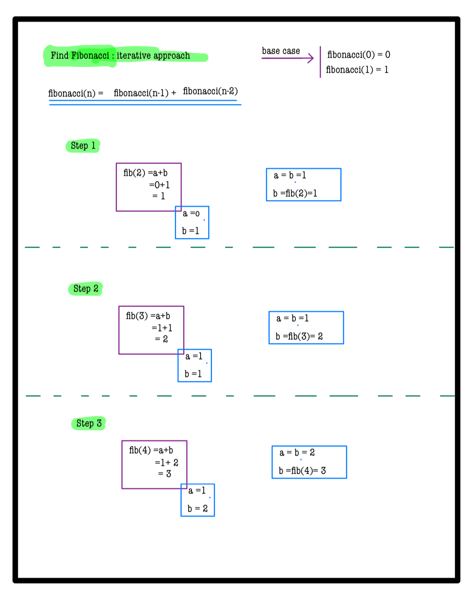
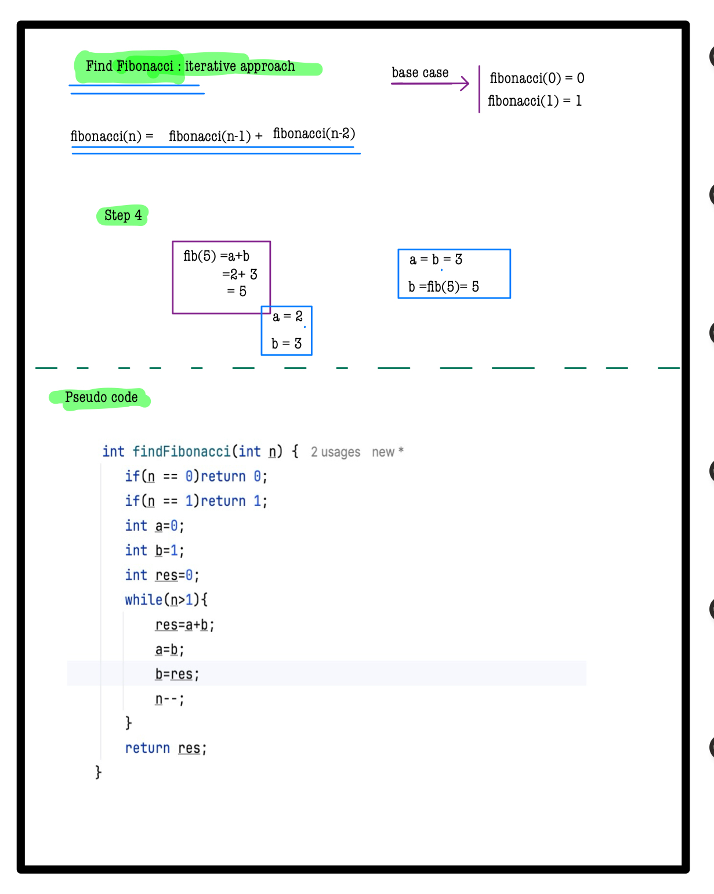

# Q3. Find Fibonacci - II
---

**Using hints except Complete Solution is Penalty free now**  
**Use Hint**

---

## 📝 Problem Description
The Fibonacci numbers are the numbers in the following integer sequence:

0, 1, 1, 2, 3, 5, 8, 13, 21, 34, 55, 89, 144, …….  
In mathematical terms, the sequence \(F_n\) of Fibonacci numbers is defined by the recurrence relation:  
**\(F_n = F_{n-1} + F_{n-2}\)**  
Given a number **A**, find and return the **A-th** Fibonacci Number using recursion.  
*Note:* \(F_0 = 0\) and \(F_1 = 1\).

---

## ⚙️ Problem Constraints
- `0 <= A <= 20`

---

## 📝 Input Format
First and only argument is an integer **A**.

---

## 📤 Output Format
Return an integer denoting the **A-th** term of the sequence.

---

## 📚 Example
### Input 1:
```plaintext
 A = 2
```
### output 1:
```plaintext
1
```
### Explaination 1:
```plaintext
f(2) = f(1) + f(0) = 1
```
### Input 2:
```plaintext
 A = 9
```
### output 2:
```plaintext
34
```
### Explaination 2:
```plaintext
 f(9) = f(8) + f(7) = 21 + 13  = 34
```
# 📝 Problem Solutions
---
### Approach1 :
#### Source code : [findFactorial2.java](../../src/recursionOne/findFactorial2/approachOne/findFactorial2.java)
#### Time Complexity : o(n)
#### Space Complexity : o(n)

 

---
### Approach2 :
#### Source code : [findFactorial2.java](../../src/recursionOne/findFactorial2/approachTwo/findFactorial2.java)
#### Time Complexity : o(n)
#### Space Complexity : o(n)

 
 
 
 
 

---
### Approach3 :
#### Source code : [findFactorial2.java](../../src/recursionOne/findFactorial2/approachThree/findFactorial2.java)
#### Time Complexity : o(n)
#### Space Complexity : o(1)

 
 
