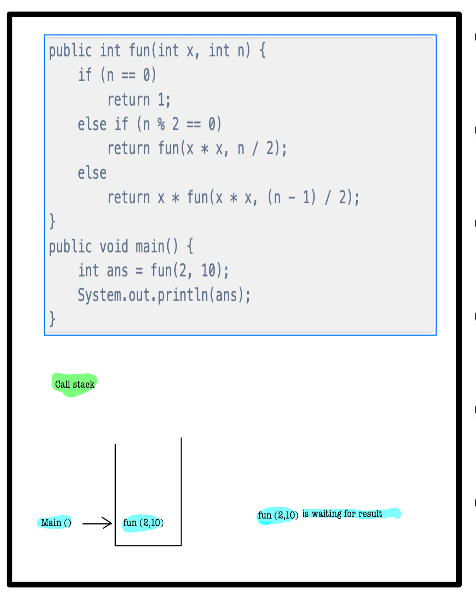
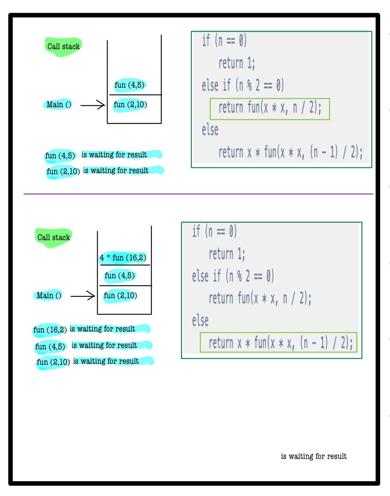
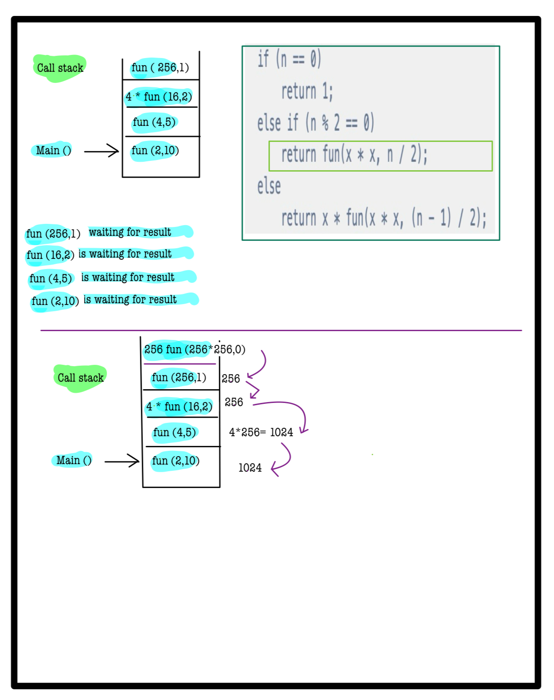
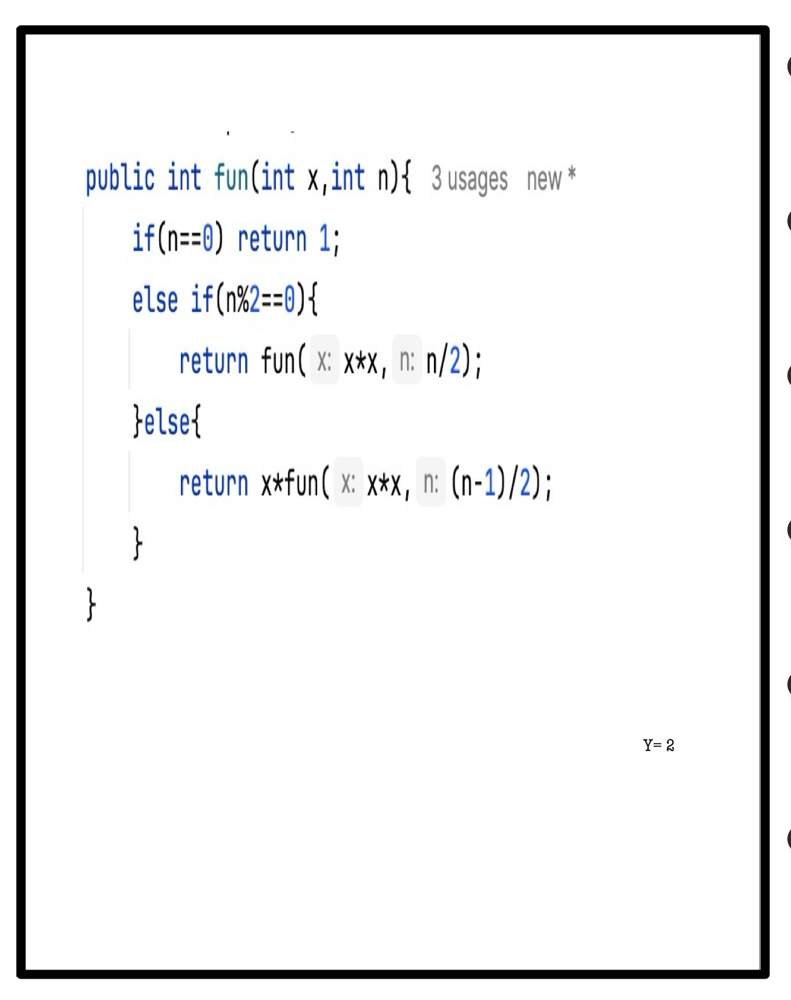

# Q1. Output 7

**Using hints except Complete Solution is Penalty free now**

```java
public class output7 {
    public int fun(int x,int n){
        if(n==0) return 1;
        else if(n%2==0){
            return fun(x*x,n/2);
        }else{
            return x*fun(x*x,(n-1)/2);
        }
    }
    public static void main(String[] args) {
        output7 o = new output7();
        int ans=o.fun(2,10);
        System.out.println(ans);
    }
}

```
# 📝 Problem Solutions
---
### Approach1 :
#### Source code : [output7.java](../../src/recursionOne/output7/output7.java)


 
 
 
 
