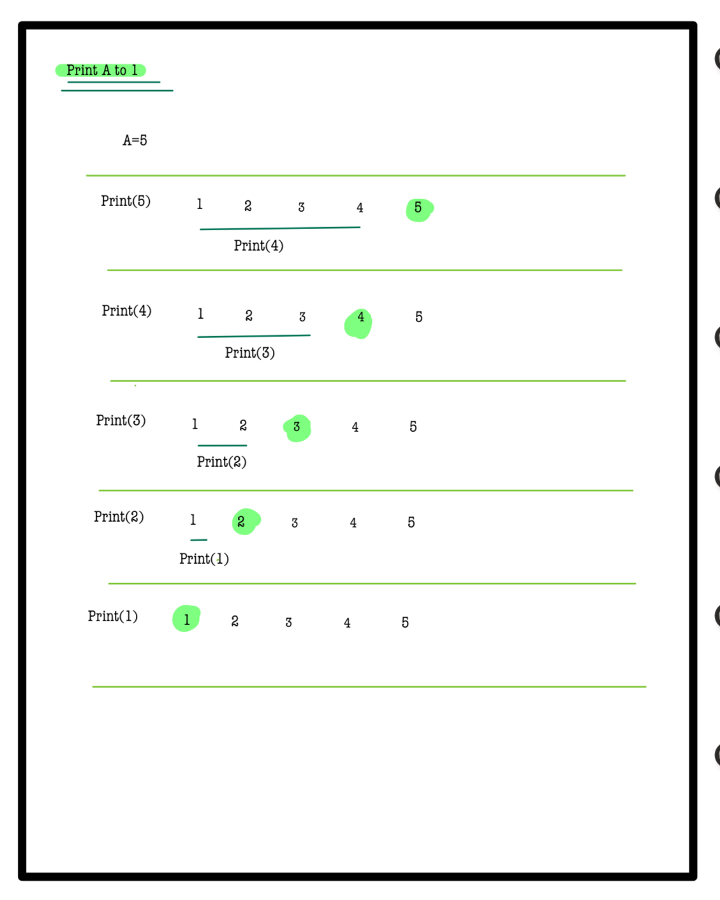
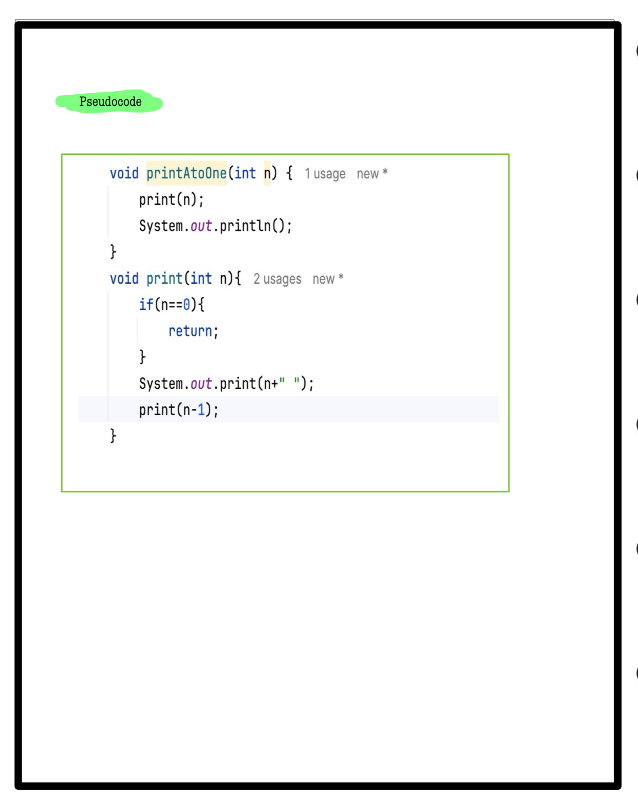

# Q5. Print A to 1 function

**Problem Description**  
**You are given an integer A, print A to 1 using recursion.**  
**Note :- After printing all the numbers from A to 1, print a new line.**

**Problem Constraints**
- `1 <= A <= 10^4`

**Input Format**
- First argument A is an integer.

**Output Format**
- Print A space-separated integers from A to 1.
- Note: There should be exactly one space after each integer. After printing all the integers, print a new line.

## 📚 Example
### Input 1:
```plaintext
 A = 10
```
### output 1:
```plaintext
10 9 8 7 6 5 4 3 2 1 
```
### Explaination 1:
```plaintext
Print 10 to 1 space separated integers.
```
### Input 2:
```plaintext
 A = 5
```
### output 2:
```plaintext
5 4 3 2 1 
```
### Explaination 2:
```plaintext
Print 5 to 1 space separated integers.
```
# 📝 Problem Solutions
---
### Approach1 :
#### Source code : [printAtoOne.java](../../src/recursionOne/printAtoOne/printAtoOne.java)
#### Time Complexity : o(n)
#### Space Complexity : o(n)

 
 