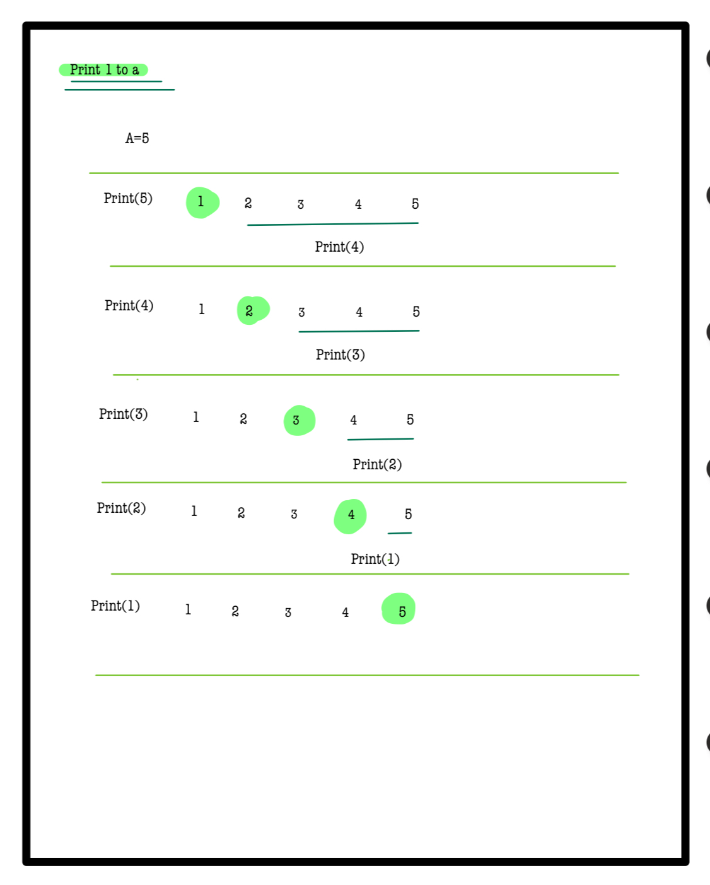
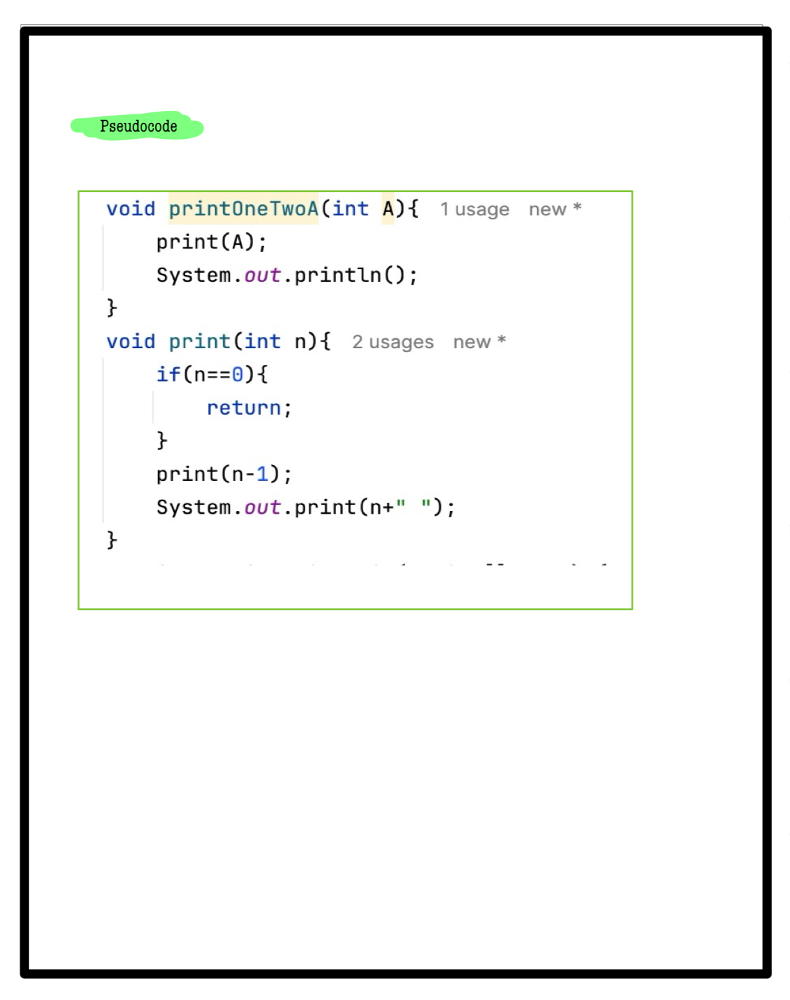

# Q4. Print 1 to A function

**Using hints except Complete Solution is Penalty free now**  
**Use Hint**  
**Problem Description**  
**You are given an integer A, print 1 to A using recursion.**  
**Note :- After printing all the numbers from 1 to A, print a new line.**

**Problem Constraints**
- `1 <= A <= 10^4`

**Input Format**
- First argument A is an integer.

**Output Format**
- Print A space-separated integers 1 to A.
- Note: There should be exactly one space after each integer. After printing all the integers, print a new line.

---
## 📚 Example
### Input 1:
```plaintext
 A = 10
```
### output 1:
```plaintext
1 2 3 4 5 6 7 8 9 10 
```
### Explaination 1:
```plaintext
Print 1 to 10 space separated integers.
```
### Input 2:
```plaintext
 A = 5
```
### output 2:
```plaintext
1 2 3 4 5 
```
### Explaination 2:
```plaintext
Print 1 to 5 space separated integers.
```
# 📝 Problem Solutions
---
### Approach1 :
#### Source code : [printOneTwoA.java](../../src/recursionOne/printOneTwoA/printOneTwoA.java)
#### Time Complexity : o(n)
#### Space Complexity : o(n)

 
 
