# Q1. Simple Recursion

**Using hints except Complete Solution is Penalty free now**

```java
public class simpleRecursion {
    static int bar(int x, int y) {
        if (y == 0) return 0;
        return (x + _bar_(x, y - 1));
    }

    static int foo(int x, int y) {
        if (y == 0) return 1;
        return _bar_(x, _foo_(x, y - 1));
    }

    public static void main(String[] args) {
        System.out.println(_foo_(3, 5));
    }
}
```
# 📝 Problem Solutions
---
### Approach1 :
#### Source code : [simpleRecursion.java](../../src/recursionOne/simpleRecursion/simpleRecursion.java)


 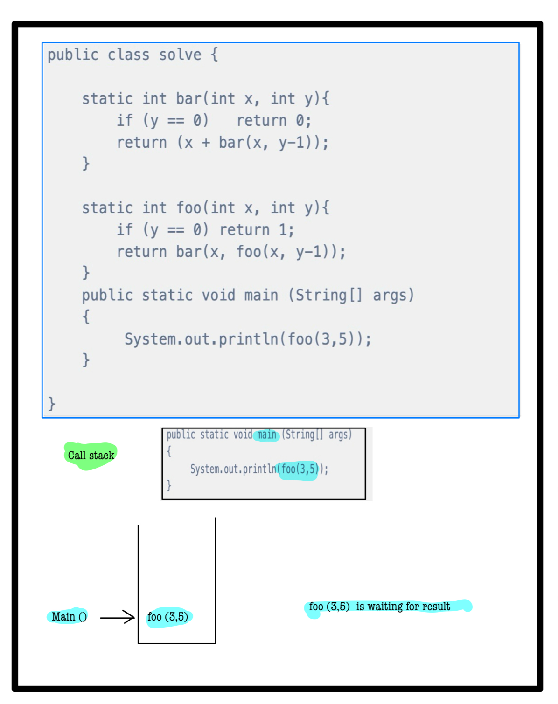
 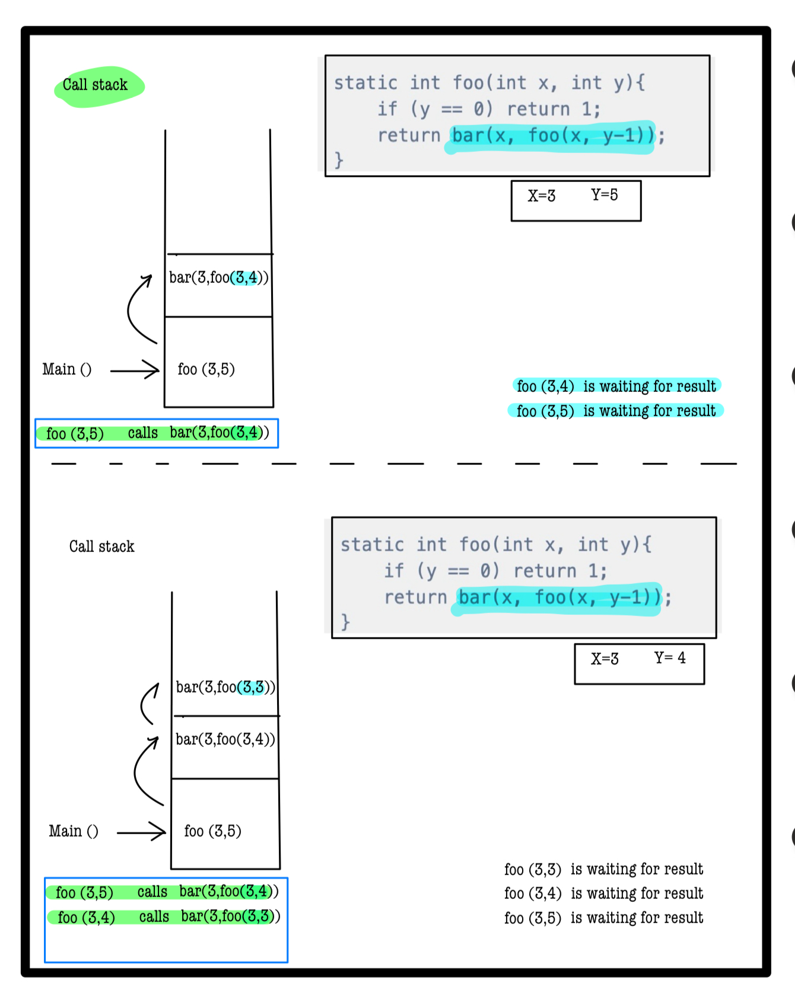
 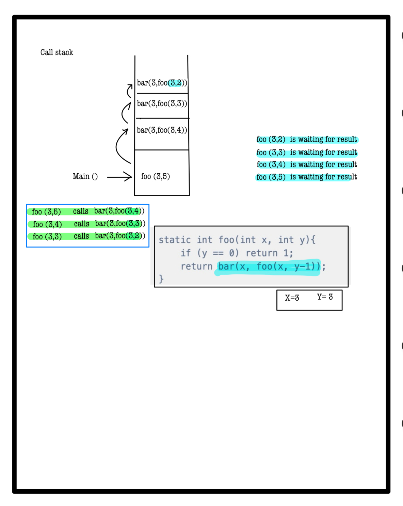
 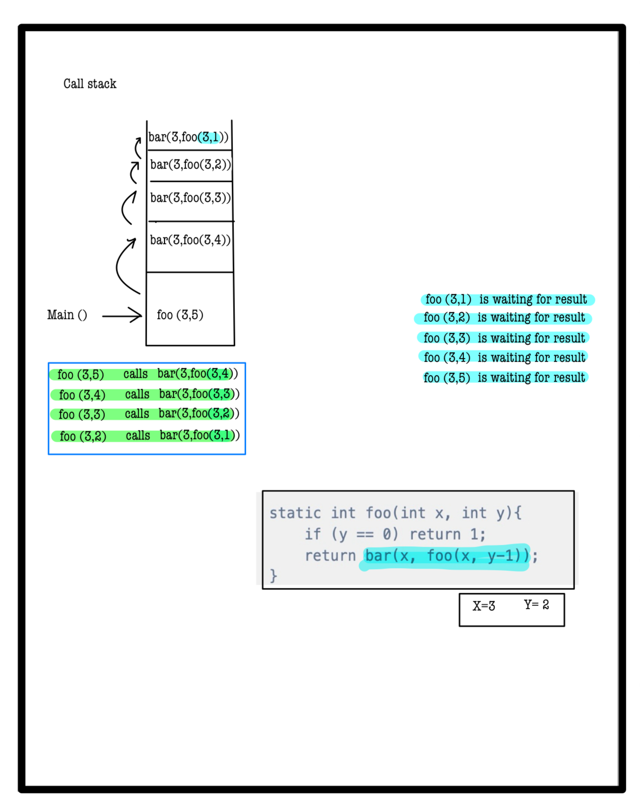
 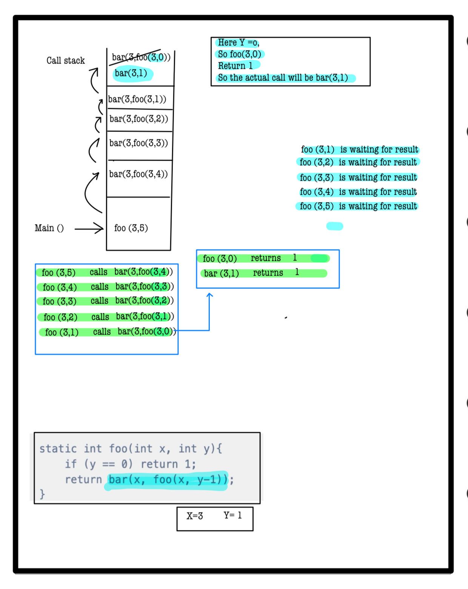
 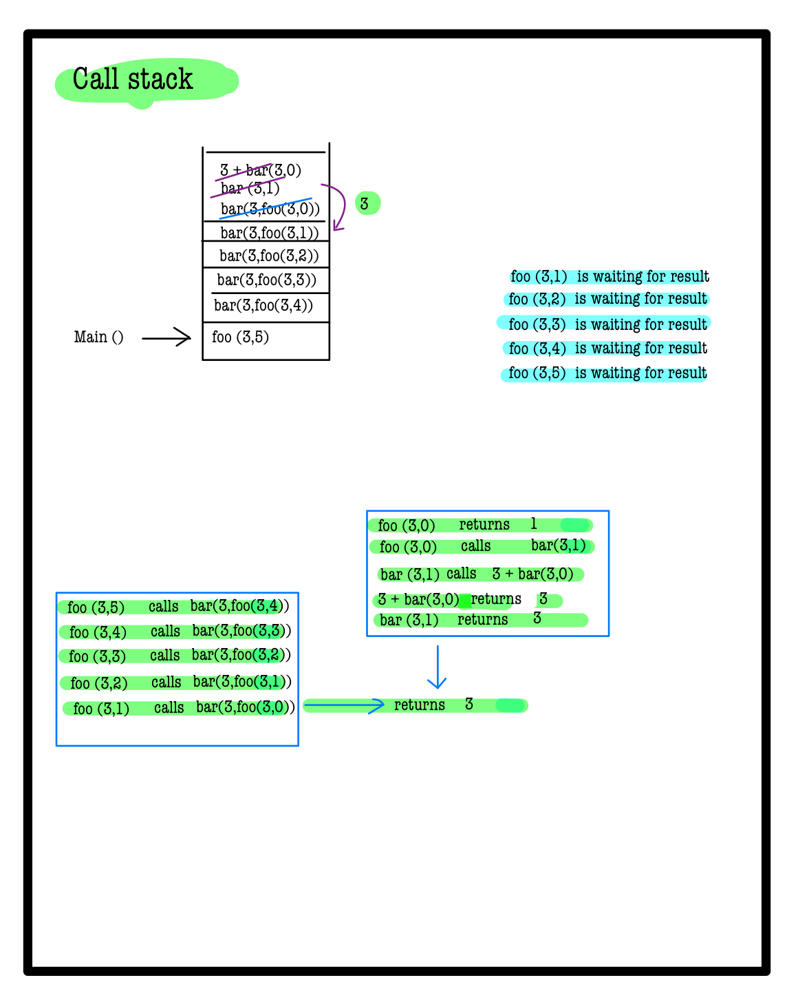
 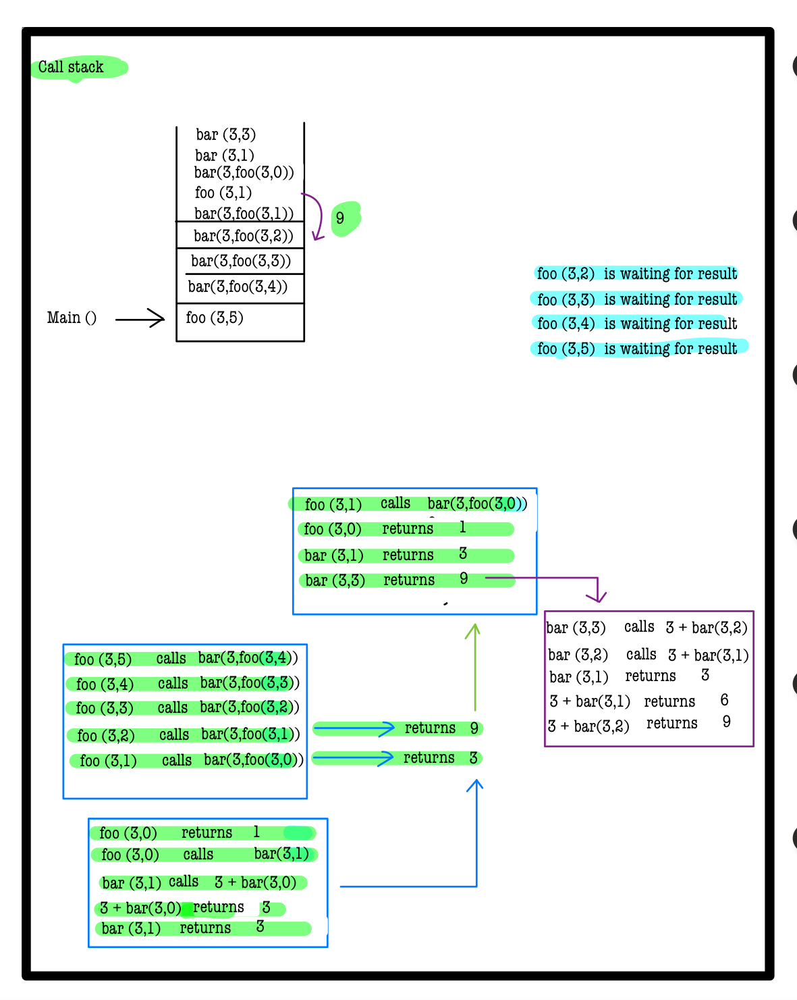
 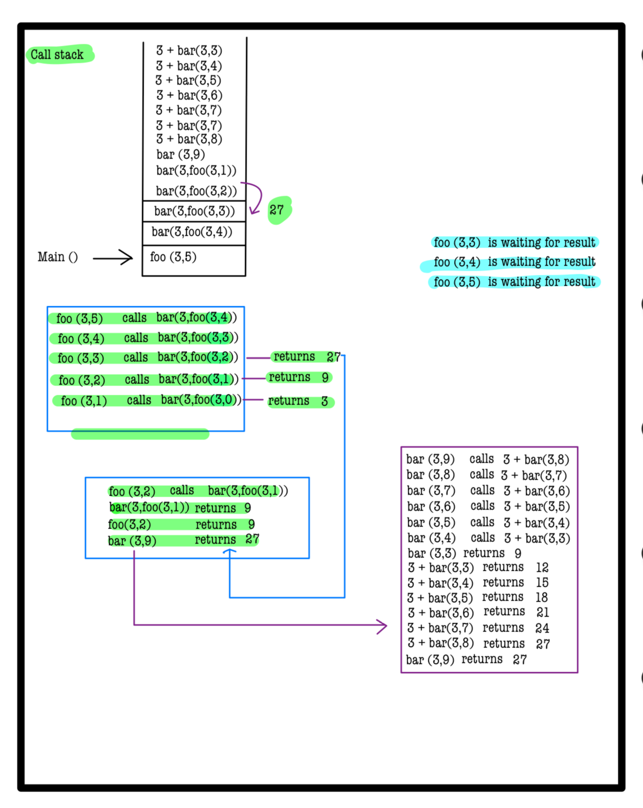
 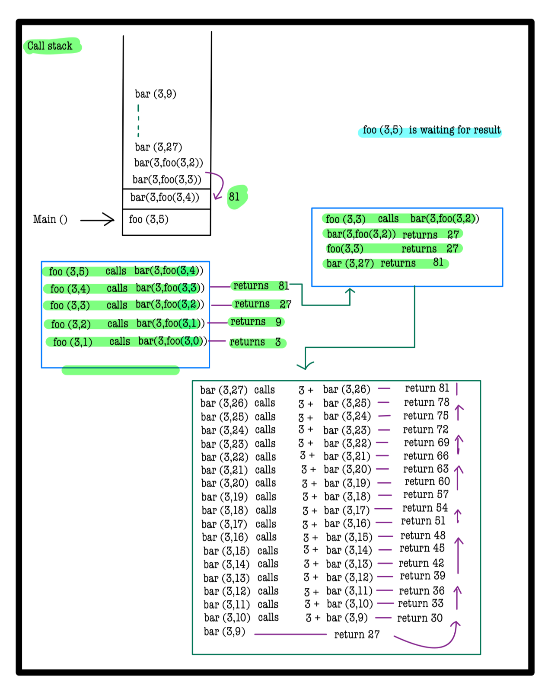
 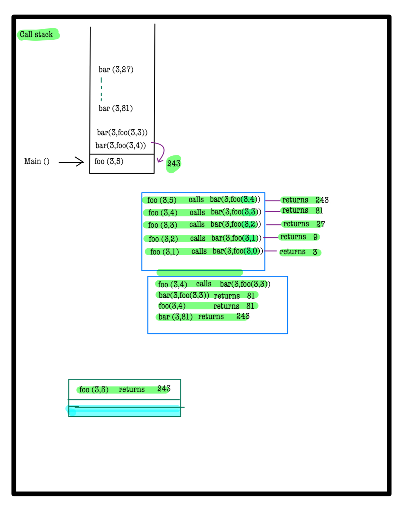
 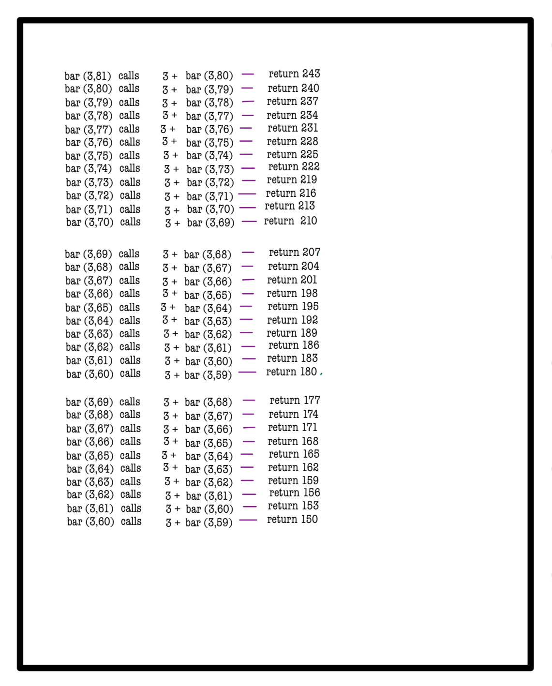
 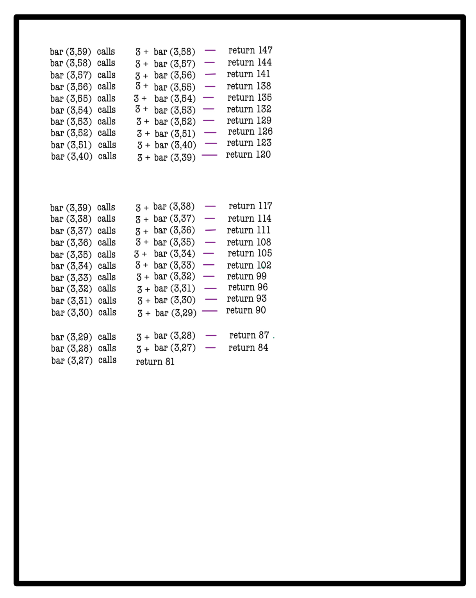