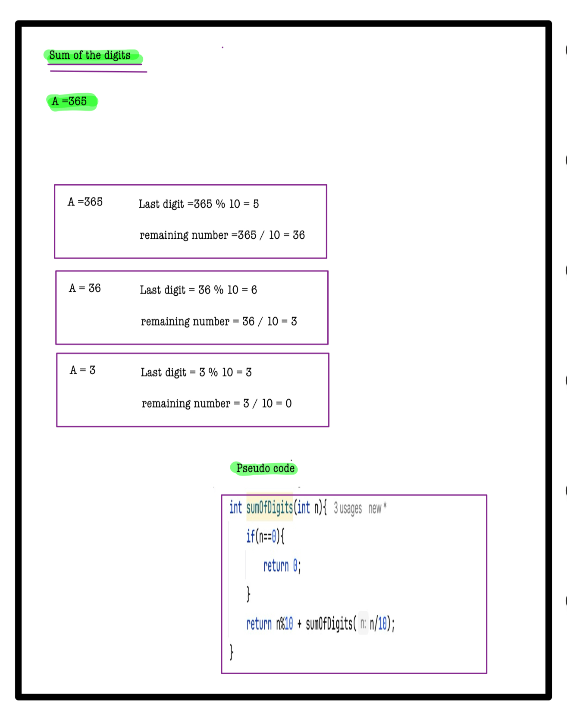

# Q2. Sum of Digits!

**Problem Description**  
Given a number **A**, we need to find the sum of its digits using recursion.

---

**Problem Constraints**
- `1 <= A <= 10^9`

---

**Input Format**
- The first and only argument is an integer **A**.

---

**Output Format**
- Return an integer denoting the sum of digits of the number **A**.

---


## 📚 Example
### Input 1:
```plaintext
46
```
### output 1:
```plaintext
10
```
### Explaination 1:
```plaintext
 Sum of digits of 46 = 4 + 6 = 10
```
### Input 2:
```plaintext
11
```
### output 2:
2
```
### Explaination 2:
```plaintext
 Sum of digits of 11 = 1 + 1 = 2
```
# 📝 Problem Solutions
---
### Approach1 :
#### Source code : [sumOfDigits.java](../../src/recursionOne/sumOfDigits/sumOfDigits.java)
#### Time Complexity : o(logn)
#### Space Complexity : o(logn)

 
