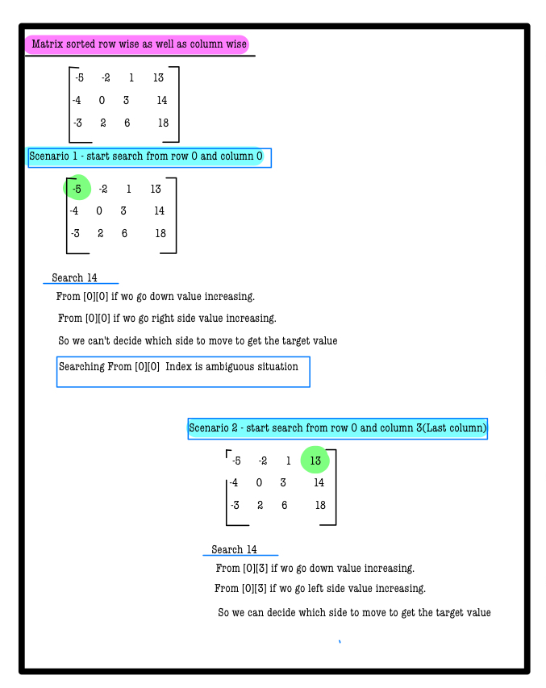
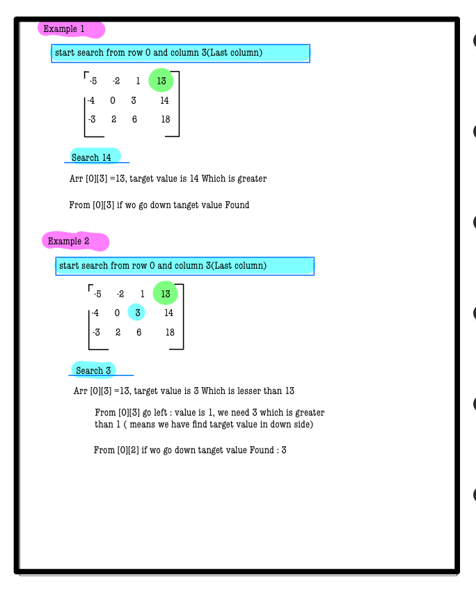
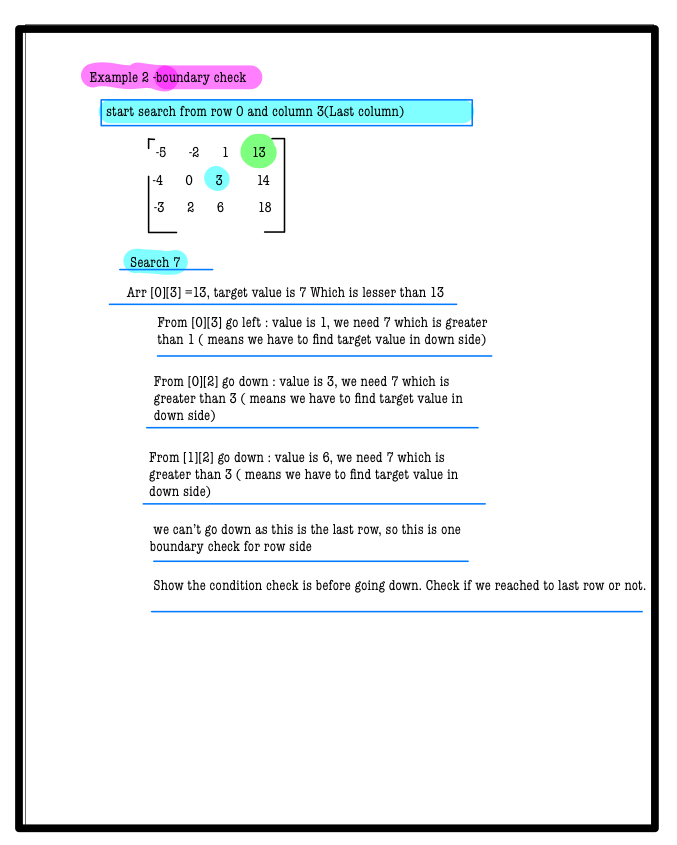
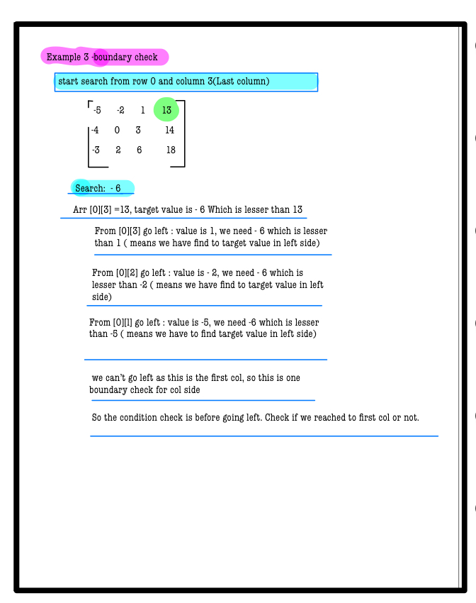

# Q2. Search in a row-wise and column-wise sorted matrix
---
## 🚀 Introduction
Given a matrix of integers **A** of size **N x M** where each row and column is sorted in non-decreasing order, your task is to locate a given integer **B**.  
_Use hints to develop your solution. Complete solution approaches are penalty-free!_
---
## 📝 Problem Description
Given a matrix **A** and an integer **B**, find the position of **B** in the matrix with the following specifications:  
- If `A[i][j] = B` then return `(i * 1009 + j)`.  
- If **B** is not present, return `-1`.  

**Note 1:** Rows are numbered from top to bottom starting at 1, and columns are numbered from left to right starting at 1.  
**Note 2:** If multiple **B** are present, return the smallest value of `i * 1009 + j`.  
**Note 3:** The expected time complexity is linear (`O(N + M)`).  
**Note 4:** Use 1-based indexing for the answer.

---

## ⚙️ Problem Constraints
- `1 <= N, M <= 1000`
- `-100000 <= A[i][j] <= 100000`
- `-100000 <= B <= 100000`

---

## 📝 Input Format
- First argument: the 2D integer matrix **A**.
- Second argument: the integer **B** to find.

---

## 📤 Output Format
- Return the position value of **B** as per `(i * 1009 + j)` where `i` and `j` are 1-based indices.
- Return `-1` if **B** is not found.

---

## 📚 Example
### Input 1:
```plaintext
A = [[1, 2, 3],
     [4, 5, 6],
     [7, 8, 9]]
B = 2
```
# 📝 Problem Solutions
---
### Approach1 : 
#### Source code : [searchInARowColcolwiseSortedMatrix.java](../src/spiralOrderMatrix2/searchInARowColcolwiseSortedMatrix.java)
#### Time Complexity : o(row+col)
#### Space Complexity : o(1)

  
  
  
  


