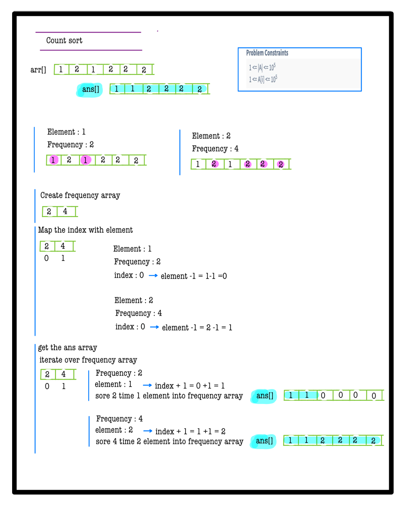
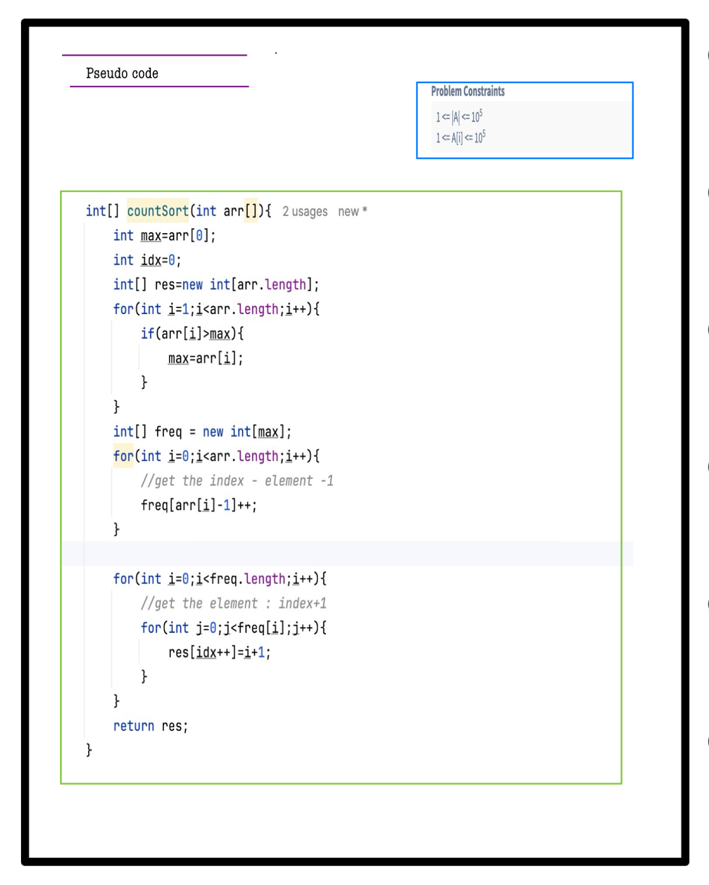

# Q2. Count Sort

**Problem Description**  
Given an array **A**, sort this array using the Count Sort Algorithm and return the sorted array.

**Problem Constraints**
- `1 <= |A| <= 10^5`
- `1 <= A[i] <= 10^5`

**Input Format**
- A single integer array **A**.

**Output Format**
- Return the sorted array of integers.

---

## 📚 Example
### Input 1:
```plaintext
A = [1, 3, 1]
```
### Output 1:
```plaintext
[1, 1, 3]
```
### Explanation 1:
Array sorted using Count Sort is `[1, 1, 3]`.

---

### Input 2:
```plaintext
A = [4, 2, 1, 3]
```
### Output 2:
```plaintext
[1, 2, 3, 4]
```
### Explanation 2:
Array sorted using Count Sort is `[1, 2, 3, 4]`.
---


# 📝 Problem Solutions
---
### Approach1 :
#### Source code : [countSort.java](../../src/sortingOne/countSort/approachOne/countSort.java)
#### Time Complexity : o(n)
#### Space Complexity : o(n)

  
  
