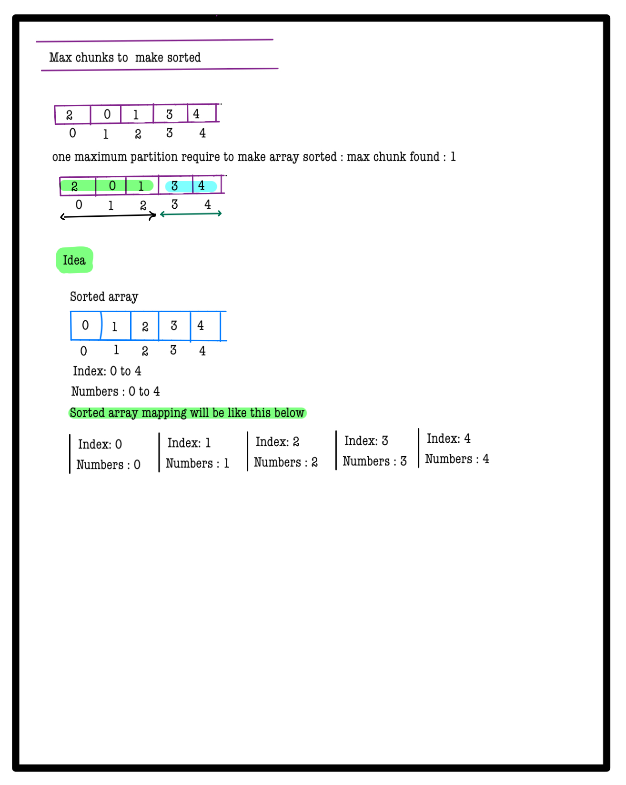
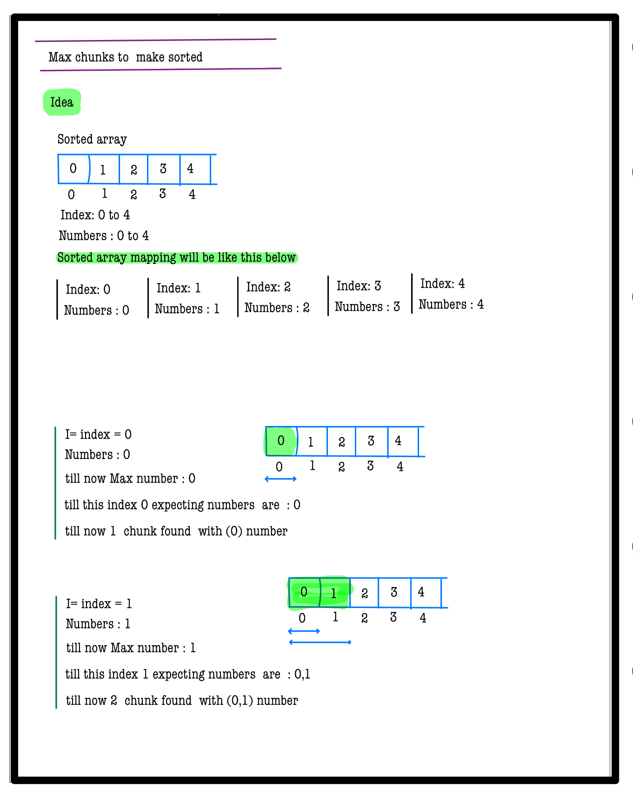
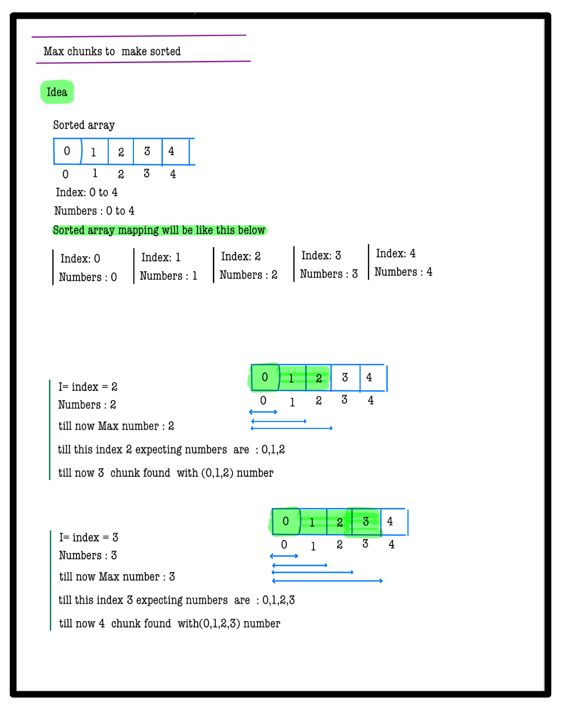
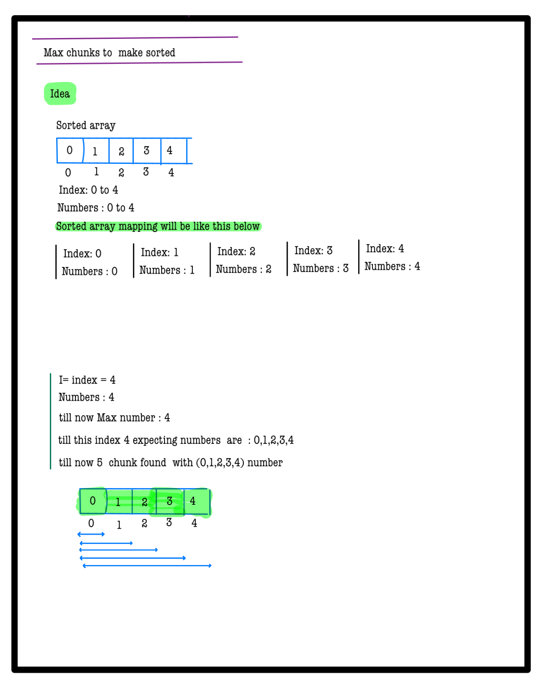
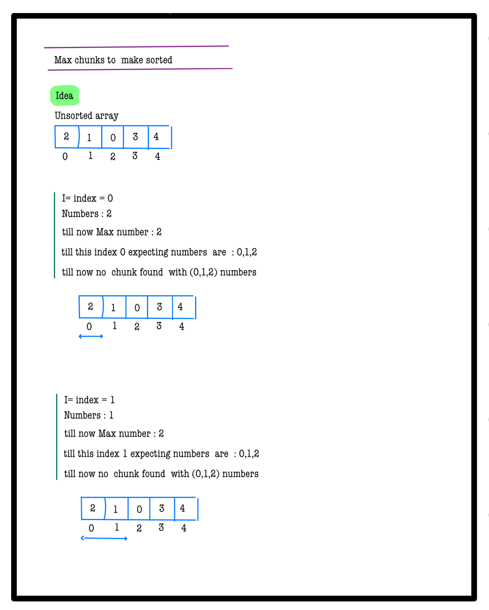
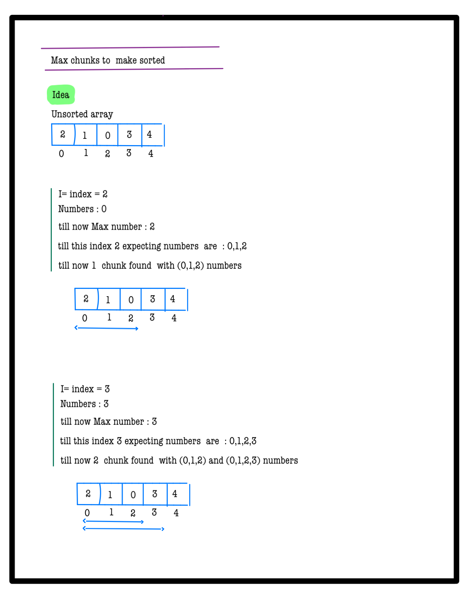
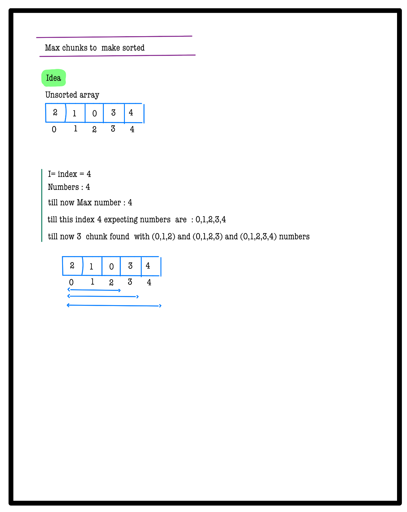
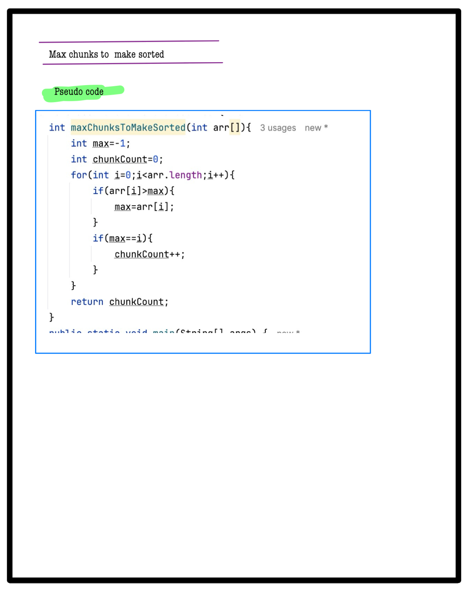

# Q1. Max Chunks To Make Sorted

**Problem Description**  
Given an array of integers **A** of size **N** that is a permutation of `[0, 1, 2, ..., N-1]`, if we split the array into some number of "chunks" (partitions), and individually sort each chunk, then concatenate them in order, the resulting array equals the fully sorted array.  
Your task is to determine the **maximum** number of chunks you can make.

**Problem Constraints**
- `1 <= N <= 100000`
- `0 <= A[i] < N`

**Input Format**
- The only argument is the integer array **A**.

**Output Format**
- Return the maximum number of chunks that can be made.

---
## 📚 Example
### Input 1:
```plaintext
A = [1, 2, 3, 4, 0]
```
### Output 1:
```plaintext
1
```
### Explanation 1:
A = [1, 2, 3, 4, 0] To get the 0 in the first index, we have to take all elements in a single chunk.

---

### Input 2:
```plaintext
A = [2, 0, 1, 3]
```
### Output 2:
```plaintext
2
```
### Explanation 2:
A = [2, 0, 1, 3] We can divide the array into 2 chunks. First chunk is [2, 0, 1] and second chunk is [3].

---

# 📝 Problem Solutions
---
### Approach1 :
#### Source code : [maxChunksToMakeSorted.java](../../src/sortingOne/maxChunksToMakeSorted/approachOne/maxChunksToMakeSorted.java)
#### Time Complexity : o(n)
#### Space Complexity : o(1)

  
  
  
  
  
  
  
  