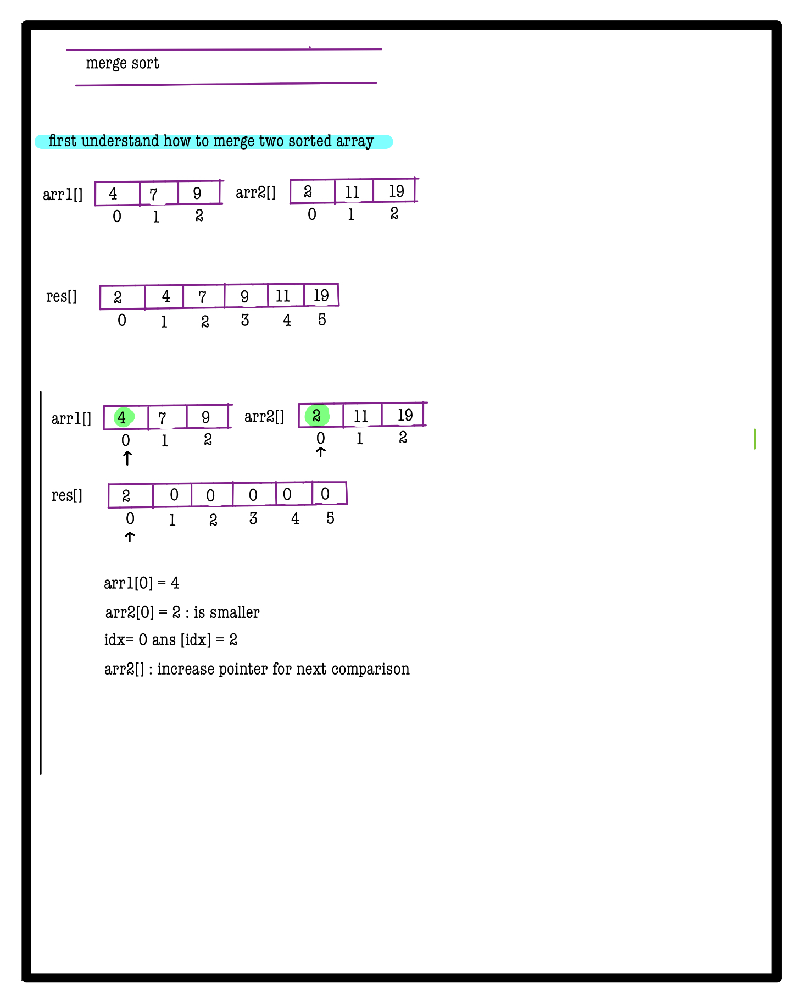
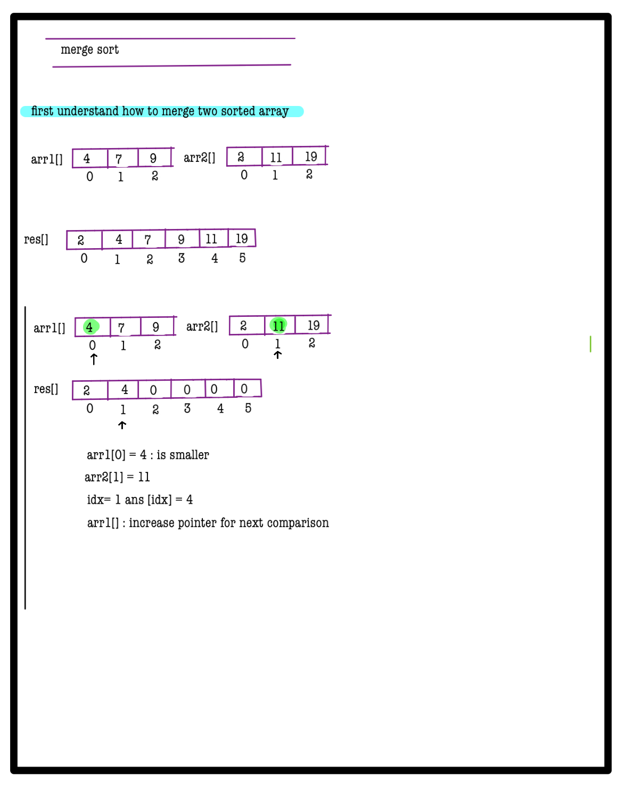
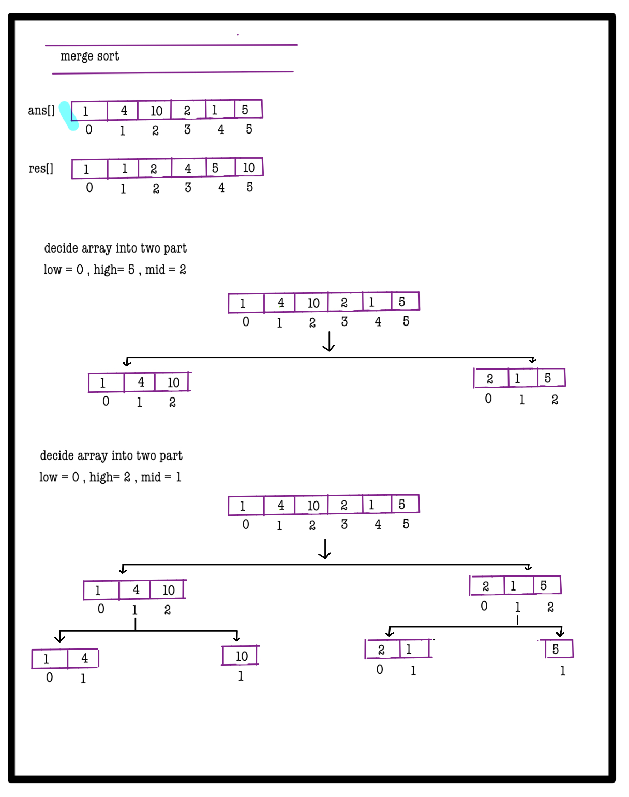
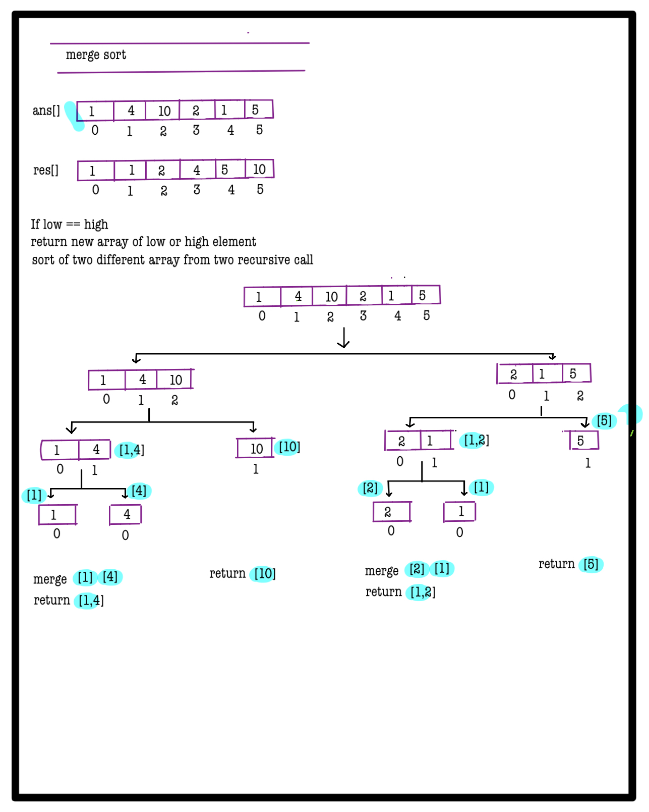
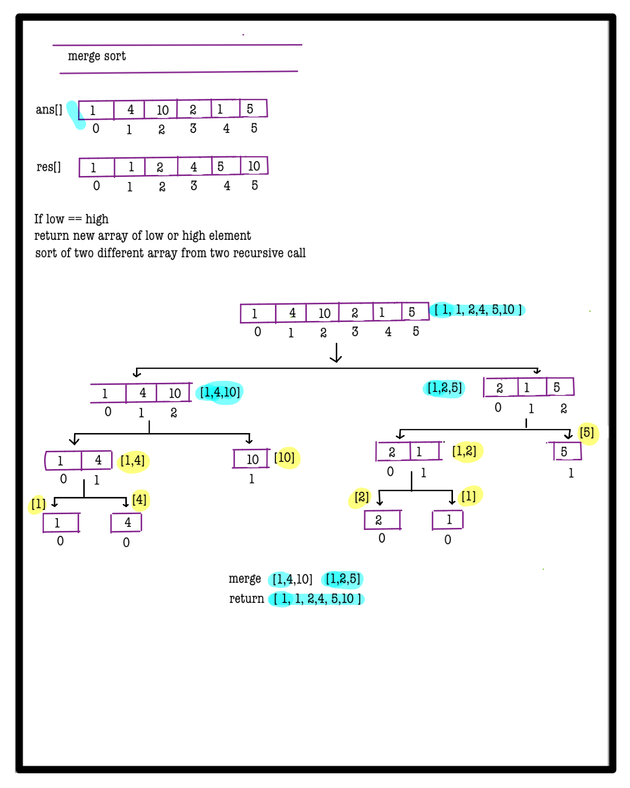
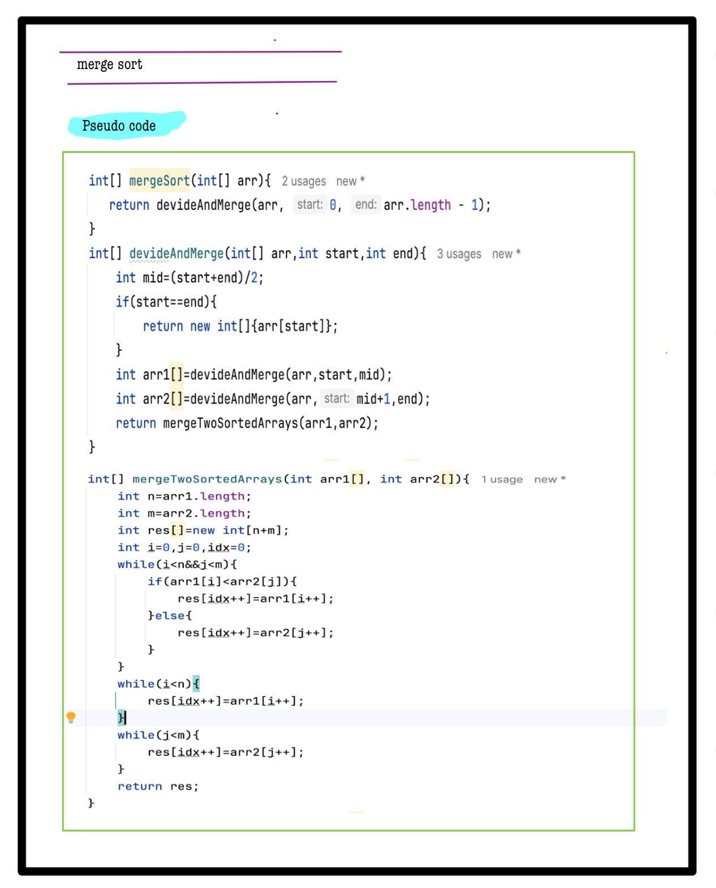

# Q3. Merge Sort
**Problem Description**  
Given an integer array **A**, sort the array using the **Merge Sort** algorithm and return the sorted array.

**Problem Constraints**
- `1 <= |A| <= 10^5`
- `1 <= A[i] <= 10^9`

**Input Format**
- The first argument is a 1-D integer array **A**.

**Output Format**
- Return the sorted array after applying merge sort.

---

## 📚 Example
### Input 1:
```plaintext
A = [1, 4, 10, 2, 1, 5]
```
### Output 1:
```plaintext
[1, 1, 2, 4, 5, 10]
```

### Input 2:
```plaintext
A = [3, 7, 1]
```
### Output 2:
```plaintext
[1, 3, 7]
```

### Explanation:
Return the array sorted in ascending order, demonstrating the application of merge sort.

---


# 📝 Problem Solutions
---
### Approach1 :
#### Source code : [mergeSort.java](../../src/sortingOne/mergeSort/approachOne/mergeSort.java)
#### Time Complexity : o(nlogn)
#### Space Complexity : o(n)

  
  
  
  
  
  
  
  
  
  

