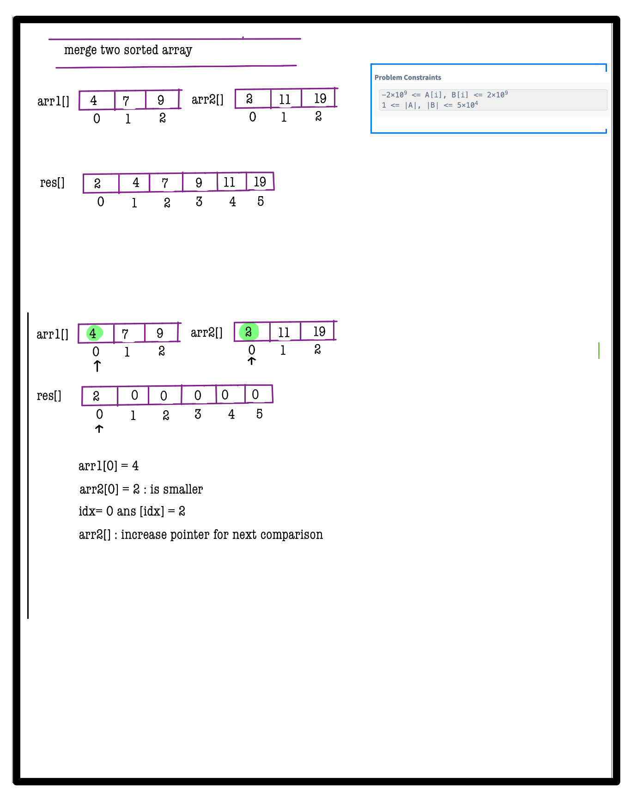
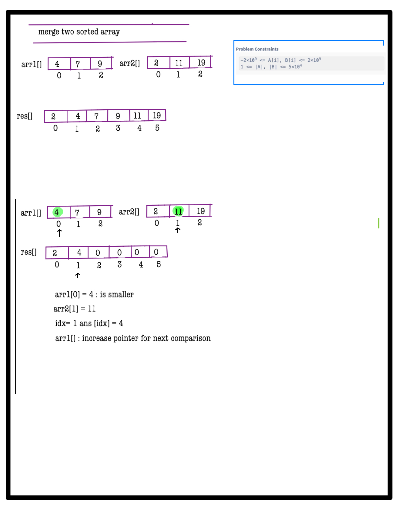
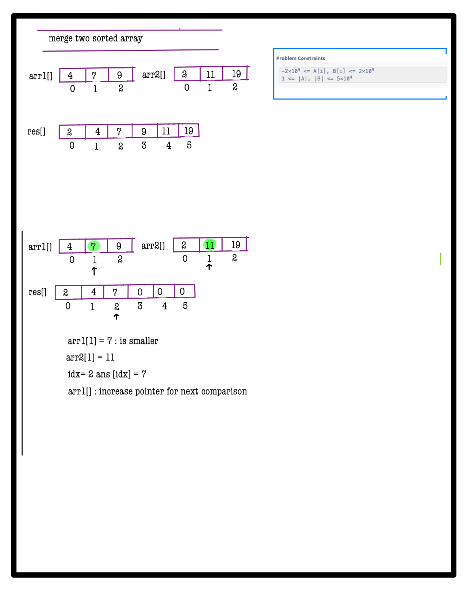
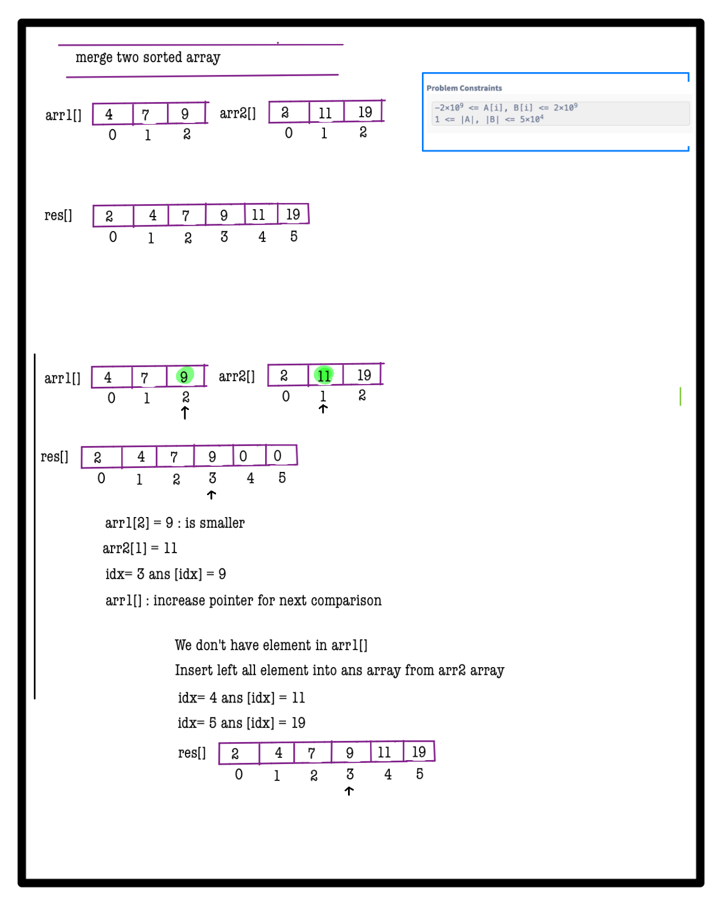
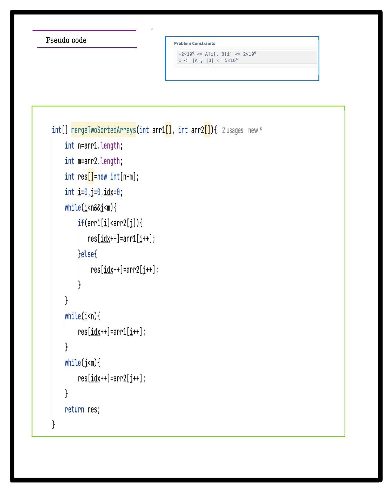

# Q1. Merge Two Sorted Arrays
**Problem Description**  
Given two sorted integer arrays **A** and **B**, merge them into a single sorted array and return it.

**Note:** The solution should run in linear time complexity, and you should avoid using any library function for merging.

---

## Problem Constraints
- `-2×10^9 <= A[i], B[i] <= 2×10^9`
- `1 <= |A|, |B| <= 5×10^4`

---

## Input Format
- First argument: a 1-D integer array **A**
- Second argument: a 1-D integer array **B**

---

## Output Format
- Return a 1-D array which contains all elements from **A** and **B** merged and sorted.

---

## 📚 Example
### Input 1:
```plaintext
A = [4, 7, 9]
B = [2, 11, 19]
```
### Output 1:
```plaintext
[2, 4, 7, 9, 11, 19]
```
### Explanation 1:
Merging **A** and **B** yields the sorted array as shown.

---

### Input 2:
```plaintext
A = [1]
B = [2]
```
### Output 2:
```plaintext
[1, 2]
```
### Explanation 2:
Merging **A** and **B** results in `[1, 2]`.

---


# 📝 Problem Solutions
---
### Approach1 :
#### Source code : [mergeTwoSortedArrays.java](../../src/sortingOne/mergeTwoSortedArrays/approachOne/mergeTwoSortedArrays.java)
#### Time Complexity : o(n+m)
#### Space Complexity : o(n+m)

  
  
  
  
  