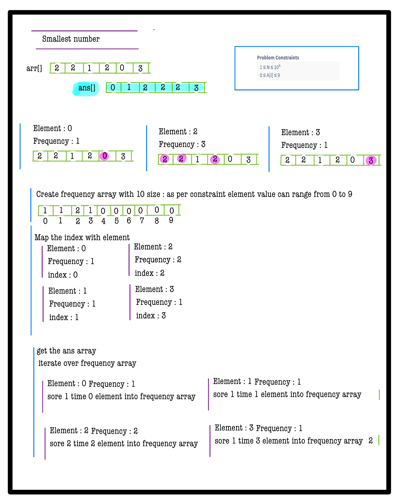
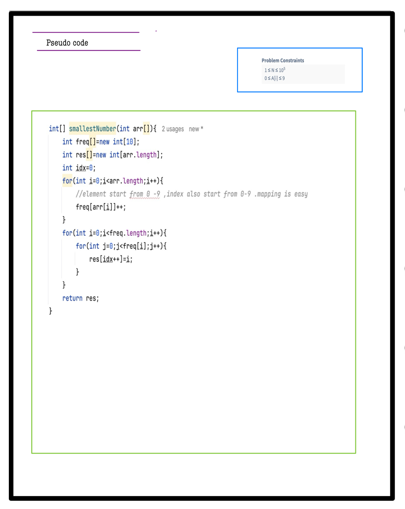

# Q4. Smallest Number

**Problem Description**  
Given an array **A**, where each element is a digit (0-9), find the smallest number that can be formed by rearranging these digits. Return the result as an array of digits.  
**Note**: Do not use any sorting algorithms or library sort methods.

**Problem Constraints**
- `1 <= N <= 10^5`
- `0 <= A[i] <= 9`

**Input Format**
- A single array **A** of length N representing digits.

**Output Format**
- An array representing the smallest number formed by rearranging digits.

---

## 📚 Example
### Input 1:
```plaintext
A = [6, 3, 4, 2, 7, 2, 1]
```
### Output 1:
```plaintext
[1, 2, 2, 3, 4, 6, 7]
```
### Explanation 1:
Rearranged digits produce the smallest number `1223467`.

---

### Input 2:
```plaintext
A = [4, 2, 7, 3, 9, 0]
```
### Output 2:
```plaintext
[0, 2, 3, 4, 7, 9]
```
### Explanation 2:
Rearranged digits produce the smallest number `023479`, which is `23479`.

---
# 📝 Problem Solutions
---
### Approach1 :
#### Source code : [smallestNumber.java](../../src/sortingOne/smallestNumber/approachOne/smallestNumber.java)
#### Time Complexity : o(n)
#### Space Complexity : o(1)

  
  