# Q3. Sort subarray with left and right index

**Problem Description**  
You are given an array **A** of integers of length N and two indices, **B** and **C**.  
Your task is to sort the subarray `[B, C]` within the given array. The rest of the array should remain unchanged.

**Problem Constraints**
- `1 ≤ N ≤ 10^5`
- `0 ≤ A[i] ≤ 10^9`
- `0 ≤ B ≤ C ≤ N - 1`

**Input Format**
- The first argument is the array **A** of length N.
- The second argument is the integer **B**.
- The third argument is the integer **C**.

**Output Format**
- Return the array after sorting the `[B, C]` subarray.

---


## 📚 Example
### Input 1:
```plaintext
A = [59, 11, 8, 91, 49, 44, 8]
B = 4
C = 6
```
### Output 1:
```plaintext
[59, 11, 8, 91, 8, 44, 49]
```

### Input 2:
```plaintext
A = [50, 40, 30, 20, 10]
B = 0
C = 3
```
### Output 2:
```plaintext
[20, 30, 40, 50, 10]
```

### Explanation 1:
Initially the subarray [B, C], i.e. A[4, 6] = [49, 44, 8].
After sorting this becomes [8, 44, 49].
It can be seen that this subarray gets sorted and rest of the array remains unchanged!

---
### Explanation 2:
Initially the subarray [B, C], i.e. A[0, 3] = [50, 40, 30, 20].
After sorting this becomes [20, 30, 40, 50].
It can be seen that this subarray gets sorted and rest of the array remains unchanged!

---

# 📝 Problem Solutions
---
### Approach1 :
#### Source code : [sortSubarrayWithLeftAndRightIndex.java](../../src/sortingOne/sortSubarrayWithLeftAndRightIndex/approachOne/sortSubarrayWithLeftAndRightIndex.java)
#### Time Complexity : o(nlogn)
#### Space Complexity : o(n)

 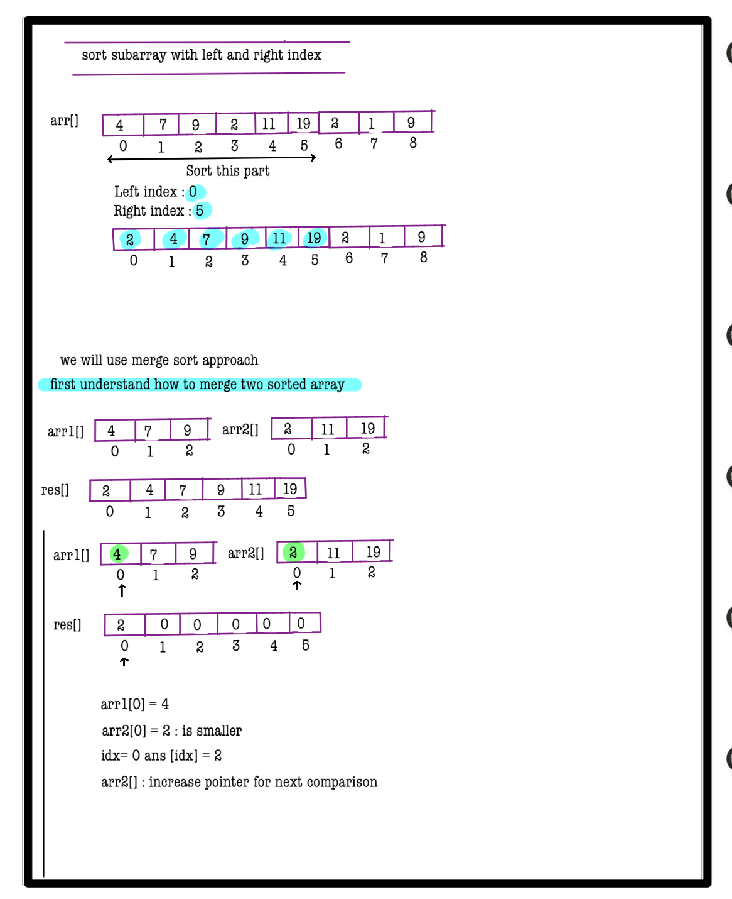 
 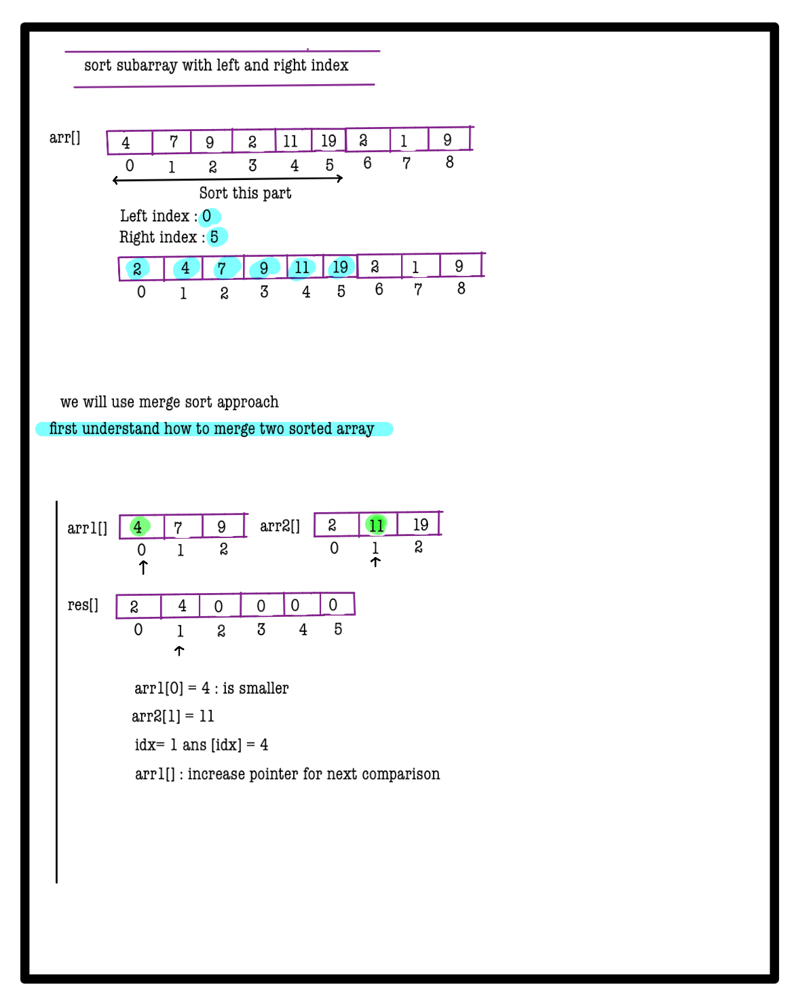 
 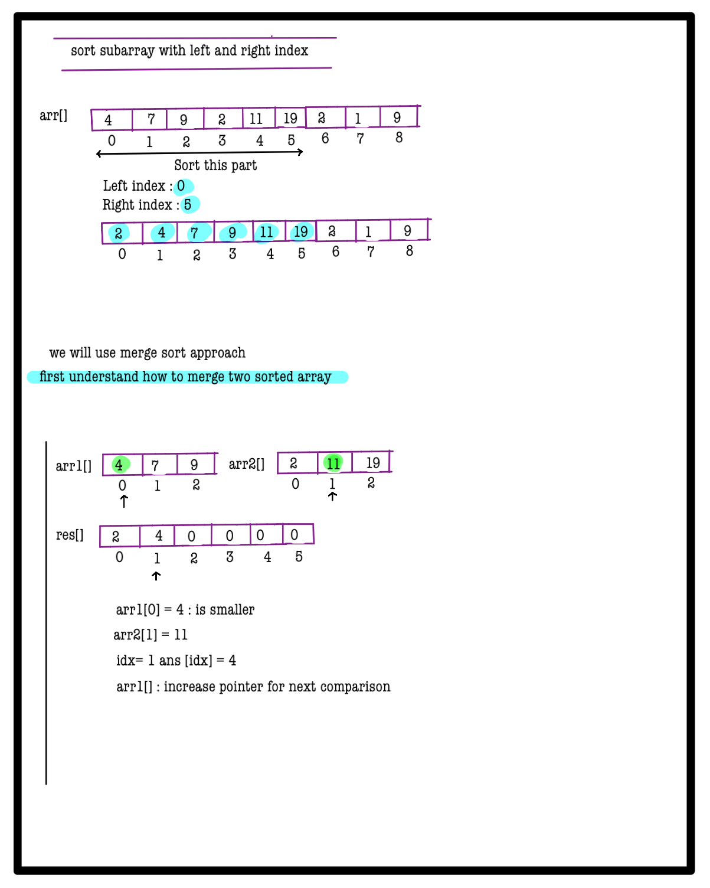 
 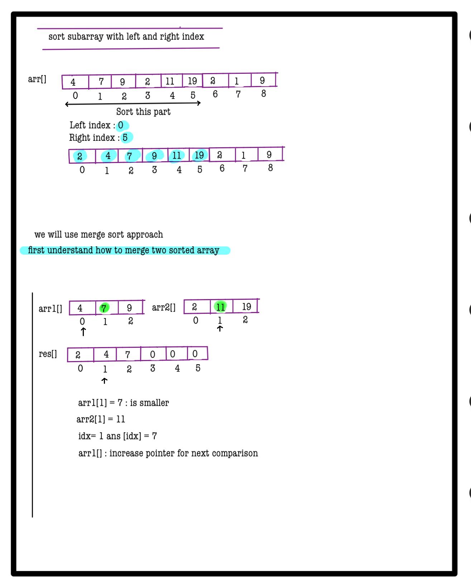 
 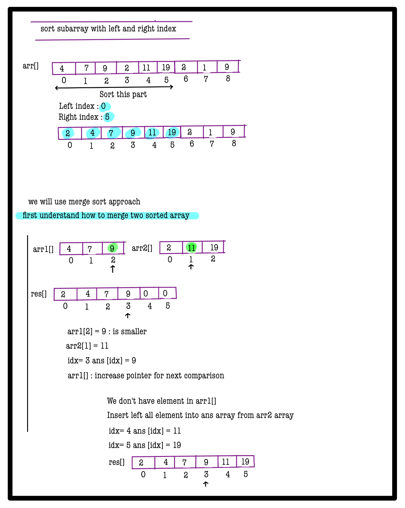 
 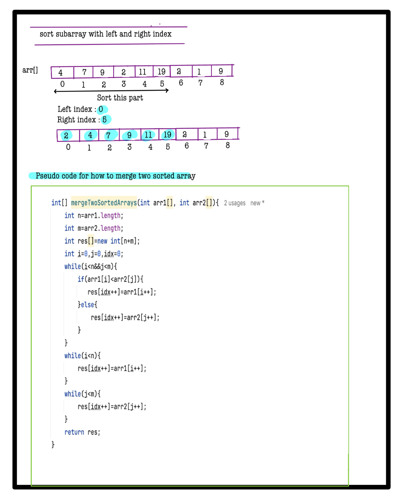 
 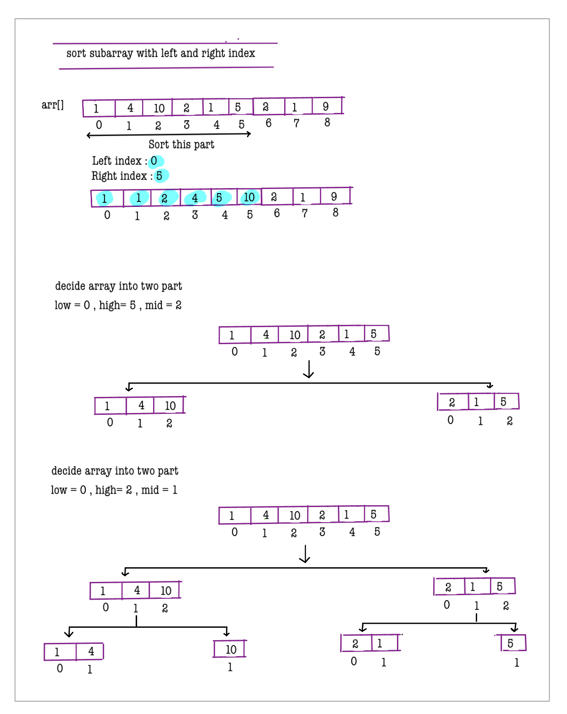 
 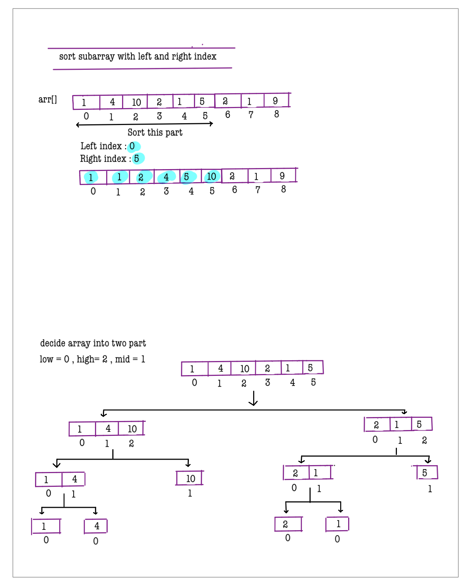 
 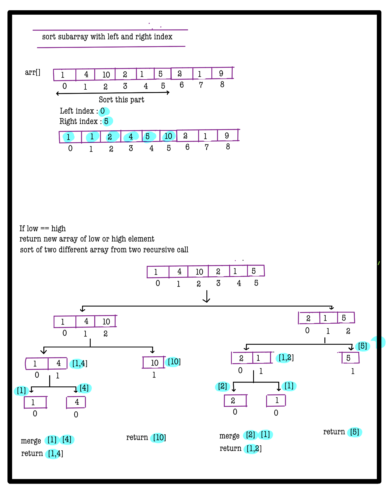 
 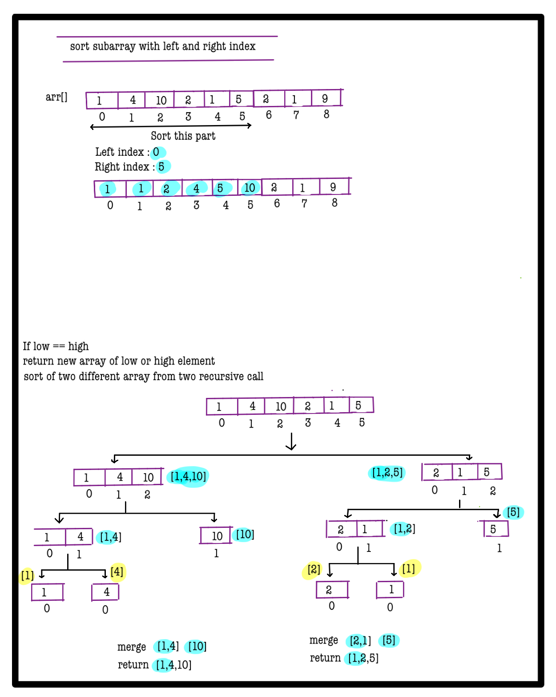 
 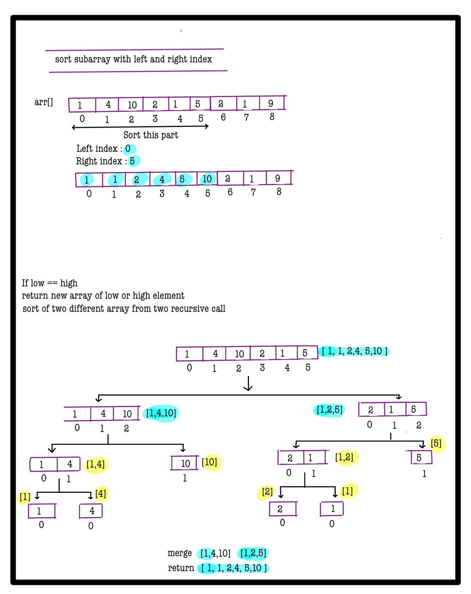
 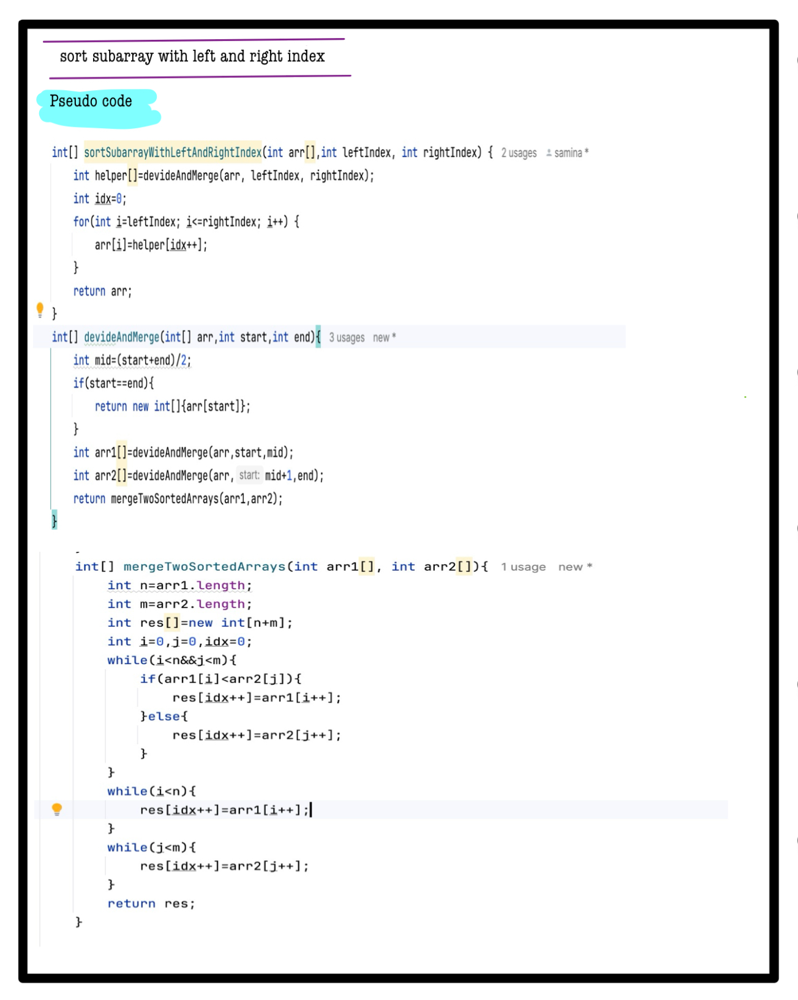