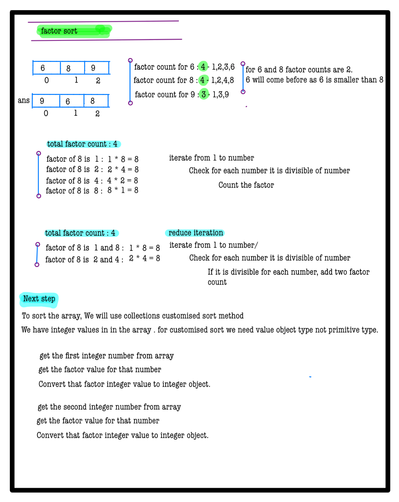
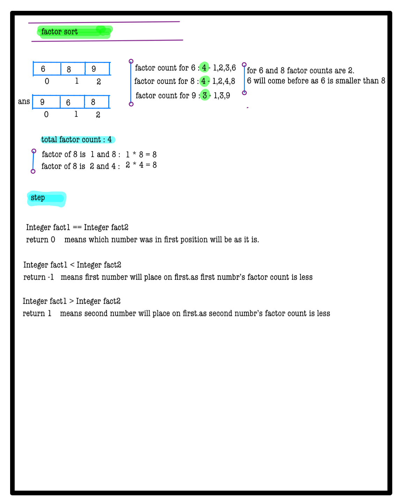
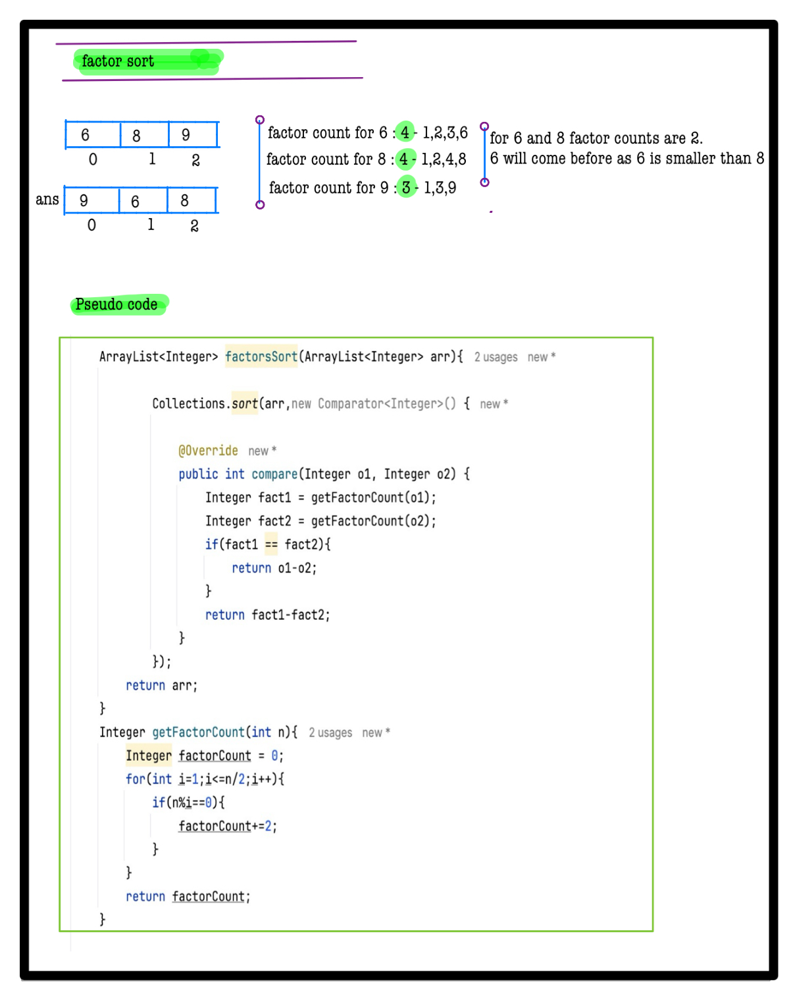

# Q3. Factors sort

**Problem Description**  
You are given an array **A** of **N** elements. Sort the given array in increasing order of number of distinct factors of each element, i.e., the element with the least number of factors should come first, and the element with the highest number of factors should come last. If two elements have the same number of factors, the smaller value should come first.

Note: You cannot use any extra space.

**Problem Constraints**
- 1 <= N <= 10^4
- 1 <= A[i] <= 10^4

**Input Format**  
First argument A is an array of integers.

**Output Format**  
Return an array of integers.

## Example Input 1
```plaintext
A = [6, 8, 9]
```

## Example Input 2
```plaintext
A = [2, 4, 7]
```

### Output 1:
```plaintext  
[9, 6, 8]
```

### Output 2:
```plaintext 
[2, 7, 4]
```

### Example Explanation 1
``` 
The number 9 has 3 factors, 6 has 4 factors, and 8 has 4 factors.  
```

### Example Explanation 2
``` 
The number 2 has 2 factors, 7 has 2 factors, and 4 has 3 factors.
```


# 📝 Problem Solutions
---
### Approach1 :
#### Source code : [factorsSort.java](../../src/sortingTwo/factorsSort/approachOne/factorsSort.java)
#### Time Complexity : o(n^2)
#### Space Complexity : o(1)

  
  
  
