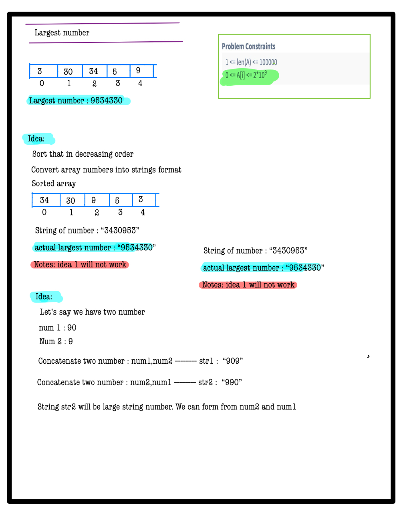
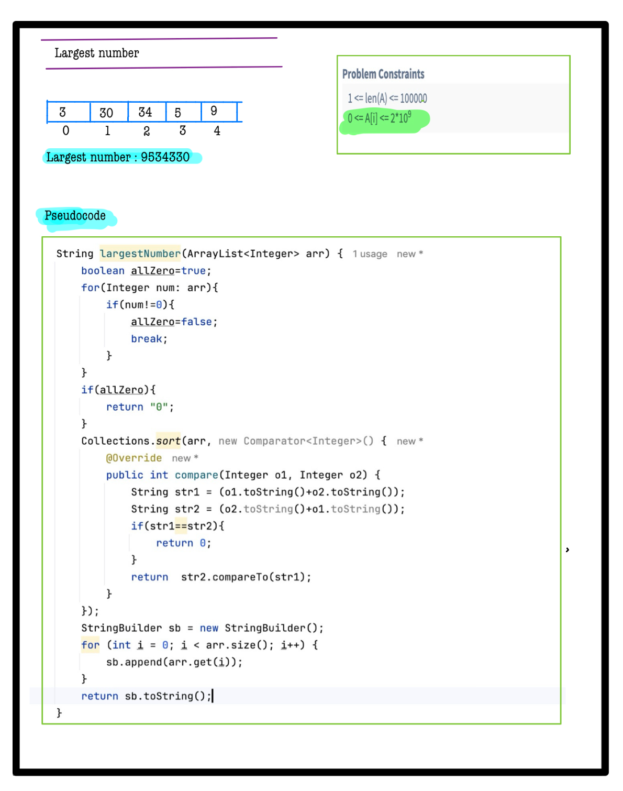

# Q1. Largest Number

**Problem Description**  
Given an array **A** of non-negative integers, arrange them such that they form the largest number.  
**Note:** The result may be very large, so you need to return a string instead of an integer.

**Problem Constraints**
- **1 <= len(A) <= 100000**
- **0 <= A[i] <= 2*10^9**

**Input Format**
- The first argument is an array of integers.

**Output Format**
- Return a string representing the largest number.


## Example Input 1
```plaintext
 A = [3, 30, 34, 5, 9]
```

## Example Input 2
```plaintext
 A = [2, 3, 9, 0]
```

### Output 1:
```plaintext  
 "9534330"
```

### Output 2:
```plaintext 
 "9320"
```

### Example Explanation 1
``` 
Reorder the numbers to [9, 5, 34, 3, 30] to form the largest number.
```

### Example Explanation 2
``` 
Reorder the numbers to [9, 3, 2, 0] to form the largest number 9320.
```


# 📝 Problem Solutions
---
### Approach1 :
#### Source code : [largestNumber.java](../../src/sortingTwo/largestNumber/approachOne/largestNumber.java)
#### Time Complexity : o(nlogin)
#### Space Complexity : o(n)

  
  

