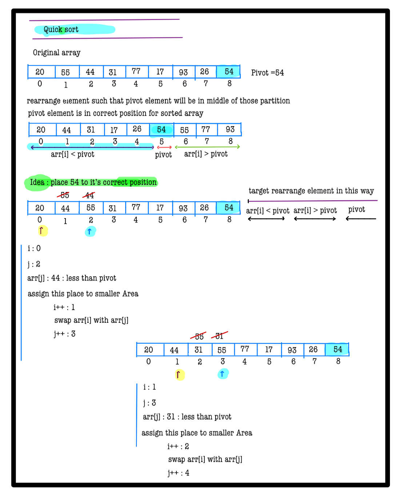
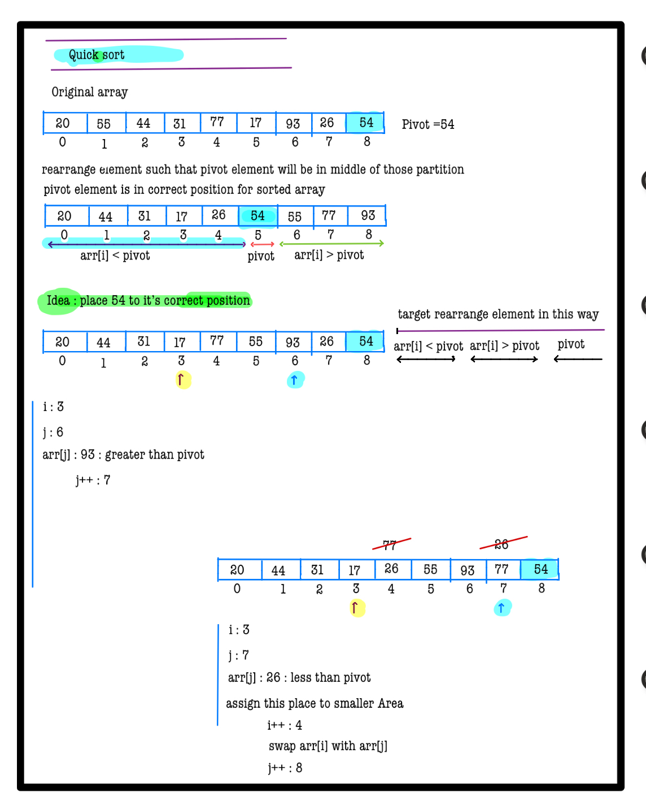

# Q4. Quick Sort

**Problem Description**  
Given an integer array **A**, sort the array using **Quick Sort**.

**Problem Constraints**
- `1 <= |A| <= 10^5`
- `1 <= A[i] <= 10^9`

**Input Format**  
First argument is an integer array **A**.

**Output Format**  
Return the sorted array.

## Example Input 1
```plaintext
A = [1, 4, 10, 2, 1, 5]
```
### Output 1:
```plaintext
[1, 1, 2, 4, 5, 10]
```
## Example Input 2
```plaintext
A = [3, 7, 1]
```
### Output 2:
```plaintext
[1, 3, 7]
```
### Example Explanation
```
Return the sorted array.
```

# 📝 Problem Solutions
---
### Approach1 :
#### Source code : [quickSort.java](../../src/sortingTwo/approachOne/quickSort.java)
#### Time Complexity : o(nlogin)
#### Space Complexity : o(n)

  
  
  
  
  
  
  
  
  
  
  
  
  
  
  
  
  