# Q4. Sort 01

**Problem Description**  
Given an array **A** of length **N** consisting only of 0s and 1s, sort this array.  
**Note**: Do not use any sorting algorithm or library's sort method.

**Problem Constraints**
- `1 <= N <= 10^5`
- `0 <= A[i] <= 1`

**Input Format**
- The input is an array **A** of length N.

**Output Format**
- Return the sorted array.

---

## 📚 Example
### Input 1:
```plaintext
A = [0,0,1,0,1,1,0]
```
### Output 1:
```plaintext
[0,0,0,0,1,1,1]
```

### Input 2:
```plaintext
A = [1,0]
```
### Output 2:
```plaintext
[0,1]
```
# 📝 Problem Solutions
---
### Approach1 :
#### Source code : [sort01.java](../../src/sortingTwo/sort01/approachOne/sort01.java)
#### Time Complexity : o(n)
#### Space Complexity : o(1)

 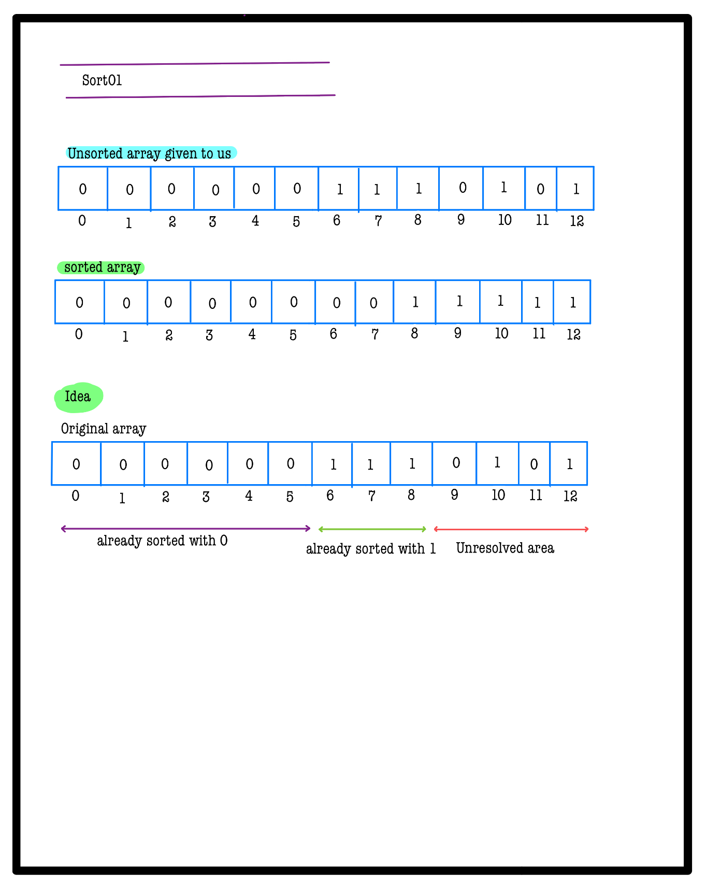 
 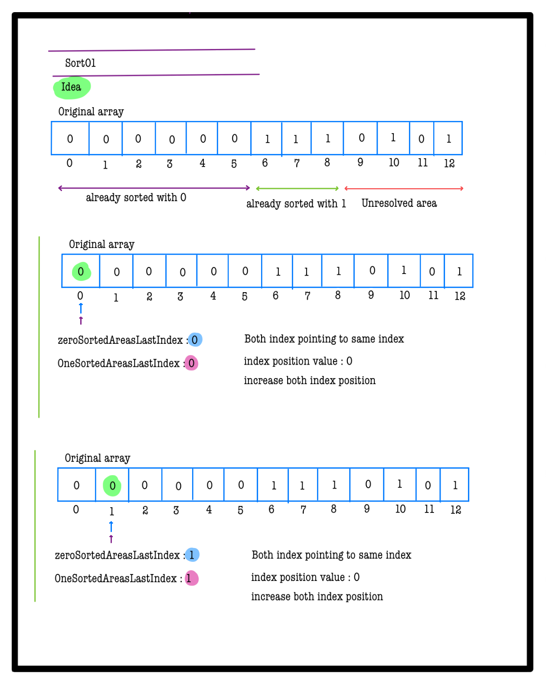 
 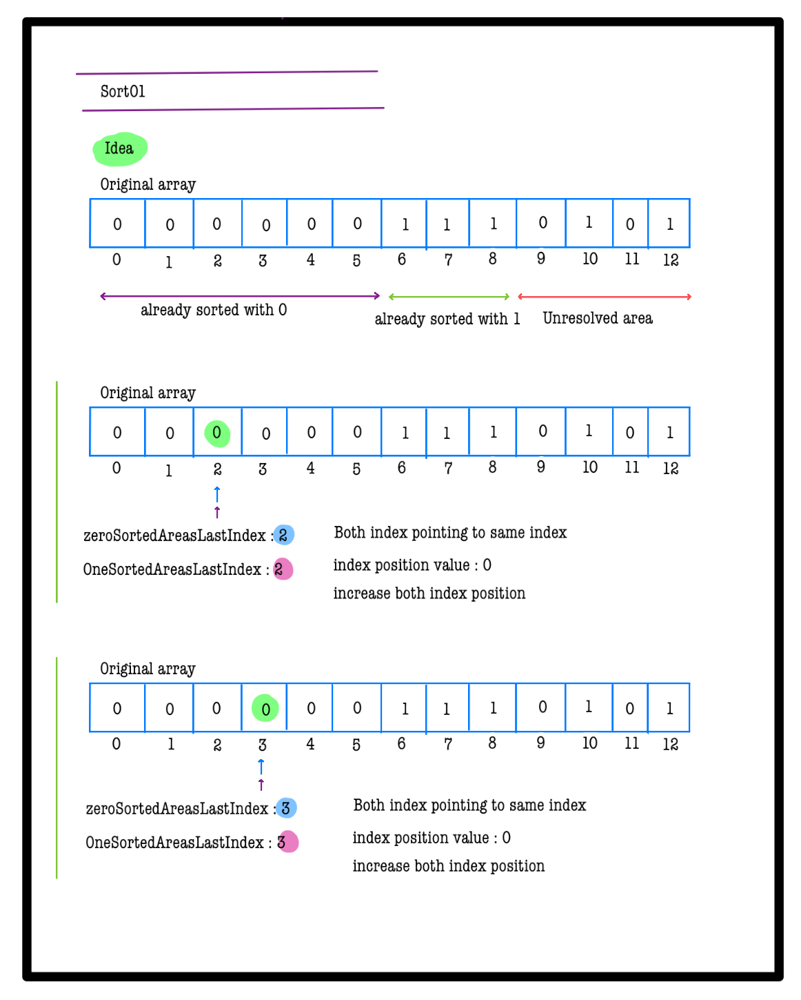 
 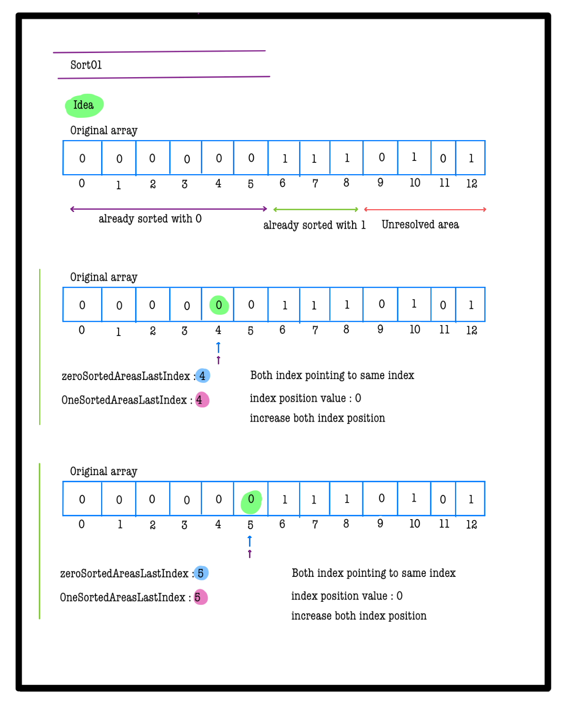 
 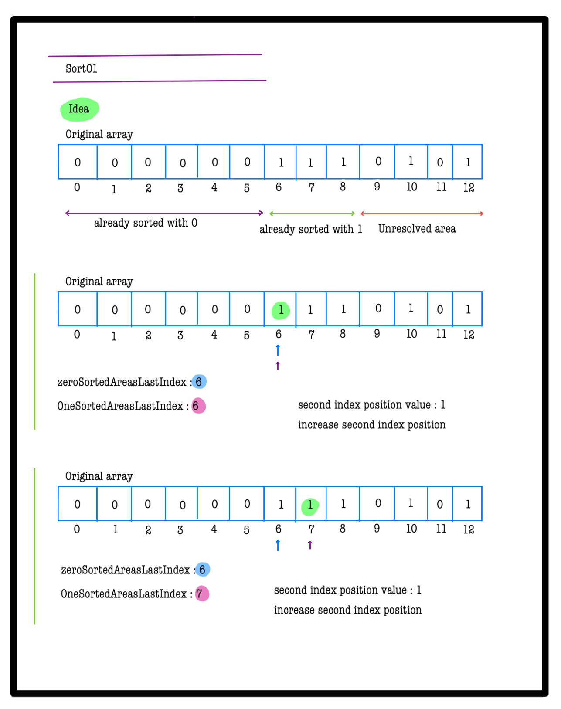 
 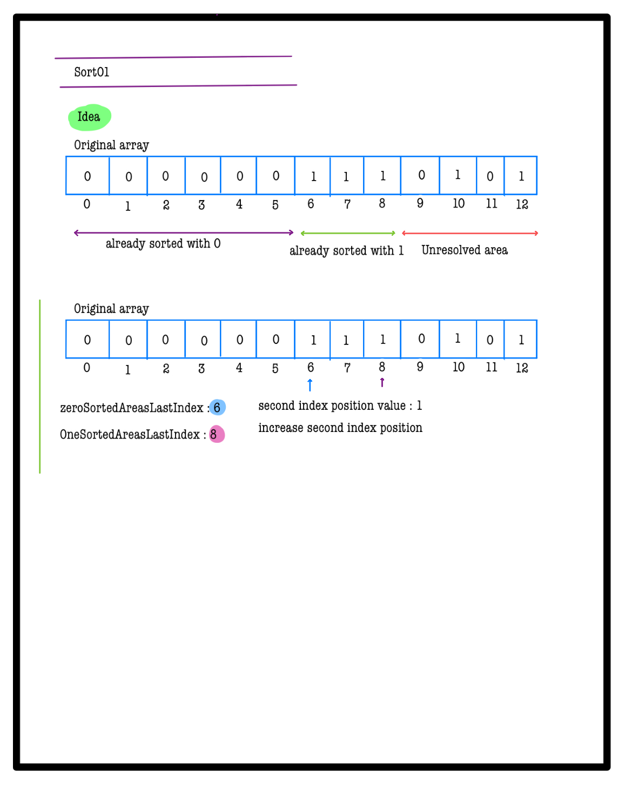 
 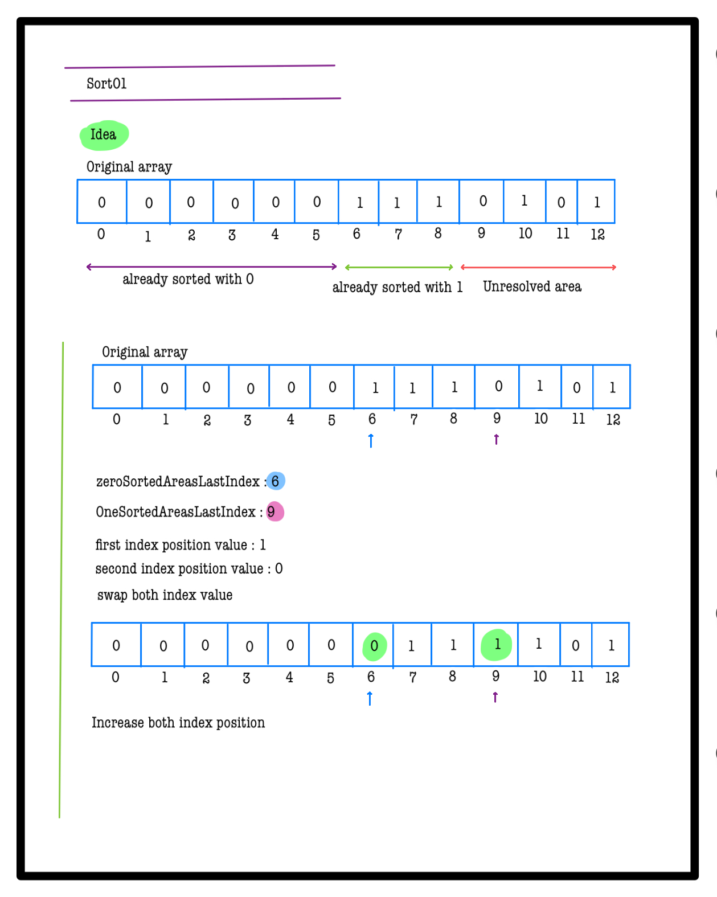 
 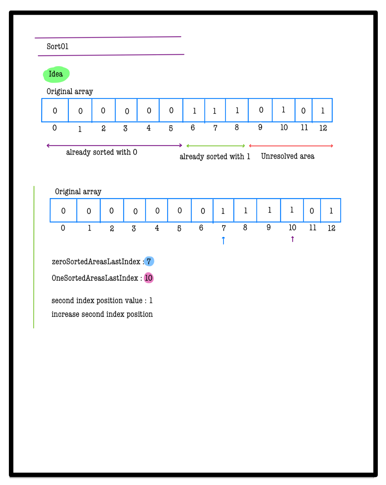 
 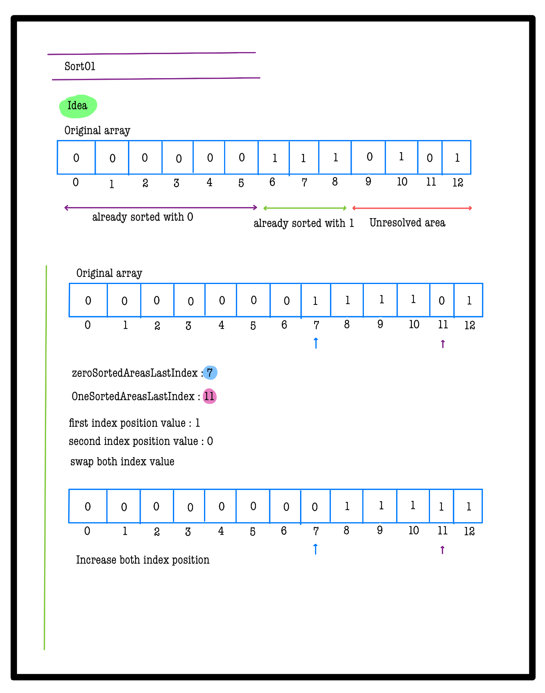 
 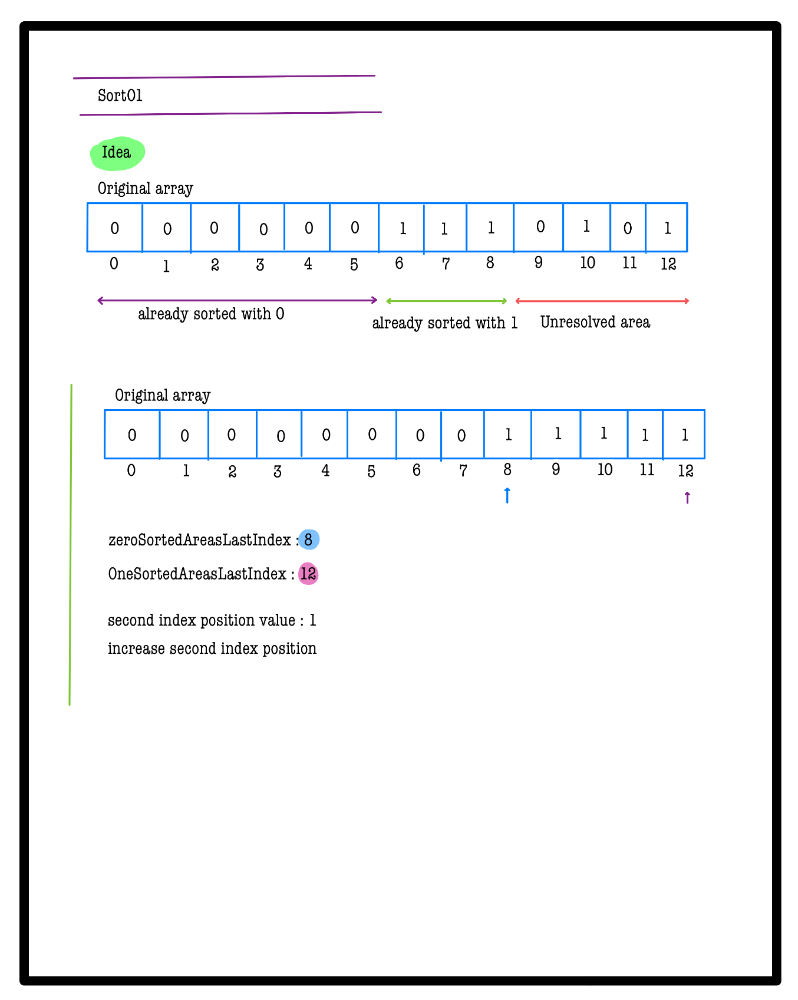 
 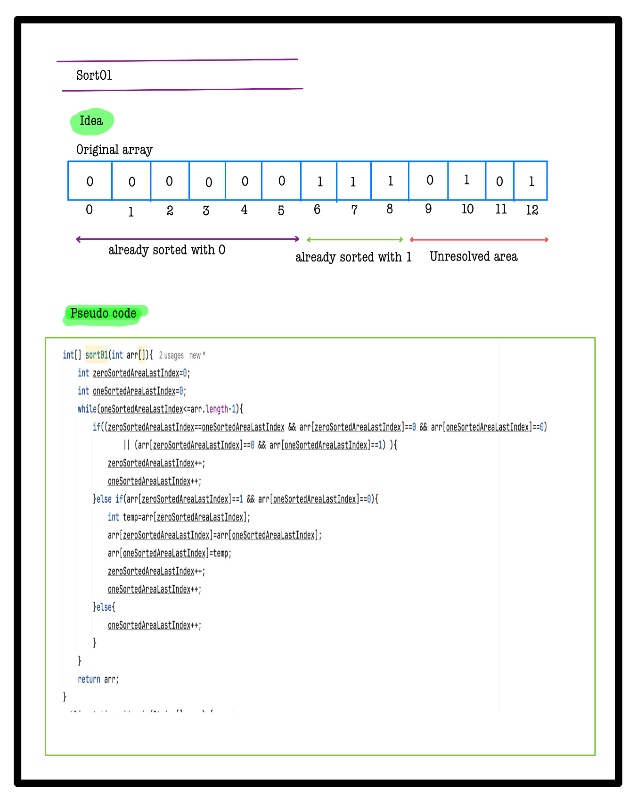 