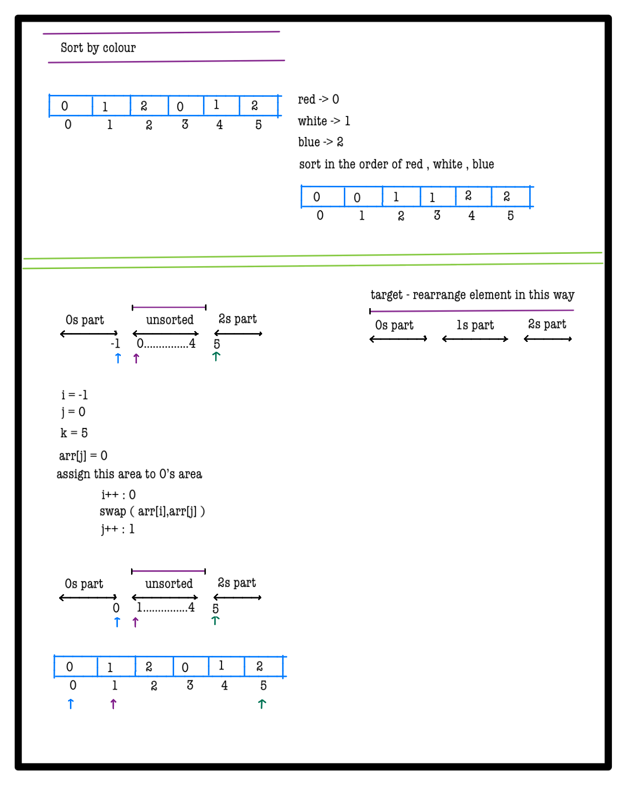
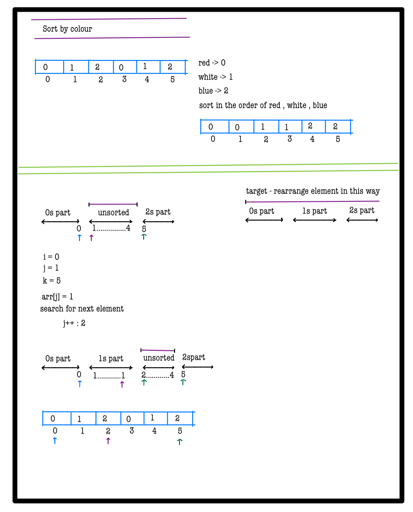
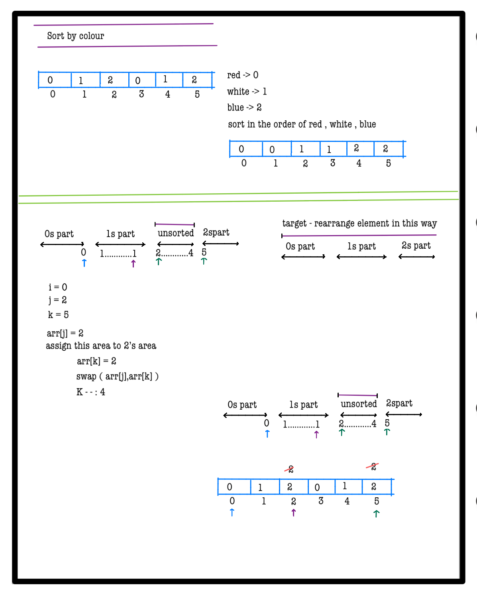
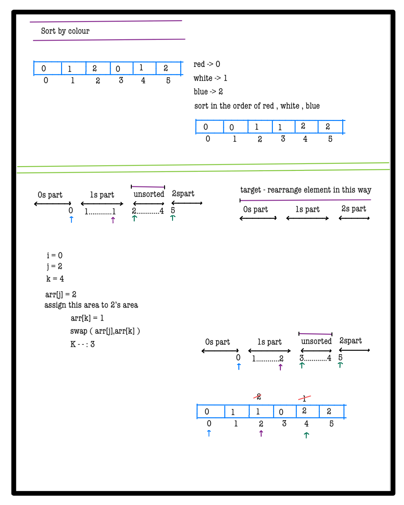
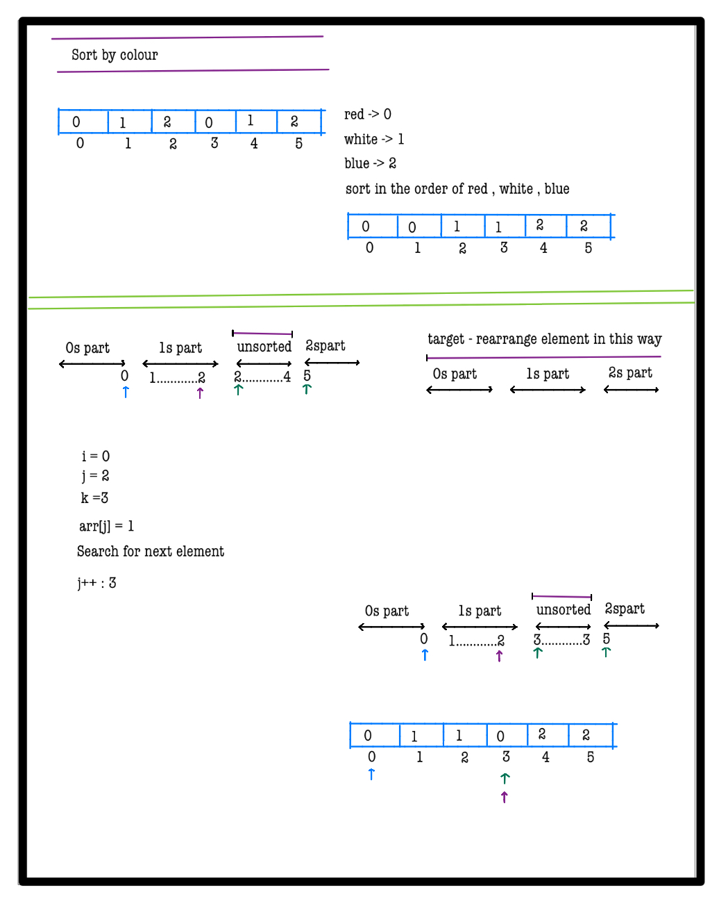
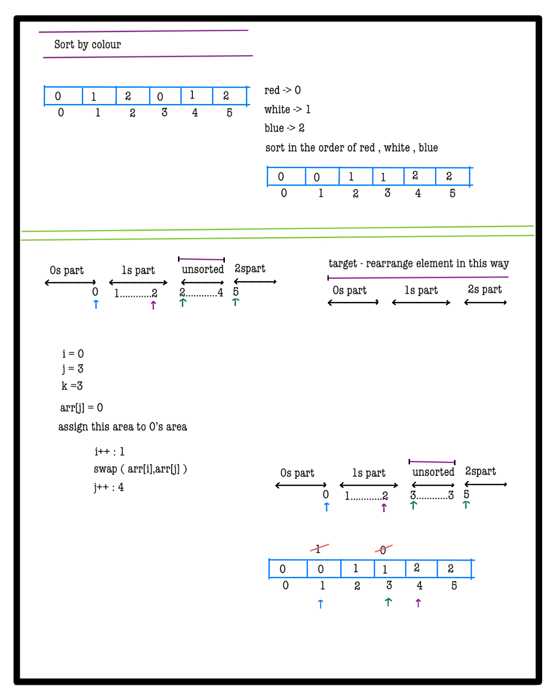
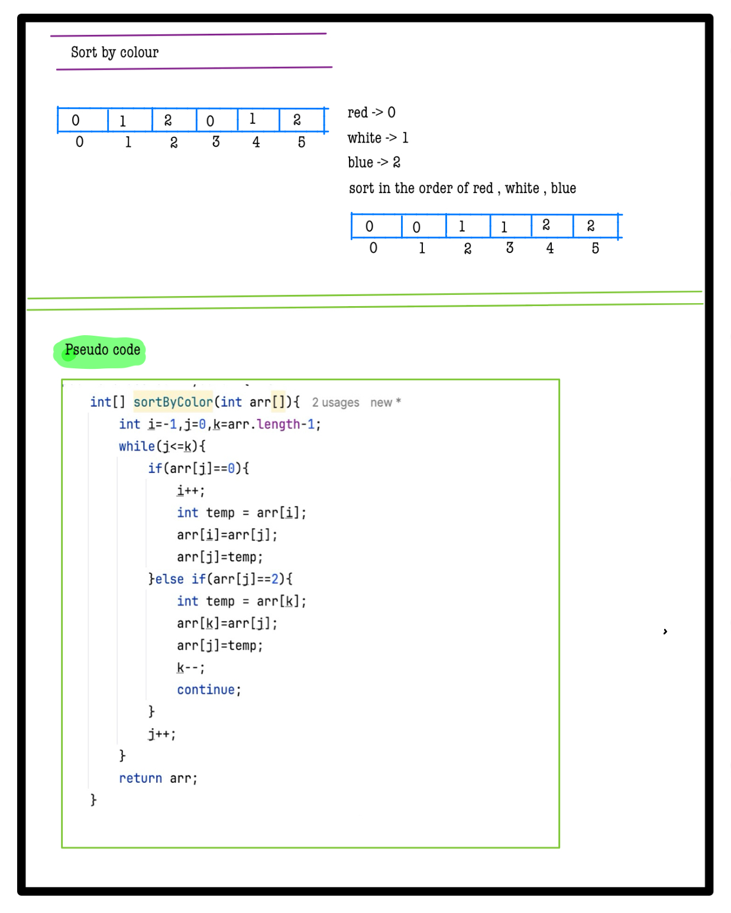

# Q2. Sort by Color

**Problem Description**  
**Given an array with N objects colored red, white, or blue, sort them so that objects of the same color are adjacent, with the colors in the order red, white, and blue.**

**We will represent the colors as:**
- **red -> 0**
- **white -> 1**
- **blue -> 2**

**Note: Using the library sort function is not allowed.**

**Problem Constraints**
- **1 <= N <= 1000000**
- **0 <= A[i] <= 2**

**Input Format**
- **First and only argument of input contains an integer array A.**

**Output Format**
- **Return an integer array in the asked order**

## Example Input 1
```plaintext
 A = [0, 1, 2, 0, 1, 2]
```

## Example Input 2
```plaintext
    A = [0]
```

### Output 1:
```plaintext  
    [0, 0, 1, 1, 2, 2]
```

### Output 2:
```plaintext 
   [0]
```

### Example Explanation 1
``` 
    [0, 0, 1, 1, 2, 2] is the required order.
```

### Example Explanation 2
``` 
    [0] is the required order
```


# 📝 Problem Solutions
---
### Approach1 :
#### Source code : [sortByColor.java](../../src/sortingTwo/sortByColor/approachOne/sortByColor.java)
#### Time Complexity : o(n)
#### Space Complexity : o(1)

  
  
  
  
  
  
  


