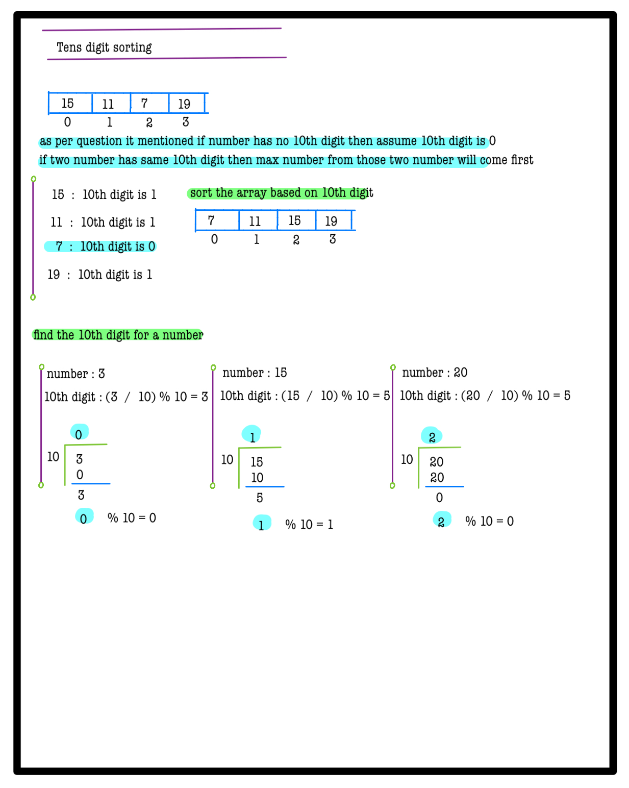
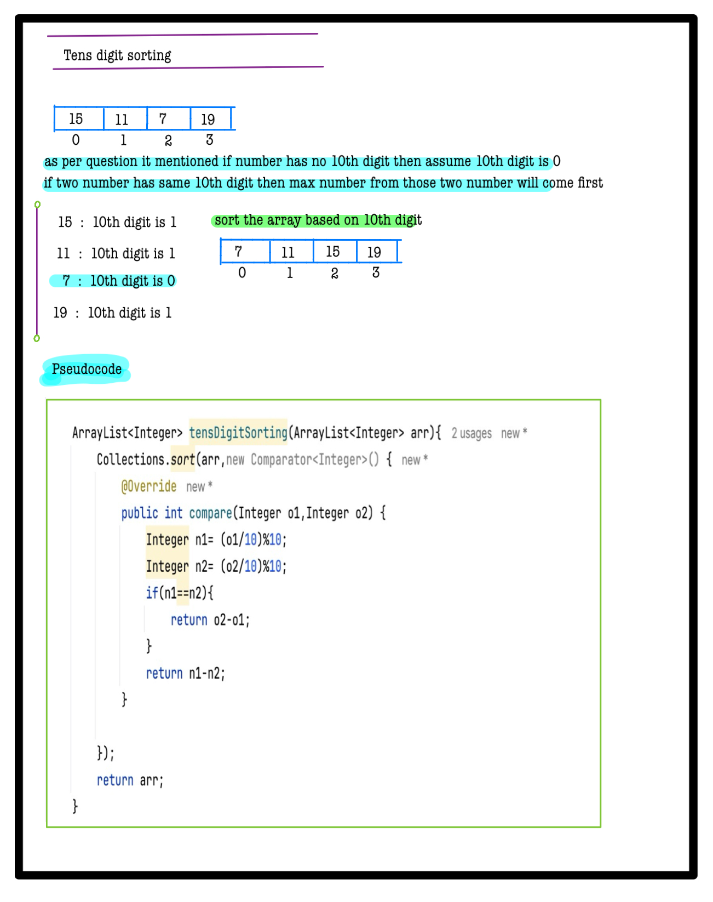

# Q3. Tens Digit Sorting

**Problem Description**  
Given an array **A** of **N** integers, sort the array in increasing order of the value at the tens place digit of every number.
- If a number has no tens digit, we can assume the value to be 0.
- If two numbers have the same tens digit, the number with the maximum value should come first.
- The solution should be based on a comparator.

**Problem Constraints**
- **1 <= N <= 10^5**
- **1 <= A[i] <= 10^9**

**Input Format**
- First argument A is an array of integers.

**Output Format**
- Return the array after sorting.

## Example Input 1
```plaintext
A = [15, 11, 7, 19]
```

## Example Input 2
```plaintext
A = [2, 24, 22, 19]
```

### Output 1:
```plaintext  
[7, 19, 15, 11]
```

### Output 2:
```plaintext 
[2, 19, 24, 22]
```

### Example Explanation 1
``` 
The sorted order is [7, 19, 15, 11]. The tens digit of 7 is 0, 
and that of 19, 15 and 11 is 1.
```

### Example Explanation 2
``` 
The sorted order is [2, 19, 24, 22]. The tens digit of 2 is 0, 
that of 19 is 1 and that of 22 and 24 is 2.
```


# 📝 Problem Solutions
---
### Approach1 :
#### Source code : [tensDigitSorting.java](../../src/sortingTwo/tensDigitSorting/approachOne/tensDigitSorting.java)
#### Time Complexity : o(nlogin)
#### Space Complexity : o(n)

  
  