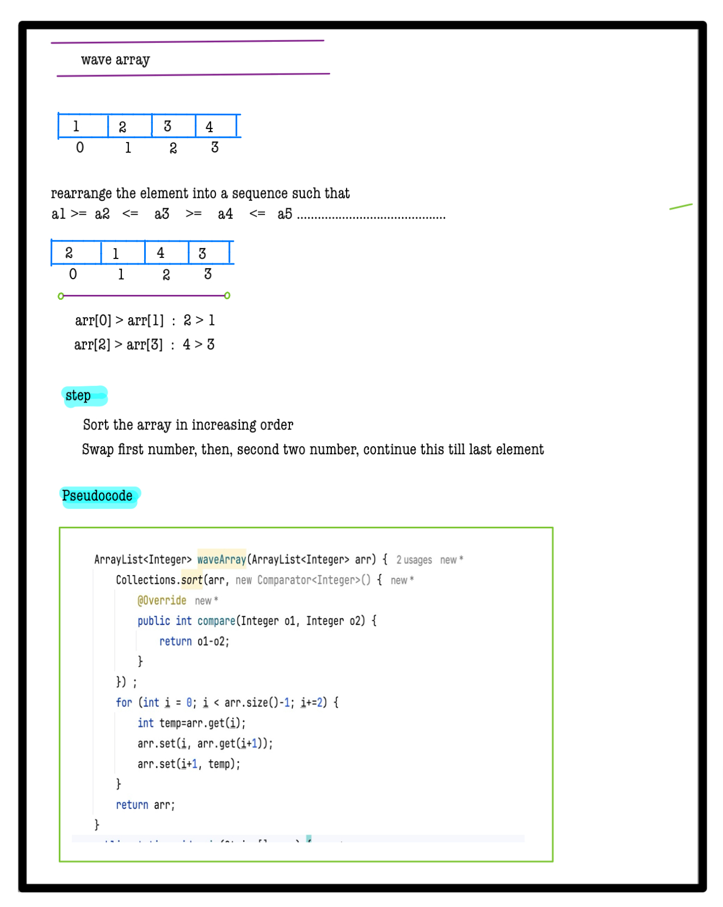

# Q1. Wave Array

**Problem Description**  
Given an array of integers **A**, sort the array into a wave-like array and return it.  
In other words, arrange the elements into a sequence such that  
a1 >= a2 <= a3 >= a4 <= a5.....  
**NOTE:** If multiple answers are possible, return the lexicographically smallest one.

**Problem Constraints**
- **1 <= len(A) <= 10^6**
- **0 <= A[i] <= 10^6**

**Input Format**
- The first argument is an integer array A.

**Output Format**
- Return an array arranged in the sequence as described.


## Example Input 1
```plaintext
A = [1, 2, 3, 4]
```

## Example Input 2
```plaintext
A = [1, 2]
```

### Output 1:
```plaintext  
[2, 1, 4, 3]
```

### Output 2:
```plaintext 
[2, 1]
```

### Example Explanation 1
``` 
One possible answer : [2, 1, 4, 3]
Another possible answer : [4, 1, 3, 2]
First answer is lexicographically smallest. So, return [2, 1, 4, 3].
```

### Example Explanation 2
``` 
Only possible answer is [2, 1].
```


# 📝 Problem Solutions
---
### Approach1 :
#### Source code : [waveArray.java](../../src/sortingTwo/waveArray/approachOne/waveArray.java)
#### Time Complexity : o(nlogin)
#### Space Complexity : o(n)

  
